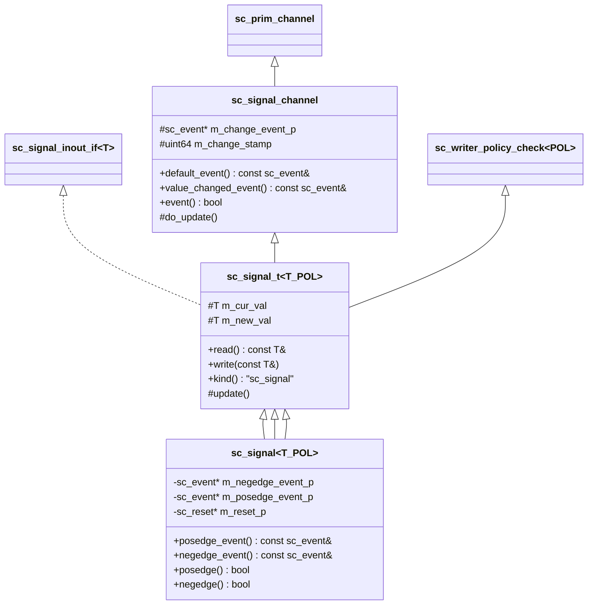
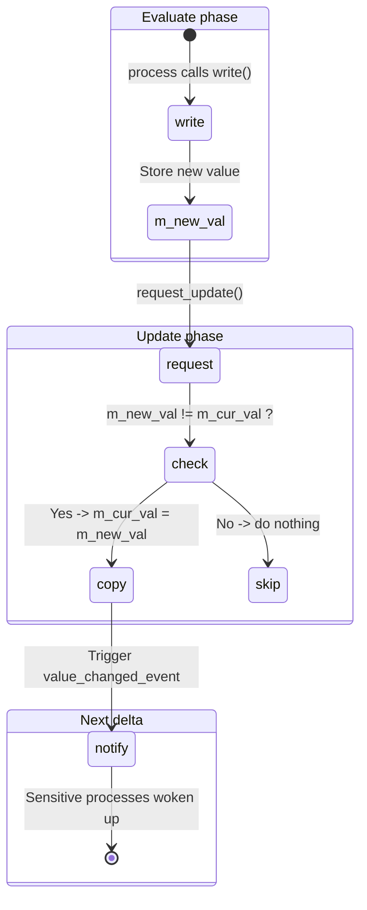

# sc_signal -- Generic Signal Channel `sc_signal<T>`

## Overview

`sc_signal<T>` is the most commonly used primitive channel in SystemC, modeling a "wire" or "register" in hardware. It holds a value of type `T`, supports read and write, and triggers events when the value changes.

This file defines the complete signal class hierarchy:
1. `sc_signal_channel` - Type-independent channel base
2. `sc_signal_t<T, POL>` - Generic signal template base
3. `sc_signal<T, POL>` - Final user-facing generic signal
4. `sc_signal<bool, POL>` - `bool` specialization (supports posedge/negedge)
5. `sc_signal<sc_dt::sc_logic, POL>` - `sc_logic` specialization

**Source files:** `sc_signal.h`, `sc_signal.cpp`

## Everyday Analogy

Think of an "electronic signboard":
- At any time you can "read" what's displayed on the board (`read()`)
- You can "write" new content (`write()`), but it won't display immediately
- At "page-turn time" (update phase), the board updates to the latest content
- If the content actually changed, the board flashes a light (triggers `value_changed_event`)
- Specifically, if the board shows "on/off" (bool), there are also "light-on events" (posedge) and "light-off events" (negedge)

## Class Hierarchy



## Key Method Descriptions

### `write()` - Write New Value

```cpp
template< class T, sc_writer_policy POL >
void sc_signal_t<T,POL>::write( const T& value_ )
{
    bool value_changed = !( m_new_val == value_ );
    if ( !policy_type::check_write(this, value_changed) )
        return;

    m_new_val = value_;
    if( value_changed || policy_type::needs_update() ) {
        request_update();
    }
}
```

Write flow:
1. Check writer policy (whether multi-writer is allowed)
2. Store new value in `m_new_val`
3. If value changed (or policy requires), request update phase update

### `update()` - Update Current Value

```cpp
template< class T, sc_writer_policy POL >
void sc_signal_t<T,POL>::update()
{
    policy_type::update();
    if( !( m_new_val == m_cur_val ) ) {
        do_update();  // m_cur_val = m_new_val; notify event
    }
}
```

Called during the update phase. Only when the new value differs from the current value does it actually update and trigger the event.

### `read()` - Read Current Value

```cpp
virtual const T& read() const
    { return m_cur_val; }
```

Always returns the **current value** (`m_cur_val`), not the new value being written. This ensures all readers see consistent values within the same delta cycle.

## Dual-Register Mechanism



## bool Specialization

`sc_signal<bool>` provides the following in addition to `value_changed_event()`:

| Method | Description |
|--------|-------------|
| `posedge_event()` | Positive edge event (value changes from false to true) |
| `negedge_event()` | Negative edge event (value changes from true to false) |
| `posedge()` | Did a positive edge just occur? |
| `negedge()` | Did a negative edge just occur? |

These correspond to rising and falling edges of clock signals in hardware. `sc_signal<bool>` also supports the reset mechanism through `is_reset()` returning an `sc_reset` pointer.

## sc_logic Specialization

`sc_signal<sc_dt::sc_logic>` is similar to `bool`, also having `posedge_event()` and `negedge_event()`, with the difference in the conditions:
- `posedge()`: Value changes to `SC_LOGIC_1`
- `negedge()`: Value changes to `SC_LOGIC_0`

## Writer Policy Integration

`sc_signal_t` inherits `sc_writer_policy_check<POL>` and calls policy checks during `write()` and `register_port()`:

```cpp
template< class T, sc_writer_policy POL >
void sc_signal_t<T,POL>::register_port( sc_port_base& port_, const char* if_typename_ )
{
    bool is_output = std::string( if_typename_ ) == typeid(if_type).name();
    if( !policy_type::check_port( this, &port_, is_output ) )
       ((void)0); // error suppressed
}
```

## Lazy Event Creation

`sc_signal_channel` uses lazy initialization for events:
- `m_change_event_p` is initially `nullptr`
- The event object is only created on the first call to `value_changed_event()`
- This saves significant memory because many signals are never monitored

## Design Notes

### RTL Correspondence

| SystemC `sc_signal` | Verilog |
|---------------------|---------|
| `write()` | Non-blocking assignment `<=` |
| `read()` | Reading wire/reg value |
| `value_changed_event()` | `@(signal)` |
| `posedge_event()` | `@(posedge clk)` |
| `negedge_event()` | `@(negedge clk)` |
| `m_cur_val` / `m_new_val` | Register's current value and next-state value |

### Why use `==` instead of `!=`?

Note the check in `update()` is `!( m_new_val == m_cur_val )`, not `m_new_val != m_cur_val`. This is because user-defined C++ types may only implement `operator==` without implementing `operator!=`; using negated `==` reduces type requirements.

## Related Files

- `sc_signal_ifs.h` - Defines `sc_signal_in_if`, `sc_signal_inout_if`, etc.
- `sc_prim_channel.h` - Base class providing `request_update()` and other methods
- `sc_writer_policy.h` - Writer policy definitions
- `sc_buffer.h` - Variant of `sc_signal` that triggers event on every write
- `sc_clock.h` - Inherits from `sc_signal<bool>`
- `sc_signal_ports.h` - Signal-specific port classes
