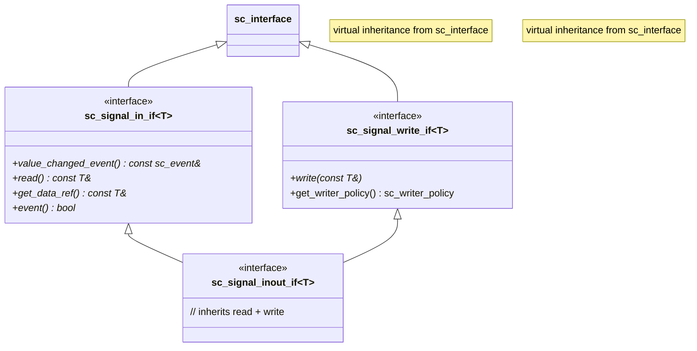
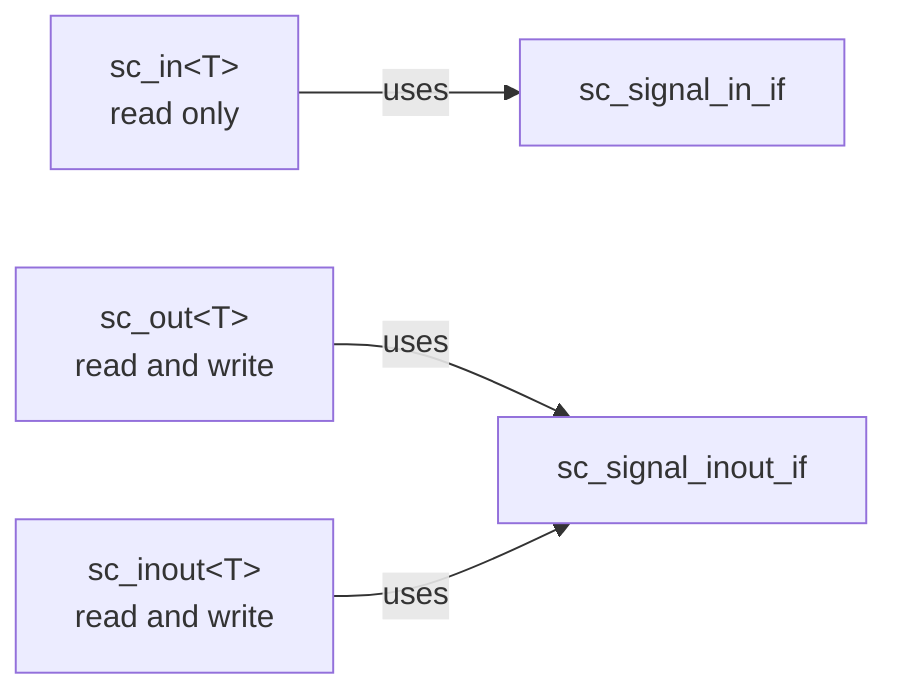

# sc_signal_ifs -- Signal-Related Interface Definitions

## Overview

`sc_signal_ifs.h` defines the interface layer for all signal channels (`sc_signal`, `sc_buffer`, etc.). These interfaces determine what operations can be performed on signals through ports (read, write, query events). Through interface separation, modules only need to know "what can be done", not the channel implementation behind it.

**Source file:** `sc_signal_ifs.h` (header-only)

## Everyday Analogy

Think of a set of "remote control protocols":
- **sc_signal_in_if** is like a "read-only remote" -- can only view what's on the screen, cannot change it
- **sc_signal_write_if** is like a "write button" -- only defines write operations
- **sc_signal_inout_if** is like a "full remote" -- can both read and write
- **sc_signal_out_if** is the same as `sc_signal_inout_if` -- because output ports also need to read back the current value

## Interface Inheritance Hierarchy



## Detailed Interface Descriptions

### `sc_signal_in_if<T>` - Input Interface

Defines all methods needed to read a signal:

| Method | Description |
|--------|-------------|
| `value_changed_event()` | Returns a reference to the value changed event |
| `read()` | Read the current value |
| `get_data_ref()` | Get a const reference to the current value (primarily for waveform tracing) |
| `event()` | Whether a value changed event occurred in the current delta cycle |

### `sc_signal_in_if<bool>` - bool Specialization Input Interface

In addition to the generic version's methods, adds edge detection:

| Method | Description |
|--------|-------------|
| `posedge_event()` | Positive edge (rising edge) event |
| `negedge_event()` | Negative edge (falling edge) event |
| `posedge()` | Whether a positive edge just occurred |
| `negedge()` | Whether a negative edge just occurred |

This specialization also has an `is_reset()` virtual method used by the `sc_reset` mechanism. Default returns `NULL`; `sc_signal<bool>` overrides it.

### `sc_signal_in_if<sc_dt::sc_logic>` - sc_logic Specialization Input Interface

Similar to the `bool` version, also provides `posedge_event()`, `negedge_event()`, `posedge()`, and `negedge()`. The difference lies in four-value logic (`0`, `1`, `X`, `Z`) edge definitions.

### `sc_signal_write_if<T>` - Write Interface

```cpp
template< typename T >
class sc_signal_write_if : public virtual sc_interface
{
public:
    virtual void write( const T& ) = 0;
    virtual sc_writer_policy get_writer_policy() const
        { return SC_DEFAULT_WRITER_POLICY; }
};
```

Defines only one core method `write()`, plus `get_writer_policy()` for querying the writer policy.

### `sc_signal_inout_if<T>` - Input/Output Interface

```cpp
template <class T>
class sc_signal_inout_if
: public sc_signal_in_if<T>, public sc_signal_write_if<T>
{};
```

Inherits both read and write interfaces; this is the interface that `sc_signal<T>` actually implements.

### `sc_signal_out_if<T>` - Output Interface

```cpp
template<typename T>
using sc_signal_out_if = sc_signal_inout_if<T>;
```

Just a type alias for `sc_signal_inout_if<T>`. In hardware design, output ports usually also need to read back the current value (e.g., for feedback), so the output interface is identical to the input/output interface.

## Design Notes

### Why split into in / write / inout?

The separation of these three interfaces serves different port types:



`sc_in` binds to `sc_signal_in_if`, so writing through an input port is prevented at compile time. This is an embodiment of the "principle of least privilege".

### Why do bool and sc_logic need specialization?

Because only boolean and four-value logic types have the concept of "edges". For types like `int` or `double`, asking "was there a rising edge" is meaningless.

### RTL Correspondence

| Interface | Verilog Correspondence |
|-----------|----------------------|
| `sc_signal_in_if<T>` | `input` port |
| `sc_signal_write_if<T>` | Write operation |
| `sc_signal_inout_if<T>` | `inout` port |
| `posedge_event()` | `posedge` event |
| `negedge_event()` | `negedge` event |

## Related Files

- `sc_interface.h` - Base class of all interfaces
- `sc_signal.h` - Channel implementing these interfaces
- `sc_signal_ports.h` - Ports using these interfaces
- `sc_writer_policy.h` - Writer policy referenced in `sc_signal_write_if`
