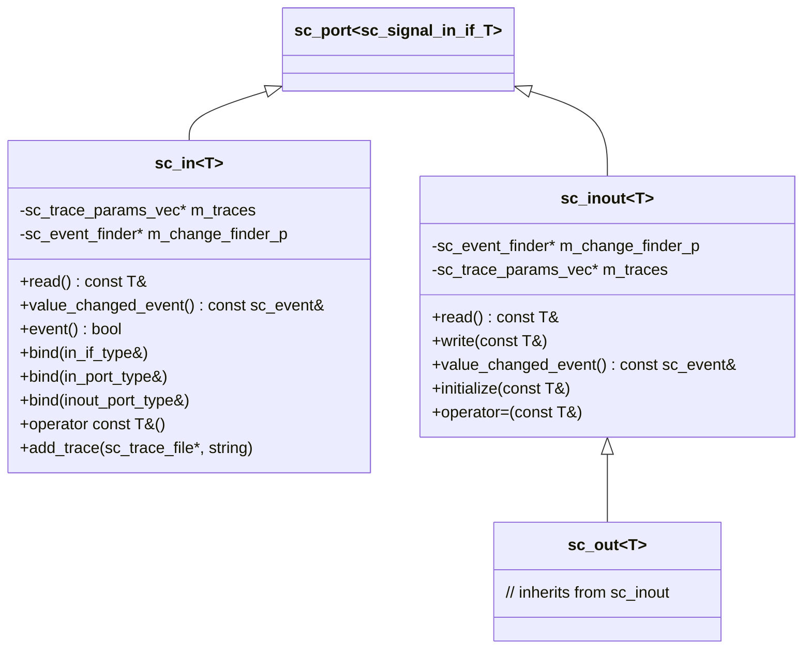
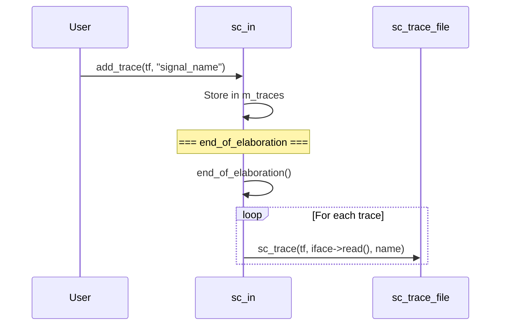

# sc_signal_ports -- Signal-Specific Port Classes

## Overview

`sc_signal_ports.h` defines three commonly used signal port classes: `sc_in<T>`, `sc_inout<T>`, and `sc_out<T>`. These are the port types users encounter most frequently in everyday SystemC design. They are specializations of `sc_port` for signal interfaces, providing convenient syntactic sugar and extra features (such as waveform tracing and event querying).

**Source files:** `sc_signal_ports.h`, `sc_signal_ports.cpp`

## Everyday Analogy

Think of an office building's communication system:
- **sc_in** is like a "read-only mailbox" -- you can only receive mail, not send
- **sc_inout** is like a "bidirectional mail slot" -- can both receive and send mail
- **sc_out** is like a "mailing slot" -- although the name suggests send-only, you can actually check the last content sent

## Class Hierarchy



## Detailed Port Type Descriptions

### `sc_in<T>` - Input Port

Binds to `sc_signal_in_if<T>`, providing only read operations.

**Main features:**

| Method | Description |
|--------|-------------|
| `read()` | Read signal value |
| `operator const T&()` | Implicit conversion to value (can be used directly in expressions) |
| `value_changed_event()` | Get value changed event |
| `event()` | Whether a value change just occurred |
| `value_changed()` | Get event finder (for `sensitive` syntax) |

**Multiple binding methods:**

```cpp
// Bind to interface (channel)
void bind( const in_if_type& interface_ );

// Bind to same-type input port (parent port)
void bind( in_port_type& parent_ );

// Bind to input/output port (parent port) -- allows sc_in to bind to sc_inout
void bind( inout_port_type& parent_ );
```

### `sc_in<bool>` - Boolean Input Port (Specialization)

In addition to general `sc_in` features, adds edge detection:

| Method | Description |
|--------|-------------|
| `posedge_event()` | Positive edge event |
| `negedge_event()` | Negative edge event |
| `posedge()` | Whether a positive edge just occurred |
| `negedge()` | Whether a negative edge just occurred |
| `pos()` | Positive edge event finder |
| `neg()` | Negative edge event finder |

These are extremely common in clock-sensitive designs:

```cpp
SC_CTOR(MyModule) {
    SC_METHOD(my_method);
    sensitive << clk.pos();  // Sensitive to clk's positive edge
}
```

### `sc_inout<T>` - Input/Output Port

Binds to `sc_signal_inout_if<T>`, supporting both read and write.

**Additional features:**

| Method | Description |
|--------|-------------|
| `write(const T&)` | Write new value |
| `operator=(const T&)` | Assignment operator (equivalent to write) |
| `initialize(const T&)` | Set initial value (used during elaboration phase) |

The `initialize()` method is particularly important: it stores the initial value before binding is complete, and automatically writes it to the channel after binding.

### `sc_out<T>` - Output Port

```cpp
template <class T>
class sc_out : public sc_inout<T>
{
    // ...
};
```

`sc_out` is just a subclass of `sc_inout` with no new methods. It exists purely for code readability, allowing designers to express the design intent that "this port is for output".

## Event Finders

Each port has event finder members for providing event references before binding is complete:

```cpp
// in sc_in<T>
sc_event_finder& value_changed() const {
    return sc_event_finder::cached_create(
        m_change_finder_p, *this,
        &in_if_type::value_changed_event );
}
```

Event finders use a lazy creation strategy (`cached_create`), allocating memory only on first use.

## Waveform Tracing

`sc_in` and `sc_inout` support waveform tracing via the `add_trace()` method. Trace parameters are collected during elaboration and actually set up in the `end_of_elaboration()` callback.



## Design Notes

### Why can sc_in bind to an sc_inout port?

In hierarchical design, a sub-module may only need to read a value, but the parent module's port is `sc_inout`. Allowing `sc_in` to bind to `sc_inout` avoids unnecessary interface mismatch errors.

### Initialization Mechanism

`sc_inout`'s `initialize()` uses an internal `sc_inout_opt_if` class to temporarily store the initial value. If `initialize()` is called before binding, the value is stored temporarily; during `end_of_elaboration()`, the stored value is written to the bound channel.

### RTL Correspondence

| SystemC | Verilog |
|---------|---------|
| `sc_in<T>` | `input` port |
| `sc_out<T>` | `output` port |
| `sc_inout<T>` | `inout` port |
| `sc_in<bool> clk` | `input clk` |
| `sensitive << clk.pos()` | `always @(posedge clk)` |

## Related Files

- `sc_port.h` - Base class `sc_port`
- `sc_signal_ifs.h` - Interface definitions for binding targets
- `sc_event_finder.h` - Event finder implementation
- `sc_signal.h` - Channel class typically bound to
- `sc_clock_ports.h` - Type aliases for clock ports
