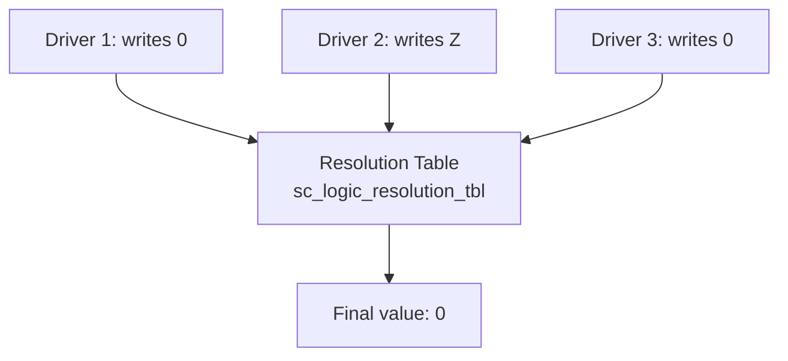
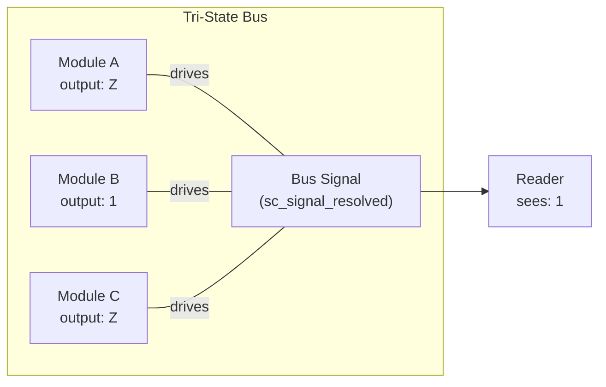

# sc_signal_resolved.h / .cpp - Resolved Signal Channel

## Overview

`sc_signal_resolved` is a special signal channel that allows **multiple processes to write simultaneously** to the same `sc_logic` signal. When multiple driver sources write at the same time, it automatically calculates the final value through a **resolution table**.  This is a key component for simulating multi-driver buses in hardware.

## Core Concept / Everyday Analogy

### Voting

Imagine a meeting vote:

- Each person (process) can vote "yes" (1), "no" (0), "abstain" (Z), or "undecided" (X)
- If everyone votes "yes" -> result is "yes"
- If some vote "yes" and some "no" -> result is "conflict/unknown" (X)
- If some vote and others "abstain" (Z) -> result matches the actual voters
- As soon as one "undecided" (X) appears -> result is "undecided" (X)

### Multi-Driver Buses in Hardware

In real hardware, multiple chips share a bus (e.g., I2C, open-drain circuits). Each chip can pull high (1), pull low (0), or release (Z, high impedance). `sc_signal_resolved` simulates this behavior.

## Resolution Table

```
         Driver B Value
         0    1    Z    X
    0 [  0    X    0    X  ]
D   1 [  X    1    1    X  ]
r   Z [  0    1    Z    X  ]
i   X [  X    X    X    X  ]
v
e
r
A
```

Resolution rules:
- **Same value**: Result is that value (0+0=0, 1+1=1)
- **Z + any value**: Result is that value (Z has no effect)
- **0 + 1**: Conflict! Result is X
- **X + any value**: Result is X (uncertainty propagates)



## Detailed Class Description

### `sc_signal_resolved` Class

```cpp
class sc_signal_resolved
: public sc_signal<sc_dt::sc_logic, SC_MANY_WRITERS>
```

Inherits from `sc_signal` but uses the `SC_MANY_WRITERS` policy, allowing multiple writers.

### Constructors

| Constructor | Description |
|-------------|-------------|
| `sc_signal_resolved()` | Auto-named `"signal_resolved_0"` etc. |
| `sc_signal_resolved(const char* name_)` | Named |
| `sc_signal_resolved(const char* name_, const value_type& initial_value_)` | Named with initial value |

### `register_port()` - No Restriction

```cpp
virtual void register_port(sc_port_base&, const char*) {}
```

Empty implementation! Unlike `sc_fifo` which restricts to single reader/writer, resolved signals allow any number of port connections.

### `write()` - Multi-Driver Write

```cpp
void sc_signal_resolved::write(const value_type& value_)
{
    sc_process_b* cur_proc = sc_get_current_process_b();
    // Find current process in m_proc_vec
    // If found, update value; if not found, add new entry
    // request_update() if value changed
}
```

Key design:
- Each process's written value is **stored separately** in `m_val_vec`
- Rather than directly overwriting the signal value, it records "who wrote what"
- Only triggers update when the value actually changes

### `update()` - Resolve Final Value

```cpp
void sc_signal_resolved::update()
{
    sc_logic_resolve(m_new_val, m_val_vec);
    base_type::update();
}
```

During the delta cycle's update phase:
1. Call `sc_logic_resolve` to resolve all driver values
2. Call the base class's `update()` to complete signal update (notify events, etc.)

### `sc_logic_resolve()` Resolution Function

```cpp
static void sc_logic_resolve(sc_dt::sc_logic& result_,
                             const std::vector<sc_dt::sc_logic>& values_)
```

- If there is only one driver source, use that value directly
- For multiple driver sources, merge using the resolution table one by one
- Once the result becomes X, exit early (X won't change back)

### Member Variables

| Variable | Type | Description |
|----------|------|-------------|
| `m_proc_vec` | `std::vector<sc_process_b*>` | List of processes writing to this signal |
| `m_val_vec` | `std::vector<value_type>` | Values written by each process |

## Design Rationale / RTL Background

### Multi-Driver in CMOS

The source code comment mentions: "We assume that driving a resolved signal to 1 or 0 from two sources is fine. This may not be true for all technologies, but it is indeed the case for CMOS (the dominant technology today)."

In CMOS:
- Two drivers both output 0 (pull low) -> result is 0 (both NMOS on, no conflict)
- Two drivers both output 1 (pull high) -> result is 1
- One outputs 0, one outputs 1 -> **Short circuit!** Result is X (undefined)

### Tri-State Bus

The most common use case is a **tri-state bus**:



Only one module is driving (outputting 0 or 1), while other modules output Z (high impedance/disconnected). The final value is the driving module's output.

## Related Files

- `sc_signal_resolved_ports.h` / `.cpp` - Resolved signal specific ports
- `sc_signal_rv.h` - Resolved vector signal (multi-bit version)
- `sc_signal.h` - Base signal channel
- `sc_logic.h` (datatypes) - `sc_logic` four-value logic type
