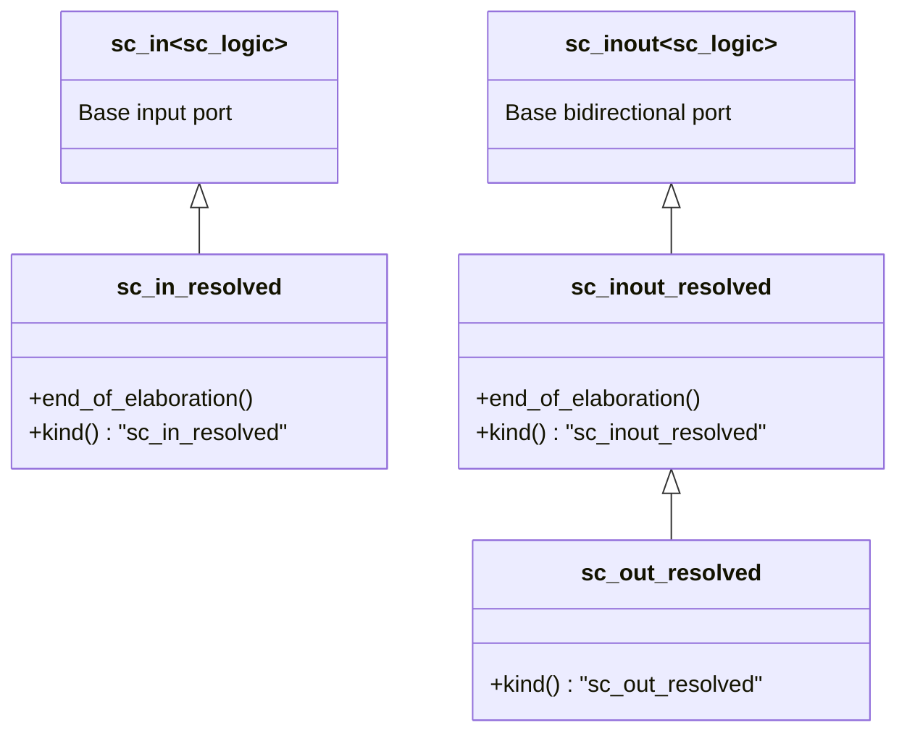
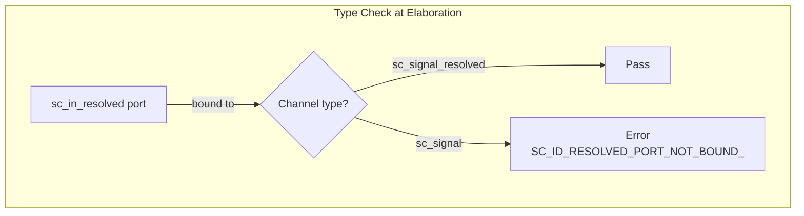

# sc_signal_resolved_ports.h / .cpp - Resolved Signal Specific Ports

## Overview

This file defines three port classes specific to `sc_signal_resolved`: `sc_in_resolved` (input), `sc_inout_resolved` (bidirectional), and `sc_out_resolved` (output). Their core function is to **check at elaboration completion whether the bound channel is indeed `sc_signal_resolved`**, ensuring resolution logic is not missed.

## Core Concept / Everyday Analogy

### Special-Specification Plugs

Imagine you have a device that requires a special voltage (resolved signal):

- A regular outlet (`sc_signal`) is unsafe and could damage the device
- A **resolution-specific outlet** (`sc_signal_resolved`) is the correct one
- These ports are like "plugs with safety detection": when plugged in, they automatically check whether the outlet is the correct type. If plugged into the wrong one, an error is reported before startup

## Class Inheritance Hierarchy



## Detailed Class Descriptions

### `sc_in_resolved` - Resolved Signal Input Port

```cpp
class sc_in_resolved : public sc_in<sc_dt::sc_logic>
```

Inherits from `sc_in<sc_logic>` with identical functionality; the only difference is the check in `end_of_elaboration()`:

```cpp
void sc_in_resolved::end_of_elaboration()
{
    base_type::end_of_elaboration();
    if (dynamic_cast<sc_signal_resolved*>(get_interface()) == 0) {
        report_error(SC_ID_RESOLVED_PORT_NOT_BOUND_, 0);
    }
}
```

Uses `dynamic_cast` to confirm the bound channel is indeed `sc_signal_resolved` (or a subclass). If bound to a regular `sc_signal<sc_logic>`, an error is reported.

### `sc_inout_resolved` - Resolved Signal Bidirectional Port

```cpp
class sc_inout_resolved : public sc_inout<sc_dt::sc_logic>
```

Same type check in `end_of_elaboration()`. Provides read-write bidirectional access.

### `sc_out_resolved` - Resolved Signal Output Port

```cpp
class sc_out_resolved : public sc_inout_resolved
```

Inherits from `sc_inout_resolved` (not `sc_out`). The source code comment explains: "`sc_out_resolved` can also read from the port, so it is no different from `sc_inout_resolved`. A separate class is provided for debugging purposes."

No need to override `end_of_elaboration()` because the parent class already performs the check.

## Constructors

All three classes provide a complete set of constructors consistent with the base class:

| Creation Method | Description |
|-----------------|-------------|
| Default construction | Auto-named |
| `const char* name_` | Named |
| Interface reference | Direct binding |
| Port reference | Bind to parent port |
| Name + interface/port combinations | Named versions of the above |

## Design Rationale

### Why are separate port classes needed?

A regular `sc_in<sc_logic>` can also bind to `sc_signal_resolved` (because `sc_signal_resolved` inherits from `sc_signal<sc_logic>`). But conversely, if your design **depends on** multi-driver resolution behavior, you should use `sc_in_resolved` to ensure:

1. **Clear design intent**: Code readers immediately know this is a multi-driver scenario
2. **Early error detection**: If accidentally bound to a regular signal, an error is reported during elaboration
3. **Type safety**: `kind()` returns different strings, aiding debugging and logging

### `sc_out_resolved` inherits from `sc_inout_resolved`

This is a common design pattern in SystemC. In hardware, output ports usually also need to read back their own values (for feedback or debugging), so the `sc_out` family typically inherits from `sc_inout`.



## Related Files

- `sc_signal_resolved.h` / `.cpp` - Resolved signal channel implementation
- `sc_signal_ports.h` - Base signal port classes
- `sc_signal_rv_ports.h` - Resolved vector signal ports (multi-bit version)
- `sc_logic.h` (datatypes) - `sc_logic` four-value logic type
