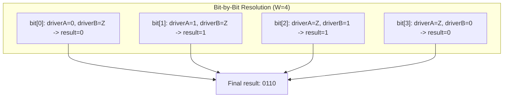
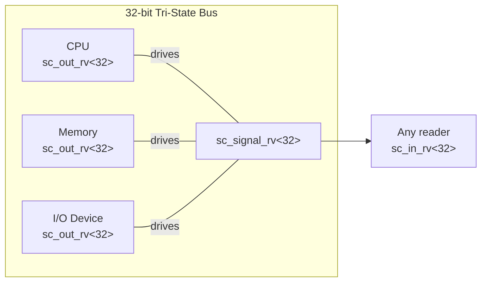

# sc_signal_rv.h - Resolved Vector Signal Channel

## Overview

`sc_signal_rv<W>` is the multi-bit version of `sc_signal_resolved`. It allows multiple processes to write simultaneously to a W-bit-wide `sc_lv<W>` (logic vector) signal, calculating the final value through bit-by-bit resolution using the resolution table.

Simply put: `sc_signal_resolved` handles 1-bit multi-driver, `sc_signal_rv<W>` handles W-bit multi-driver.

## Core Concept / Everyday Analogy

### Electronic Signboard Controlled by Multiple People

Imagine an electronic signboard with 8 light bulbs (W=8), controlled by multiple controllers simultaneously:

- Controller A wants the signboard to show `01ZZ ZZZZ` (only cares about the first two lights)
- Controller B wants the signboard to show `ZZZZ ZZ10` (only cares about the last two lights)
- Resolution result: `01ZZ ZZ10` (Z positions are determined by the controller actually driving)

Each bit's resolution logic is identical to `sc_signal_resolved`, just applied to W bits at once.

## Detailed Class Description

### `sc_lv_resolve<W>` - Resolution Function Class

```cpp
template <int W>
class sc_lv_resolve
{
public:
    static void resolve(sc_dt::sc_lv<W>&, const std::vector<sc_dt::sc_lv<W>*>&);
};
```

Static method that performs bit-by-bit resolution on `sc_lv<W>` vectors:

```cpp
for (int j = result_.length() - 1; j >= 0; --j) {
    sc_dt::sc_logic_value_t res = (*values_[0])[j].value();
    for (int i = sz - 1; i > 0 && res != 3; --i) {
        res = sc_logic_resolution_tbl[res][(*values_[i])[j].value()];
    }
    result_[j] = res;
}
```

- Outer loop iterates over each bit
- Inner loop resolves that bit across all driver sources
- `res != 3` (3 = `Log_X`) is an early termination optimization: once the result is X, no need to look further



### `sc_signal_rv<W>` - Resolved Vector Signal

```cpp
template <int W>
class sc_signal_rv
: public sc_signal<sc_dt::sc_lv<W>, SC_MANY_WRITERS>
```

#### Constructors

| Constructor | Description |
|-------------|-------------|
| `sc_signal_rv()` | Auto-named `"signal_rv_0"` etc. |
| `sc_signal_rv(const char* name_)` | Named, initial value is empty vector |
| `sc_signal_rv(const char* name_, const value_type& initial_value_)` | Named with initial value |

#### `register_port()` - No Restriction

```cpp
virtual void register_port(sc_port_base&, const char*) {}
```

Same as `sc_signal_resolved`, empty implementation allowing any number of port connections.

#### `write()` - Multi-Driver Write

```cpp
void sc_signal_rv<W>::write(const value_type& value_)
```

Logic is almost identical to `sc_signal_resolved::write()`:
1. Get current process pointer
2. Search for the process in `m_proc_vec`
3. If found, update the value; if not found, add new entry
4. `request_update()` if value changed

Key difference: `m_val_vec` stores `value_type*` (pointers) rather than values, so `new` is needed to allocate memory.

#### `update()` - Resolution Update

```cpp
void sc_signal_rv<W>::update()
{
    sc_lv_resolve<W>::resolve(this->m_new_val, m_val_vec);
    base_type::update();
}
```

#### Destructor

```cpp
sc_signal_rv<W>::~sc_signal_rv()
{
    for (int i = m_val_vec.size() - 1; i >= 0; --i) {
        delete m_val_vec[i];
    }
}
```

Because `m_val_vec` stores pointers, memory must be manually freed during destruction.

### Member Variables

| Variable | Type | Description |
|----------|------|-------------|
| `m_proc_vec` | `std::vector<sc_process_b*>` | List of processes writing to this signal |
| `m_val_vec` | `std::vector<value_type*>` | Values written by each process (pointers) |

## Comparison with `sc_signal_resolved`

| Property | `sc_signal_resolved` | `sc_signal_rv<W>` |
|----------|---------------------|-------------------|
| Data type | `sc_logic` (1 bit) | `sc_lv<W>` (W bits) |
| Resolution function | `sc_logic_resolve` | `sc_lv_resolve<W>::resolve` |
| Value storage | `vector<value_type>` (values) | `vector<value_type*>` (pointers) |
| Template parameter | None | `W` (bit width) |
| Definition form | Non-template class | Template class |

## Design Rationale / RTL Background

### Multi-Bit Tri-State Bus

A typical hardware scenario: a 32-bit data bus shared by multiple devices.



Each device outputs all Z (high impedance) when not using the bus, and outputs actual data values when using the bus.

### Why use pointers for value storage?

`sc_signal_resolved` uses value storage (`vector<value_type>`), while `sc_signal_rv` uses pointer storage (`vector<value_type*>`). This is likely because `sc_lv<W>` objects can be large (W may be very large), and using pointers avoids extensive copying when the vector resizes.

## Related Files

- `sc_signal_rv_ports.h` - Resolved vector signal specific ports
- `sc_signal_resolved.h` - Single-bit resolved signal
- `sc_signal.h` - Base signal channel
- `sc_lv.h` (datatypes) - Logic vector type
