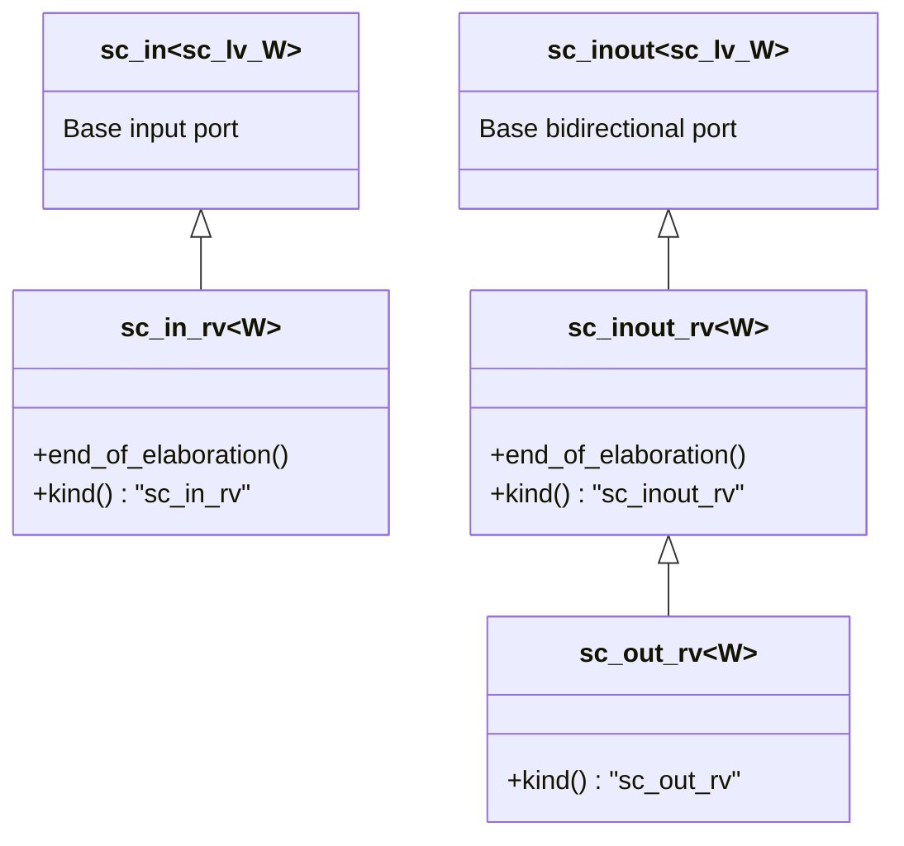
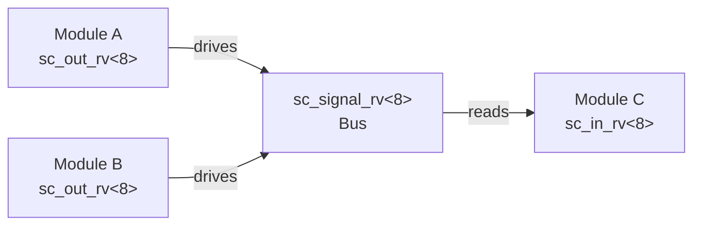

# sc_signal_rv_ports.h - Resolved Vector Signal Specific Ports

## Overview

This file defines three port classes specific to `sc_signal_rv<W>`: `sc_in_rv<W>` (input), `sc_inout_rv<W>` (bidirectional), and `sc_out_rv<W>` (output). They are the multi-bit generalization of `sc_signal_resolved_ports`, checking at elaboration time that the bound channel is indeed `sc_signal_rv<W>`.

## Core Concept / Everyday Analogy

### Multi-Wire Specialized Connectors

Just like `sc_signal_resolved_ports` are single-wire specialized connectors, `sc_signal_rv_ports` are **multi-wire** specialized connectors. You cannot plug a 32-pin ribbon cable into a 1-pin socket; the type system and elaboration checks will catch such errors.

## Class Inheritance Hierarchy



## Detailed Class Descriptions

### `sc_in_rv<W>` - Resolved Vector Input Port

```cpp
template <int W>
class sc_in_rv : public sc_in<sc_dt::sc_lv<W>>
```

#### Elaboration Check

```cpp
template <int W>
void sc_in_rv<W>::end_of_elaboration()
{
    base_type::end_of_elaboration();
    if (dynamic_cast<sc_signal_rv<W>*>(this->get_interface()) == 0) {
        this->report_error(SC_ID_RESOLVED_PORT_NOT_BOUND_, 0);
    }
}
```

Confirms the bound channel is `sc_signal_rv<W>` rather than a plain `sc_signal<sc_lv<W>>`.

### `sc_inout_rv<W>` - Resolved Vector Bidirectional Port

```cpp
template <int W>
class sc_inout_rv : public sc_inout<sc_dt::sc_lv<W>>
```

Same elaboration check as `sc_in_rv`, but additionally provides write functionality.

### `sc_out_rv<W>` - Resolved Vector Output Port

```cpp
template <int W>
class sc_out_rv : public sc_inout_rv<W>
```

Inherits from `sc_inout_rv<W>`. Source code comment: "`sc_out_rv` can also read from the port, so it is no different from `sc_inout_rv`. A separate class is provided for debugging purposes."

Does not need to override `end_of_elaboration()`.

## Comparison with `sc_signal_resolved_ports`

| Property | resolved ports | rv ports |
|----------|---------------|----------|
| Data type | `sc_logic` | `sc_lv<W>` |
| Template | Non-template class | Template class (parameter W) |
| Check target | `sc_signal_resolved` | `sc_signal_rv<W>` |
| Definition location | `.h` + `.cpp` | `.h` only (templates must be fully defined in headers) |

### Why do rv ports have no .cpp file?

Because they are template classes. C++ templates must have their complete definitions in header files; the compiler needs to see the entire implementation to generate code for specific widths. `sc_signal_resolved_ports` are non-template classes, so their implementation can be placed in .cpp files.

## Constructors

All three classes provide constructor sets consistent with the base class:

- Default construction
- Named construction
- Interface binding
- Port binding
- Named combinations of the above

## Conceptual Usage Example

```cpp
// Module declaration
sc_in_rv<8>   data_in;    // 8-bit resolved vector input
sc_out_rv<8>  data_out;   // 8-bit resolved vector output

// Top-level connection
sc_signal_rv<8> bus;       // 8-bit resolved vector bus
module_a.data_out(bus);    // Module A drives the bus
module_b.data_out(bus);    // Module B also drives the bus (multi-driver)
module_c.data_in(bus);     // Module C reads the bus
```



## Related Files

- `sc_signal_rv.h` - Resolved vector signal channel
- `sc_signal_resolved_ports.h` - Single-bit resolved signal ports
- `sc_signal_ports.h` - Base signal ports
- `sc_lv.h` (datatypes) - Logic vector type
