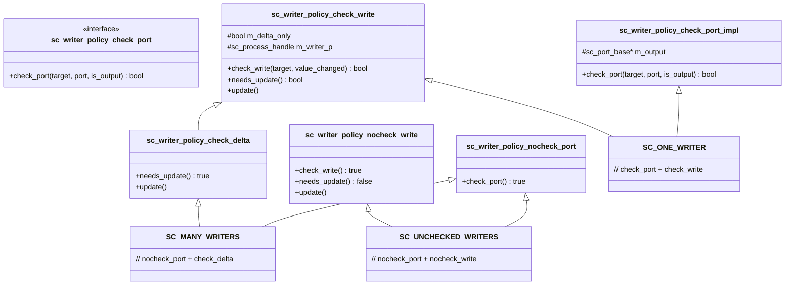
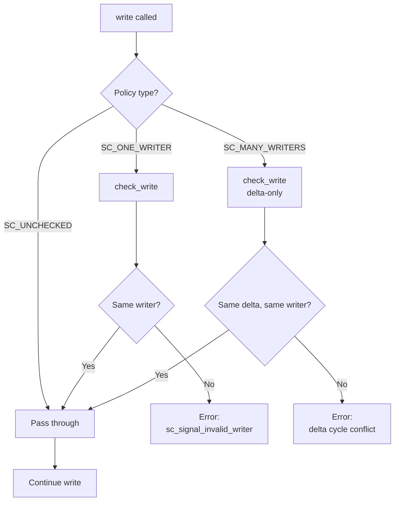

# sc_writer_policy -- Signal Writer Policy

## Overview

`sc_writer_policy.h` defines the writer checking policy for `sc_signal`. In hardware design, a wire is typically driven by only one driver. SystemC simulates this constraint at the software level through writer policies, with three levels of checking to choose from.

**Source file:** `sc_writer_policy.h` (header-only)

## Everyday Analogy

Think of a whiteboard:
- **SC_ONE_WRITER** (exclusive use): Only one person can write on this whiteboard; others are stopped if they try to pick up the pen. The sole writer is determined during renovation (elaboration).
- **SC_MANY_WRITERS** (turn-taking): Multiple people can write, but only one person can write at any given instant (delta cycle). If two people pick up pens simultaneously, an error is reported.
- **SC_UNCHECKED_WRITERS** (free use): Anyone can write with no checking at all. Fast but dangerous.

## Policy Enumeration

```cpp
enum sc_writer_policy
{
    SC_ONE_WRITER        = 0, // Single writer (from a single output port)
    SC_MANY_WRITERS      = 1, // Multiple writers allowed (different ports)
    SC_UNCHECKED_WRITERS = 3  // Delta cycle conflicts allowed (non-standard)
};
```

The default policy depends on compile options:
- If `SC_NO_WRITE_CHECK` is defined -> defaults to `SC_UNCHECKED_WRITERS`
- Otherwise -> defaults to `SC_ONE_WRITER`

## Policy Composition Structure



## Detailed Policy Descriptions

### SC_ONE_WRITER - Single Writer

**Port check (`check_port`):**
- Records the first output port during `register_port()`
- Reports an error if a second output port attempts to bind

**Write check (`check_write`):**
- Records the first writing process
- Reports an error if a different process attempts to write

This is the strictest policy, corresponding to the hardware rule "one wire can only have one driver".

### SC_MANY_WRITERS - Multiple Writers

**Port check:** No check (allows multiple output ports to bind)

**Write check (`check_delta`):**
- Resets the writer record each delta cycle
- Within the same delta cycle, only one process is allowed to write
- Different processes can write in different delta cycles

```cpp
struct sc_writer_policy_check_delta : sc_writer_policy_check_write
{
    bool needs_update() const { return true; }  // always force update
    void update() { sc_process_handle().swap( m_writer_p ); }  // reset writer
};
```

### SC_UNCHECKED_WRITERS - No Checking

**Port check:** No check
**Write check:** No check

Best performance but least safe. Used in scenarios where conflicts are guaranteed not to occur, or when maximum performance is needed.

## Checking Flow



## Integration with `sc_signal`

`sc_signal_t<T, POL>` gains policy functionality through protected inheritance:

```cpp
template< class T, sc_writer_policy POL >
class sc_signal_t
  : public    sc_signal_inout_if<T>
  , public    sc_signal_channel
  , protected sc_writer_policy_check<POL>  // policy mixin
{
    // ...
};
```

Policy methods are called at three points:
1. `register_port()` -> `check_port()` - Check at binding time
2. `write()` -> `check_write()` - Check at write time
3. `update()` -> `update()` - Reset at update time (SC_MANY_WRITERS)

## Design Notes

### Why are three policies needed?

| Policy | Use Case | Hardware Correspondence |
|--------|----------|----------------------|
| SC_ONE_WRITER | Regular signal wires | Single driver |
| SC_MANY_WRITERS | Bus arbitration | Tri-state bus |
| SC_UNCHECKED_WRITERS | Performance testing | None |

### Why is SC_MANY_WRITERS enum value 1 and SC_UNCHECKED_WRITERS 3?

These values are not consecutive; space is reserved between them for potential future policies. Value 2 is reserved and unused.

## Related Files

- `sc_signal.h` - Signal channel using writer policies
- `sc_signal_ifs.h` - `sc_signal_write_if` references `sc_writer_policy`
- `sc_port.h` - Port binding triggers `check_port()`
