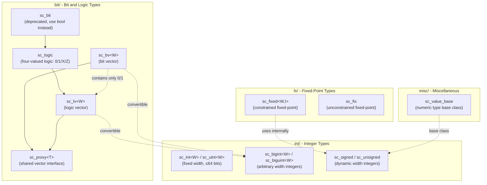
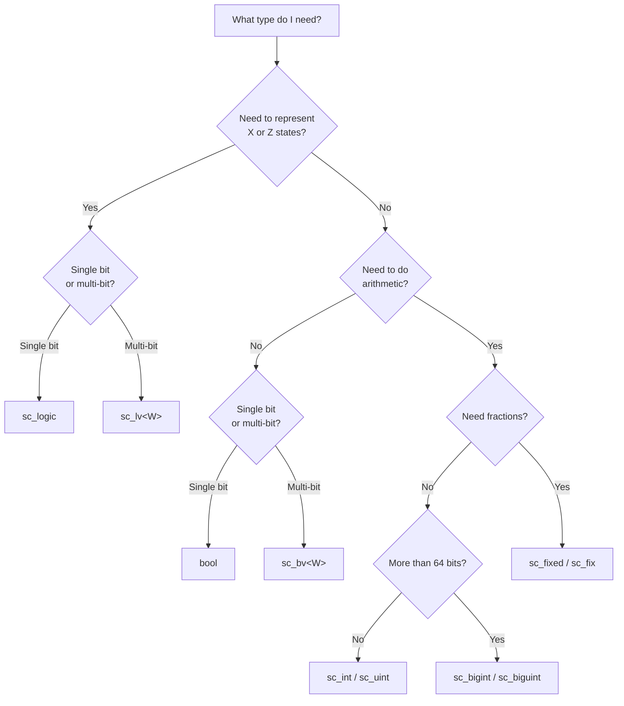

# SystemC Data Types Overview - datatypes Directory

This directory contains all hardware simulation data type implementations in SystemC. These types are what distinguishes SystemC from ordinary C++ libraries: they allow software engineers to precisely describe digital signals in hardware circuits using C++.

## Why Do We Need Special Data Types?

Imagine you're building a house with LEGO bricks. Regular C++ types (`int`, `bool`) are like fixed-size LEGO bricks—you can only use 8-bit, 16-bit, 32-bit, or 64-bit. But in hardware design, you might need a 13-bit counter or a 128-bit bus. SystemC's data types are like LEGO bricks that can be cut to any size.

Furthermore, in real circuits, a wire doesn't just have two states of 0 and 1—it can also be in a "high impedance" (Z) or "unknown" (X) state. This is like a traffic light that, besides red and green, could also malfunction (unknown) or be completely off (high impedance).

## Subdirectory Overview

| Subdirectory | Purpose | Everyday Analogy |
|--------|------|----------|
| `bit/` | Bit and logic vector types | An array of switches—each switch can be on/off (two-valued) or on/off/disconnected/unknown (four-valued) |
| `int/` | Arbitrary-width integer types | A resizable numeric calculator, supporting signed/unsigned with any bit width |
| `fx/`  | Fixed-point number types | A hardware calculator with decimal points, used for DSP and scenarios requiring precise fractional arithmetic |
| `misc/`| Miscellaneous utility types | A utility toolbox containing value representation conversion and other common functions |

## Relationships Between Types

## How to Choose the Right Type?

## Related Files

- `bit/` - [Bit and logic types detailed documentation](bit/_index.md)
- `int/` - Integer types (sc_int, sc_uint, sc_bigint, sc_biguint, sc_signed, sc_unsigned)
- `fx/` - Fixed-point types (sc_fixed, sc_ufixed, sc_fix, sc_ufix)
- `misc/` - Miscellaneous utilities (sc_value_base, sc_concatref)
