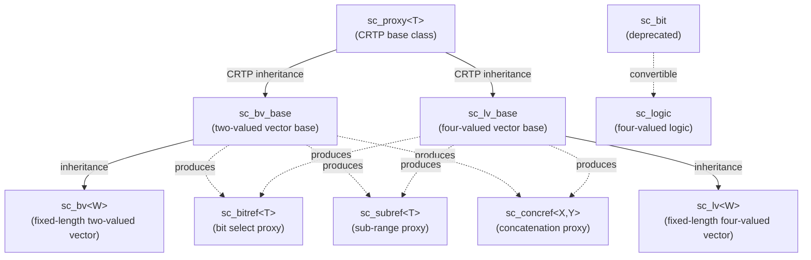

# Bit and Logic Types - bit Directory

This directory implements all bit and logic related data types in SystemC, forming the foundation of digital signal simulation in hardware.

## Everyday Analogy

Imagine a light switch control panel in a building:

- **`sc_bit`** / **`bool`**: The simplest switch -- only two states: "on" and "off". Just like a light switch at home.
- **`sc_logic`**: An advanced four-position switch -- besides "on" (1) and "off" (0), there is also "disconnected" (Z, high impedance) and "uncertain" (X, unknown). Like a traffic signal that might be broken.
- **`sc_bv<W>`**: A row of simple switches -- W switches lined up, each with only on/off. Like the switch panel for a row of classroom lights.
- **`sc_lv<W>`**: A row of advanced switches -- W four-position switches lined up. Like a large control panel in a control center, where each switch can be in one of four states.

## File Overview

| File | Class | Description |
|------|-------|-------------|
| `sc_bit.h/.cpp` | `sc_bit` | Single-bit class (deprecated, use `bool` instead) |
| `sc_logic.h/.cpp` | `sc_logic` | Four-valued logic class (0, 1, X, Z) |
| `sc_bv_base.h/.cpp` | `sc_bv_base` | Two-valued bit vector base class (dynamic length) |
| `sc_bv.h` | `sc_bv<W>` | Two-valued bit vector template class (compile-time fixed length) |
| `sc_lv_base.h/.cpp` | `sc_lv_base` | Four-valued logic vector base class (dynamic length) |
| `sc_lv.h` | `sc_lv<W>` | Four-valued logic vector template class (compile-time fixed length) |
| `sc_proxy.h` | `sc_proxy<T>` | CRTP base class for vector types, providing common operations |
| `sc_bit_proxies.h` | Multiple proxy classes | Proxy classes for bit select, sub-range select, and concatenation |
| `sc_bit_ids.h` | Error message IDs | Defines error/warning message codes used by the bit module |

## Class Inheritance Hierarchy



## Two-Valued vs Four-Valued

| Property | Two-valued (sc_bv) | Four-valued (sc_lv) |
|----------|-------------------|-------------------|
| Possible values | 0, 1 | 0, 1, X, Z |
| Memory usage | Less (only data bits needed) | More (data bits + control bits needed) |
| Performance | Faster | Slower |
| Use cases | Pure digital logic | Tri-state buses, uninitialized signals |
| `is_01()` | Always returns `true` | Needs checking |

## Internal Storage

Vector types internally use `sc_digit` (typically `unsigned int`, 32 bits) arrays to store bits:

- **`sc_bv_base`**: Has only one `m_data[]` array, each bit occupies one bit position
- **`sc_lv_base`**: Has two arrays `m_data[]` (data) and `m_ctrl[]` (control), combined to represent four states

```
sc_lv encoding:
  data=0, ctrl=0 => '0'
  data=1, ctrl=0 => '1'
  data=0, ctrl=1 => 'Z'
  data=1, ctrl=1 => 'X'
```

## Related Files

- [sc_bit.md](sc_bit.md) - Single-bit class (deprecated)
- [sc_logic.md](sc_logic.md) - Four-valued logic class
- [sc_bv_base.md](sc_bv_base.md) - Two-valued vector base class
- [sc_bv.md](sc_bv.md) - Fixed-length two-valued vector template
- [sc_lv_base.md](sc_lv_base.md) - Four-valued vector base class
- [sc_lv.md](sc_lv.md) - Fixed-length four-valued vector template
- [sc_proxy.md](sc_proxy.md) - Common interface base for vectors
- [sc_bit_proxies.md](sc_bit_proxies.md) - Bit/sub-range/concatenation proxy classes
- [sc_bit_ids.md](sc_bit_ids.md) - Error message ID definitions
