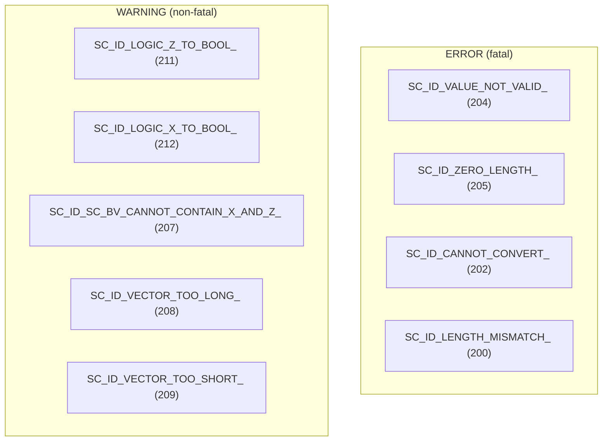

# sc_bit_ids - Bit Module Error and Warning Message IDs

## Overview

`sc_bit_ids.h` defines all error and warning message IDs used in the `datatypes/bit` module. Each ID corresponds to a specific error scenario and is used by SystemC's reporting system (`SC_REPORT_ERROR` / `SC_REPORT_WARNING`).

**Source file:** `sc_bit_ids.h`

## Everyday Analogy

This file is like an "error code handbook". Just like hospital diagnostic codes -- each code corresponds to a specific problem, making it easy for doctors (developers) to quickly identify and handle issues.

## Message ID List

All IDs have numeric values in the range 200-299, belonging to the `datatypes/bit` module.

| ID | Value | Message | Trigger Scenario |
|----|-------|---------|-----------------|
| `SC_ID_LENGTH_MISMATCH_` | 200 | "length mismatch in bit/logic vector assignment" | Assigning vectors of different lengths |
| `SC_ID_INCOMPATIBLE_TYPES_` | 201 | "incompatible types" | Incompatible type operations |
| `SC_ID_CANNOT_CONVERT_` | 202 | "cannot perform conversion" | String conversion failure (empty string, illegal characters, etc.) |
| `SC_ID_INCOMPATIBLE_VECTORS_` | 203 | "incompatible vectors" | Incompatibility in vector operations |
| `SC_ID_VALUE_NOT_VALID_` | 204 | "value is not valid" | `sc_bit` or `sc_logic` receives an illegal value |
| `SC_ID_ZERO_LENGTH_` | 205 | "zero length" | Creating a vector with length 0 |
| `SC_ID_VECTOR_CONTAINS_LOGIC_VALUE_` | 206 | "vector contains 4-value logic" | Four-valued vector attempts conversion to two-valued |
| `SC_ID_SC_BV_CANNOT_CONTAIN_X_AND_Z_` | 207 | "sc_bv cannot contain values X and Z" | `sc_bv` tries to store X or Z |
| `SC_ID_VECTOR_TOO_LONG_` | 208 | "vector is too long: truncated" | Source vector is too long during assignment, gets truncated |
| `SC_ID_VECTOR_TOO_SHORT_` | 209 | "vector is too short: 0-padded" | Source vector is too short during assignment, gets 0-padded |
| `SC_ID_WRONG_VALUE_` | 210 | "wrong value" | General value error |
| `SC_ID_LOGIC_Z_TO_BOOL_` | 211 | "sc_logic value 'Z' cannot be converted to bool" | `sc_logic(Z).to_bool()` |
| `SC_ID_LOGIC_X_TO_BOOL_` | 212 | "sc_logic value 'X' cannot be converted to bool" | `sc_logic(X).to_bool()` |

## Usage

### SC_DEFINE_MESSAGE Macro

```cpp
SC_DEFINE_MESSAGE(SC_ID_VALUE_NOT_VALID_, 204, "value is not valid")
```

This macro expands to declare an external string constant in the `sc_core` namespace. The actual string definition is in `sc_report_handler.cpp`.

### Triggering in Code

```cpp
// in sc_bit.cpp
void sc_bit::invalid_value(char c) {
    std::stringstream msg;
    msg << "sc_bit( '" << c << "' )";
    SC_REPORT_ERROR(sc_core::SC_ID_VALUE_NOT_VALID_, msg.str().c_str());
}

// in sc_logic.cpp
void sc_logic::invalid_01() const {
    if ((int)m_val == Log_Z) {
        SC_REPORT_WARNING(sc_core::SC_ID_LOGIC_Z_TO_BOOL_, 0);
    } else {
        SC_REPORT_WARNING(sc_core::SC_ID_LOGIC_X_TO_BOOL_, 0);
    }
}
```

## Severity Classification



- **ERROR**: Typically aborts the simulation (calls `sc_abort()`), indicating a serious program error
- **WARNING**: Simulation continues, but results may be incorrect and need developer attention

## Design Rationale

Centrally defining error IDs has several benefits:

1. **Uniqueness**: Each ID has a unique numeric value, making it easy to search quickly in logs
2. **Modularity**: The 200-299 range is exclusive to the bit module, avoiding conflicts with other modules
3. **Configurability**: Users can customize the behavior of certain errors through `SC_REPORT_HANDLER` (e.g., change a WARNING to an ERROR, or suppress a WARNING)

## Related Files

- [sc_bit.md](sc_bit.md) - Uses `SC_ID_VALUE_NOT_VALID_`
- [sc_logic.md](sc_logic.md) - Uses `SC_ID_VALUE_NOT_VALID_`, `SC_ID_LOGIC_Z_TO_BOOL_`, `SC_ID_LOGIC_X_TO_BOOL_`
- [sc_bv_base.md](sc_bv_base.md) - Uses `SC_ID_ZERO_LENGTH_`, `SC_ID_CANNOT_CONVERT_`, `SC_ID_SC_BV_CANNOT_CONTAIN_X_AND_Z_`
- [sc_lv_base.md](sc_lv_base.md) - Uses `SC_ID_ZERO_LENGTH_`
- Source: `ref/systemc/src/sysc/datatypes/bit/sc_bit_ids.h`
