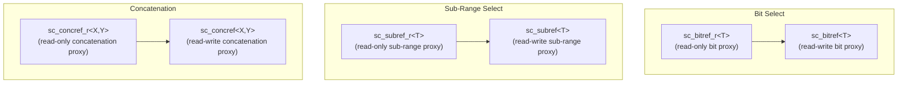
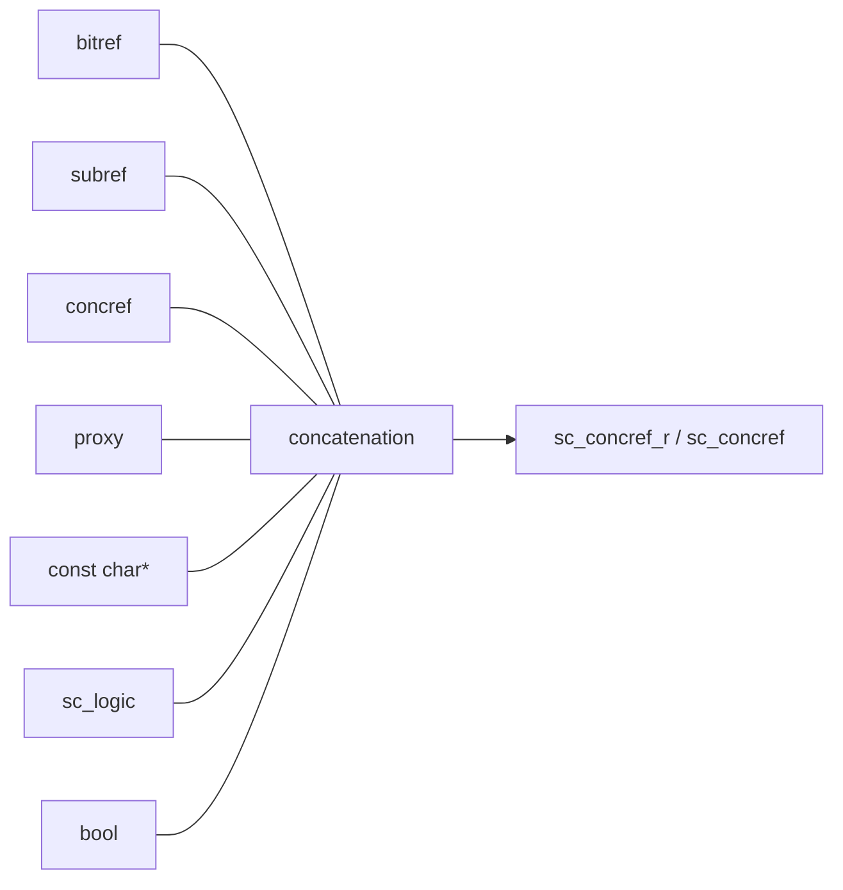

# sc_bit_proxies - Bit Select, Sub-Range, and Concatenation Proxy Classes

## Overview

`sc_bit_proxies.h` defines a series of proxy classes that implement three access operations on bit vectors: single bit select, sub-range select (part select), and concatenation. These proxy classes let you manipulate parts of a bit vector using intuitive syntax.

**Source file:** `sc_bit_proxies.h` (header only, approximately 3930 lines)

## Everyday Analogy

Imagine you have a row of lockers (bit vector); proxy classes are like different "retrieval methods":

- **`sc_bitref`** (bit select): You open a single locker and take out or put in something. Like `locker[3]` -- operating on locker number 3 only.
- **`sc_subref`** (sub-range select): You open several consecutive lockers at once. Like `locker.range(7, 4)` -- operating on lockers 4 through 7.
- **`sc_concref`** (concatenation): You join two different rows of lockers together and treat them as one row. Like `(lockerA, lockerB)` -- concatenating row A and row B into one row.

## Key Concepts

### Why Are Proxy Classes Needed?

In C++, the return value of `operator[]` cannot simultaneously support both reading and writing (l-value and r-value semantics differ). Proxy classes solve this problem:

```cpp
sc_bv<8> vec("10110011");
// vec[3] returns sc_bitref<sc_bv_base>, not bool
// This proxy can:
//   - be read:  bool b = vec[3];         (implicit conversion)
//   - be written: vec[3] = true;          (assignment operator)
//   - be used in expressions: vec[3] & vec[2]
```

### r-value vs l-value Proxies

Each proxy comes in two versions:

- **`_r` version** (read-only): Can only read, not modify. Used for `const` objects.
- **Unsuffixed version** (read-write): Inherits from the `_r` version and adds write capability.



## Class Details

### sc_bitref_r<T> / sc_bitref<T> - Bit Select Proxy

```cpp
// Internal: stores reference to parent object + bit index
T&  m_obj;    // reference to parent vector
int m_index;  // bit position
```

**Key methods:**

```cpp
// r-value operations
value_type value() const;          // get bit value (0,1,X,Z)
bool is_01() const;                // check if 0 or 1
bool to_bool() const;              // convert to bool
char to_char() const;              // convert to char
bit_type operator ~ () const;      // bitwise complement
operator bit_type() const;         // implicit conversion to logic

// l-value operations (sc_bitref only)
sc_bitref<T>& operator = (value_type v);
sc_bitref<T>& operator = (const sc_logic& v);
sc_bitref<T>& operator &= (value_type v);
sc_bitref<T>& operator |= (value_type v);
sc_bitref<T>& operator ^= (value_type v);
```

**sc_bitref_conv_r<T>**: A helper class that provides implicit conversion to `bool` and `operator!` for bit proxies of `sc_bv_base` (two-valued vectors). Because bits of a two-valued vector are always 0 or 1, conversion to `bool` is safe.

### sc_subref_r<T> / sc_subref<T> - Sub-Range Select Proxy

```cpp
// Internal: stores reference to parent + range
T&  m_obj;   // reference to parent vector
int m_hi;    // high bit index
int m_lo;    // low bit index
int m_len;   // length = hi - lo + 1
```

The sub-range proxy lets you treat a segment of a vector as an independent vector:

```cpp
sc_lv<16> data("1010110011001100");
// data.range(11, 8) returns sc_subref, representing bits 8-11
sc_lv<4> nibble = data.range(11, 8);  // "1100"
data.range(11, 8) = "0101";           // modify in place
```

**Key methods:**

```cpp
int length() const;                // sub-range length
value_type get_bit(int i) const;   // get bit relative to sub-range
sc_digit get_word(int i) const;    // get word (packed bits)
sc_digit get_cword(int i) const;   // get control word

// l-value operations
void set_bit(int i, value_type v);
void set_word(int i, sc_digit w);
void set_cword(int i, sc_digit w);
```

### sc_concref_r<X,Y> / sc_concref<X,Y> - Concatenation Proxy

```cpp
// Internal: stores references to two parts
X& m_left;   // left (high) part
Y& m_right;  // right (low) part
int m_len;   // total length = left.length() + right.length()
```

The concatenation proxy joins two vectors (or proxies) together:

```cpp
sc_lv<4> high("1010");
sc_lv<4> low("0011");
// (high, low) returns sc_concref, representing "10100011"
sc_lv<8> full = (high, low);
```

**Key methods:**

```cpp
int length() const;                // total length
value_type get_bit(int i) const;   // get bit from combined view

// l-value operations
void set_bit(int i, value_type v);
```

Bit index mapping: low bits (index < right.length()) map to the right vector, high bits map to the left vector.

## Concatenation Operators

The file defines a large number of `operator,` and `concat()` function overloads to handle all possible combinations:



Any two concatenatable objects can be concatenated using `(a, b)` or `concat(a, b)`.

## Design Rationale / RTL Background

In Verilog, bit select, sub-range, and concatenation are built-in language syntax:

```verilog
wire [7:0] data;
wire bit3 = data[3];           // bit select
wire [3:0] nibble = data[7:4]; // part select
wire [15:0] wide = {data, data}; // concatenation
```

SystemC uses C++ operator overloading and proxy classes to simulate these operations. Although the code is much more complex than Verilog (approximately 3900 lines), it provides the same functionality and similar syntax.

The key design principle of proxy classes is "deferred evaluation" -- `vec[3]` does not immediately copy a bit, but returns a proxy object that knows "where to find the bit". This is especially important in l-value contexts (e.g., `vec[3] = 1`).

## Related Files

- [sc_proxy.md](sc_proxy.md) - Base class for proxies, defines methods like `operator[]` and `range()`
- [sc_bv_base.md](sc_bv_base.md) - Two-valued vector, uses these proxy classes
- [sc_lv_base.md](sc_lv_base.md) - Four-valued vector, uses these proxy classes
- [sc_bit_ids.md](sc_bit_ids.md) - Error message definitions
- Source: `ref/systemc/src/sysc/datatypes/bit/sc_bit_proxies.h`
