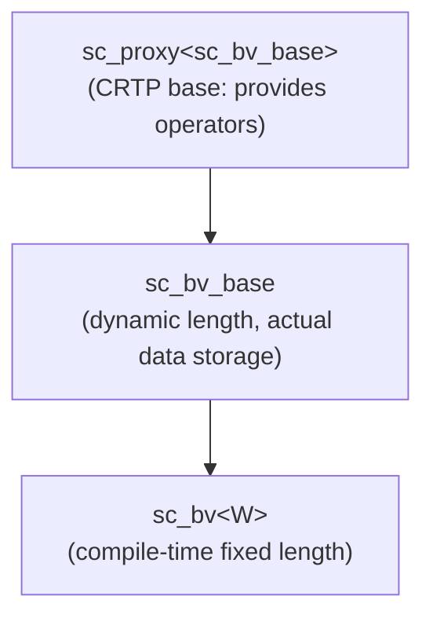

# sc_bv<W> - Fixed-Length Two-Valued Bit Vector

## Overview

`sc_bv<W>` is a template class providing a two-valued bit vector with a compile-time fixed length of W bits. It inherits from `sc_bv_base`, where the template parameter `W` determines the vector width at compile time. This is one of the most commonly used bit vector types in SystemC.

**Source file:** `sc_bv.h` (header only, no .cpp)

## Everyday Analogy

If `sc_bv_base` is "a switch panel that can be cut to any length", then `sc_bv<W>` is "a switch panel with a factory-fixed length". For example, `sc_bv<8>` is an 8-slot switch panel -- you cannot change its length at runtime.

It is like buying clothes: `sc_bv_base` is fabric (can be custom-tailored), while `sc_bv<W>` is ready-to-wear (fixed size, but more convenient to use).

## Key Concepts

### Why Is the Template Version Needed?

1. **Type safety**: `sc_bv<8>` and `sc_bv<16>` are different types, so the compiler can check bit widths at compile time
2. **Hardware correspondence**: Signal widths in hardware are determined at design time; expressing them as template parameters is the most natural approach
3. **Performance**: The compiler may optimize for fixed lengths

### Thin Wrapper

`sc_bv<W>` has almost no logic of its own -- it simply passes `W` to the `sc_bv_base` constructor, then delegates all operations to the base class. This design pattern is called a "thin wrapper".

## Class Interface

### Constructors

```cpp
sc_bv();                              // all bits = 0
explicit sc_bv(bool init_value);      // all bits = init_value
explicit sc_bv(char init_value);      // '0' or '1'
sc_bv(const char* a);                 // from string
sc_bv(const bool* a);                 // from bool array
sc_bv(const sc_logic* a);             // from logic array
sc_bv(const sc_unsigned& a);          // from integer types
sc_bv(const sc_signed& a);
sc_bv(unsigned long a);
sc_bv(long a);
sc_bv(int a);
sc_bv(uint64 a);
sc_bv(int64 a);
sc_bv(const sc_proxy<X>& a);         // from any proxy
sc_bv(const sc_bv<W>& a);            // copy
```

All constructors follow the same pattern: first initialize the base class `sc_bv_base` with `W`, then set the value using `sc_bv_base::operator=`.

### Assignment Operators

```cpp
sc_bv<W>& operator = (const sc_proxy<X>& a);
sc_bv<W>& operator = (const sc_bv<W>& a);
sc_bv<W>& operator = (const char* a);
sc_bv<W>& operator = (const bool* a);
sc_bv<W>& operator = (const sc_logic* a);
sc_bv<W>& operator = (const sc_unsigned& a);
sc_bv<W>& operator = (unsigned long a);
sc_bv<W>& operator = (int a);
// ... etc
```

All assignment operators simply call `sc_bv_base::operator=` and return `*this`.

## Usage Examples

```cpp
// 8-bit bus
sc_bv<8> data_bus;
data_bus = "10110011";

// 32-bit register
sc_bv<32> reg_value = 0x12345678;

// bit operations (inherited from sc_proxy)
sc_bv<8> a("11001100");
sc_bv<8> b("10101010");
sc_bv<8> c = a & b;   // "10001000"
sc_bv<8> d = a | b;   // "11101110"
sc_bv<8> e = ~a;      // "00110011"

// single bit access
bool bit0 = a[0];     // returns sc_bitref proxy

// sub-range access
sc_bv<4> nibble = a.range(7, 4);  // upper nibble
```

## Inheritance Structure



## Design Rationale / RTL Background

In hardware design, every signal's width must be determined before synthesis. For example, an 8-bit register or a 32-bit bus -- the widths are all fixed. The template parameter `W` of `sc_bv<W>` precisely corresponds to this concept.

Differences from `std::bitset<N>`:
- `sc_bv<W>` supports SystemC's signal system (can be bound to `sc_signal<sc_bv<W>>`)
- `sc_bv<W>` supports string format conversion (binary, octal, hexadecimal)
- `sc_bv<W>` supports interconversion with `sc_lv<W>` and integer types
- `sc_bv<W>` supports bit select and sub-range proxy objects

## Related Files

- [sc_bv_base.md](sc_bv_base.md) - Base class containing all implementation details
- [sc_lv.md](sc_lv.md) - Four-valued version `sc_lv<W>`
- [sc_proxy.md](sc_proxy.md) - CRTP base providing bitwise operations and comparisons
- Source: `ref/systemc/src/sysc/datatypes/bit/sc_bv.h`
