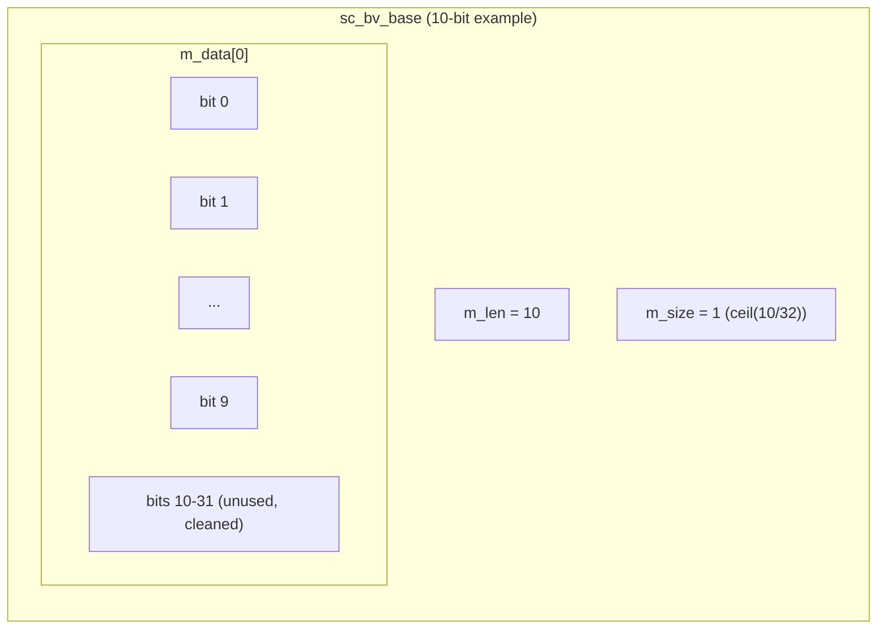
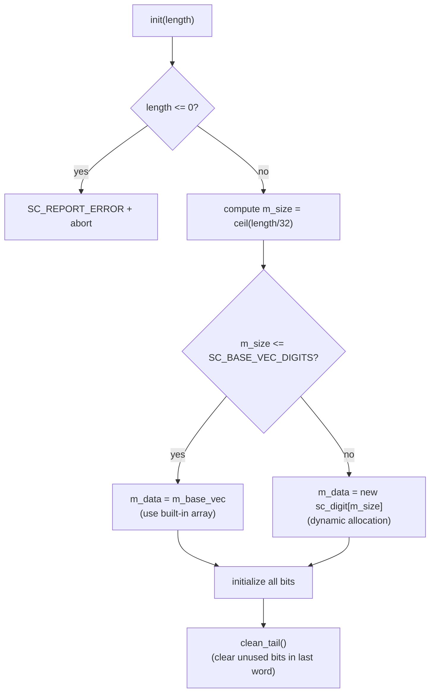

# sc_bv_base - Arbitrary-Width Two-Valued Bit Vector Base Class

## Overview

`sc_bv_base` is an arbitrary-width two-valued (0 and 1 only) bit vector base class. It is the non-template base of the `sc_bv<W>` template class, responsible for all actual data storage and operation logic. It inherits from `sc_proxy<sc_bv_base>`, gaining a rich bitwise operation interface.

**Source file:** `sc_bv_base.h` + `sc_bv_base.cpp`

## Everyday Analogy

Imagine a row of light switch panels. `sc_bv_base` is like an "adjustable-length switch panel" -- you can specify how many switches the panel has (each with only on/off), and the panel automatically allocates enough space to store all switch states.

If you need 100 switches, the panel internally uses several 32-slot drawers (`sc_digit`) to store them -- requiring 4 drawers (4 x 32 = 128 slots, with extra slots ignored).

## Key Concepts

### Differences from sc_lv_base

`sc_bv_base` stores only 0 and 1, without X and Z. This means:

- Memory usage is half that of `sc_lv_base` (no control bit array needed)
- `is_01()` always returns `true`
- Attempting to set X or Z values triggers a warning
- Better performance, suitable for pure digital logic scenarios

### Internal Storage Structure



### Small Vector Optimization (SVO)

`sc_bv_base` has a built-in fixed-size `m_base_vec` array. If the vector is small enough (no more than `SC_BASE_VEC_DIGITS` digits), it uses this built-in array directly, avoiding heap memory allocation. Dynamic allocation (`new sc_digit[m_size]`) is used only for larger vectors.

It is like: small items go straight into your pocket (built-in space), while large items require renting a suitcase (dynamic allocation).

## Class Interface

### Constructors

```cpp
explicit sc_bv_base(int length_);                    // all bits = 0
explicit sc_bv_base(bool a, int length_);            // all bits = a
sc_bv_base(const char* a);                           // from string, length auto
sc_bv_base(const char* a, int length_);              // from string, fixed length
sc_bv_base(const sc_proxy<X>& a);                    // from another proxy
sc_bv_base(const sc_bv_base& a);                     // copy
```

### Assignment Operators

```cpp
sc_bv_base& operator = (const sc_proxy<X>& a);      // from proxy
sc_bv_base& operator = (const char* a);              // from string
sc_bv_base& operator = (const bool* a);              // from bool array
sc_bv_base& operator = (const sc_logic* a);          // from logic array
sc_bv_base& operator = (unsigned long a);            // from integer types
sc_bv_base& operator = (const sc_unsigned& a);       // from sc_unsigned
// ... and more integer types
```

### Core Methods

```cpp
int length() const;                     // bit count
int size() const;                       // number of sc_digit words

value_type get_bit(int i) const;        // get bit i
void set_bit(int i, value_type value);  // set bit i

sc_digit get_word(int i) const;         // get data word i
void set_word(int i, sc_digit w);       // set data word i

sc_digit get_cword(int i) const;        // always returns 0 (no X/Z)
void set_cword(int i, sc_digit w);      // warns if w != 0

bool is_01() const;                     // always returns true
void clean_tail();                      // clean unused bits in last word
```

### Bit Operation Details

```cpp
// get_bit: extract single bit from packed array
value_type get_bit(int i) const {
    int wi = i / SC_DIGIT_SIZE;    // which word
    int bi = i % SC_DIGIT_SIZE;    // which bit in the word
    return value_type((m_data[wi] >> bi) & SC_DIGIT_ONE);
}

// set_bit: set single bit in packed array
void set_bit(int i, value_type value) {
    int wi = i / SC_DIGIT_SIZE;
    int bi = i % SC_DIGIT_SIZE;
    sc_digit mask = SC_DIGIT_ONE << bi;
    m_data[wi] |= mask;               // set to 1 first
    m_data[wi] &= value << bi | ~mask; // then apply actual value
}
```

## String Conversion

`sc_bv_base` supports string initialization in multiple formats, handled through the global function `convert_to_bin()`:

| Format | Example | Description |
|--------|---------|-------------|
| Binary | `"0b1010"` | 0b prefix |
| Octal | `"0o17"` | 0o prefix |
| Decimal | `"0d42"` | 0d prefix |
| Hexadecimal | `"0x2A"` | 0x prefix |
| No prefix | `"1010"` | Treated as four-valued logic characters |

`convert_to_bin()` converts all formats into a unified binary string and appends a format marker at the end (`F` for formatted prefix, `U` for unformatted).

## Memory Allocation Flow



## Importance of clean_tail()

When the vector length is not a multiple of 32, the last `sc_digit` contains unused bits. `clean_tail()` ensures these bits are 0, preventing incorrect results during comparisons and operations.

For example, a 10-bit vector occupies one 32-bit word, where bits 10-31 must be 0.

## Design Rationale / RTL Background

In hardware design, bit vectors are one of the most fundamental data types. VHDL's `std_logic_vector` and Verilog's `wire [N:0]` are both bit vectors. `sc_bv_base` provides a dynamically-sized version, while `sc_bv<W>` provides a compile-time fixed-size version.

Using packed `sc_digit` arrays instead of `bool` arrays is because:
1. Memory efficiency: 32 bits occupy only 4 bytes, instead of 32 bytes
2. Operation efficiency: Bitwise operations can process 32 bits at once (whole-word operations)

## Related Files

- [sc_bv.md](sc_bv.md) - Fixed-length two-valued vector template (inherits from `sc_bv_base`)
- [sc_lv_base.md](sc_lv_base.md) - Four-valued vector base (the four-valued counterpart of `sc_bv_base`)
- [sc_proxy.md](sc_proxy.md) - CRTP base class providing the common interface
- [sc_bit_proxies.md](sc_bit_proxies.md) - Bit select and sub-range proxies
- Source: `ref/systemc/src/sysc/datatypes/bit/sc_bv_base.h`
- Source: `ref/systemc/src/sysc/datatypes/bit/sc_bv_base.cpp`
