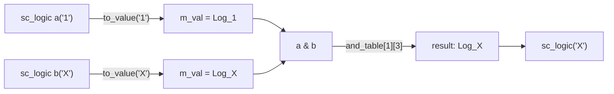

# sc_logic - Four-Valued Logic Type

## Overview

`sc_logic` is the four-valued logic type in SystemC, capable of representing four states of a hardware signal: `0` (low), `1` (high), `X` (unknown), and `Z` (high impedance). It is one of the most important basic types in SystemC, corresponding to Verilog's four-valued logic and VHDL's `std_logic`.

**Source file:** `sc_logic.h` + `sc_logic.cpp`

## Everyday Analogy

Imagine a traffic signal control system:

- **`0` (red light)**: A definite "stop", corresponding to logic low
- **`1` (green light)**: A definite "go", corresponding to logic high
- **`X` (malfunctioning flash)**: The signal is broken, and it is uncertain whether it is red or green -- this is the "unknown" state
- **`Z` (completely off)**: The signal has lost power, with no signal at all -- this is the "high impedance" state

In real circuits, a wire may be in the X state because it has not yet been driven (e.g., before reset), or in the Z state because a tri-state buffer is disabled.

## Key Concepts

### Four-Valued Logic Enumeration

```cpp
enum sc_logic_value_t {
    Log_0 = 0,   // logic 0
    Log_1,       // logic 1
    Log_Z,       // high impedance
    Log_X        // unknown
};
```

### Truth Tables (Lookup Table Implementation)

The bitwise operations of `sc_logic` do not use `if-else` logic like typical programs; instead, they use lookup tables, which is a very efficient approach in hardware simulation.

**AND truth table:**

| & | 0 | 1 | Z | X |
|---|---|---|---|---|
| **0** | 0 | 0 | 0 | 0 |
| **1** | 0 | 1 | X | X |
| **Z** | 0 | X | X | X |
| **X** | 0 | X | X | X |

Rule: If either side is 0, the result is 0 (because AND only needs one input to be 0 to determine the output is 0). All other uncertain cases are X.

**OR truth table:**

| \| | 0 | 1 | Z | X |
|----|---|---|---|---|
| **0** | 0 | 1 | X | X |
| **1** | 1 | 1 | 1 | 1 |
| **Z** | X | 1 | X | X |
| **X** | X | 1 | X | X |

Rule: If either side is 1, the result is 1 (because OR only needs one input to be 1 to determine the output is 1).

**XOR truth table:**

| ^ | 0 | 1 | Z | X |
|---|---|---|---|---|
| **0** | 0 | 1 | X | X |
| **1** | 1 | 0 | X | X |
| **Z** | X | X | X | X |
| **X** | X | X | X | X |

**NOT table:**

| Input | 0 | 1 | Z | X |
|-------|---|---|---|---|
| **Output** | 1 | 0 | X | X |

## Class Interface

### Constructors

```cpp
sc_logic();                     // default: X (unknown)
sc_logic(sc_logic_value_t v);   // from enum
explicit sc_logic(bool a);      // from bool: true->1, false->0
explicit sc_logic(char a);      // from '0','1','x','X','z','Z'
explicit sc_logic(int a);       // from 0,1,2,3
explicit sc_logic(const sc_bit& a); // from sc_bit
```

Note: The default value is `X` (unknown), simulating the real behavior of uninitialized signals in hardware.

### Bitwise Operators

```cpp
const sc_logic operator & (const sc_logic& a, const sc_logic& b); // AND
const sc_logic operator | (const sc_logic& a, const sc_logic& b); // OR
const sc_logic operator ^ (const sc_logic& a, const sc_logic& b); // XOR
const sc_logic operator ~ () const;                                // NOT

sc_logic& operator &= (const sc_logic& b); // AND assign
sc_logic& operator |= (const sc_logic& b); // OR assign
sc_logic& operator ^= (const sc_logic& b); // XOR assign
```

### Conversion Methods

```cpp
sc_logic_value_t value() const; // get raw enum value
bool is_01() const;             // check if 0 or 1
bool to_bool() const;           // convert to bool (warns if X or Z)
char to_char() const;           // convert to '0','1','Z','X'
```

### Comparison Operators

```cpp
bool operator == (const sc_logic& a, const sc_logic& b);
bool operator != (const sc_logic& a, const sc_logic& b);
```

### Predefined Constants

```cpp
extern const sc_logic SC_LOGIC_0;  // logic 0
extern const sc_logic SC_LOGIC_1;  // logic 1
extern const sc_logic SC_LOGIC_Z;  // high impedance
extern const sc_logic SC_LOGIC_X;  // unknown
```

## Internal Implementation

### Memory Management

`sc_logic` uses SystemC's `sc_mempool` for memory allocation, which can significantly improve performance when creating/destroying large numbers of `sc_logic` objects (e.g., during operations on large vectors).

### Lookup Tables

All bitwise operations are implemented through static 4x4 two-dimensional arrays. For example, AND:

```cpp
sc_logic& operator &= (const sc_logic& b) {
    m_val = and_table[m_val][b.m_val];
    return *this;
}
```

This is faster than `if-else` or `switch`, because it requires only a single array index lookup.

### Safety Check in to_bool()

```cpp
bool to_bool() const {
    if (!is_01()) { invalid_01(); }
    return ((int)m_val != Log_0);
}
```

Converting X or Z to `bool` issues a warning (not an error), because this situation is very common during simulation (e.g., signals before reset). A hard abort would make simulation impossible.

## Operation Flow



## Design Rationale / RTL Background

In hardware description languages, four-valued logic is a fundamental requirement:

- **Verilog**: Both `wire` and `reg` are four-valued (0, 1, x, z)
- **VHDL**: `std_logic` actually has nine states, but the most commonly used are these four

The `X` state is very important in hardware simulation -- it helps engineers discover "signal contention" (two drivers simultaneously driving the same wire) and "uninitialized" problems. If only 0 and 1 existed, these issues would be hidden.

The `Z` state represents high impedance, used for tri-state buses. For example, when multiple devices share a data line, only one device is driving it while the others output Z, meaning "I am not driving this line".

## Related Files

- [sc_bit.md](sc_bit.md) - Deprecated two-valued bit type
- [sc_lv_base.md](sc_lv_base.md) - Vector type that uses `sc_logic`
- [sc_lv.md](sc_lv.md) - Fixed-length four-valued vector
- [sc_bit_ids.md](sc_bit_ids.md) - Error message definitions
- Source: `ref/systemc/src/sysc/datatypes/bit/sc_logic.h`
- Source: `ref/systemc/src/sysc/datatypes/bit/sc_logic.cpp`
