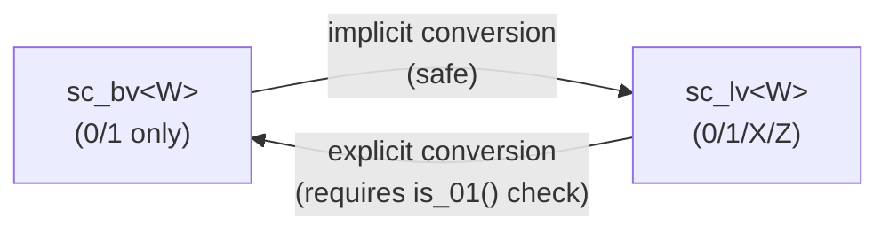
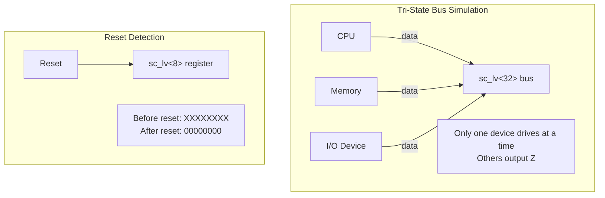
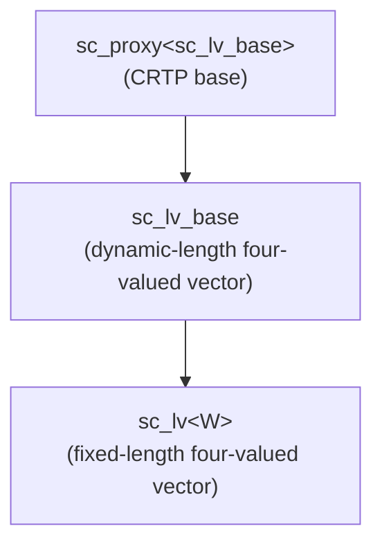

# sc_lv<W> - Fixed-Length Four-Valued Logic Vector

## Overview

`sc_lv<W>` is a template class providing a four-valued logic vector (0, 1, X, Z) with a compile-time fixed length of W bits. It inherits from `sc_lv_base` and is the most commonly used four-valued vector type in SystemC, corresponding to multi-bit signal lines in hardware.

**Source file:** `sc_lv.h` (header only, no .cpp)

## Everyday Analogy

`sc_lv<W>` is like "an advanced switch panel with a factory-fixed length". Unlike `sc_bv<W>` (which only has on/off states), each switch on `sc_lv<W>` has four positions -- allowing you to express more real-world scenarios.

Imagine you are a network administrator monitoring the status of 8 network ports:
- `sc_lv<8> port_status;`
- Each port can be: connected (1), disconnected (0), unplugged (Z), or status unknown (X)

## Key Concepts

### Relationship with sc_bv<W>



`sc_bv<W>` can be safely converted to `sc_lv<W>` (because 0/1 is a subset of 0/1/X/Z), but the reverse conversion requires confirming there are no X or Z values.

### Thin Wrapper

Like `sc_bv<W>`, `sc_lv<W>` is just a thin wrapper around `sc_lv_base` -- its only responsibility is to pass the width `W` during construction, then delegate all operations to the base class.

## Class Interface

### Constructors

```cpp
sc_lv();                              // all bits = X (unknown)
explicit sc_lv(const sc_logic& init);  // all bits = init
explicit sc_lv(bool init);            // all bits = init (0 or 1)
explicit sc_lv(char init);            // all bits = init ('0','1','x','z')
sc_lv(const char* a);                 // from string
sc_lv(const bool* a);                 // from bool array
sc_lv(const sc_logic* a);             // from logic array
sc_lv(const sc_unsigned& a);          // from integer types
sc_lv(unsigned long a);
sc_lv(int a);
// ... more integer types
sc_lv(const sc_proxy<X>& a);         // from any proxy
sc_lv(const sc_lv<W>& a);            // copy
```

**Important:** The default constructor initializes all bits to X (unknown), simulating the behavior of uninitialized signals in hardware.

### Assignment Operators

All assignment operators follow the same pattern -- call `sc_lv_base::operator=` and return `*this`.

## Usage Examples

```cpp
// 8-bit tri-state bus
sc_lv<8> tri_bus;           // initialized to "XXXXXXXX"
tri_bus = "0110ZZZZ";       // lower 4 bits are hi-Z

// check for valid data before conversion
if (tri_bus.is_01()) {
    int value = tri_bus.to_int();
}

// bit operations with 4-value logic
sc_lv<4> a("01XZ");
sc_lv<4> b("1100");
sc_lv<4> c = a & b;        // result: "0100" (X&1=X, Z&0=0)

// concatenation
sc_lv<8> full = (a, b);    // "01XZ1100"

// pattern matching
sc_lv<4> mask("1111");
bool match = (a == mask);   // false
```

## Typical Application Scenarios



## Inheritance Structure



## Design Rationale / RTL Background

`sc_lv<W>` is the SystemC type corresponding to Verilog's `wire [W-1:0]` or VHDL's `std_logic_vector(W-1 downto 0)`. It is particularly useful in the following scenarios:

- **Bus arbitration**: Simulating multiple masters contending for the same bus
- **Tri-state I/O**: Bidirectional pins on FPGAs
- **Power-on simulation**: Undefined states during system startup
- **Fault injection testing**: Deliberately injecting X values to test circuit fault tolerance

Selection guideline versus `sc_bv<W>`: If your signal only ever has 0 and 1 (e.g., internal registers, pure combinational logic), `sc_bv<W>` offers better performance. If you need to express high impedance or unknown states, use `sc_lv<W>`.

## Related Files

- [sc_lv_base.md](sc_lv_base.md) - Base class containing all implementation details
- [sc_bv.md](sc_bv.md) - Two-valued version `sc_bv<W>`
- [sc_logic.md](sc_logic.md) - Single four-valued logic element
- [sc_proxy.md](sc_proxy.md) - CRTP base class
- Source: `ref/systemc/src/sysc/datatypes/bit/sc_lv.h`
