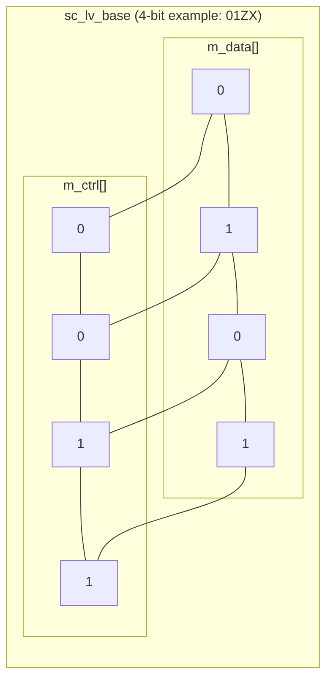
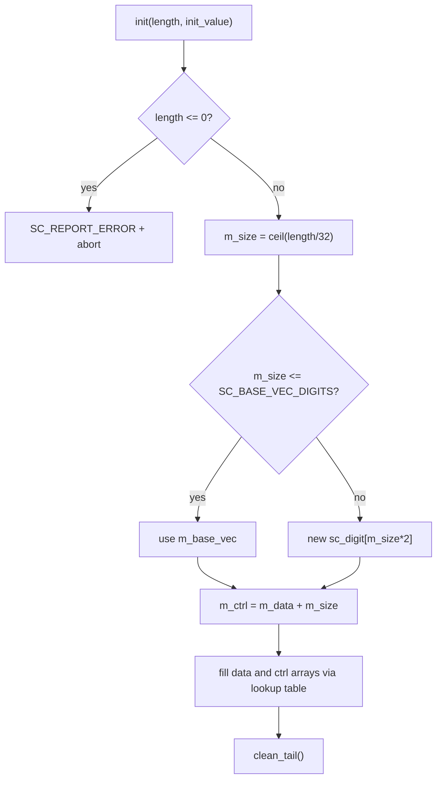

# sc_lv_base - Arbitrary-Width Four-Valued Logic Vector Base Class

## Overview

`sc_lv_base` is an arbitrary-width four-valued logic vector base class capable of storing four states: 0, 1, X, and Z. It is the non-template base of the `sc_lv<W>` template class, and the four-valued counterpart of `sc_bv_base`. It inherits from `sc_proxy<sc_lv_base>`.

**Source file:** `sc_lv_base.h` + `sc_lv_base.cpp`

## Everyday Analogy

If `sc_bv_base` is a row of simple switch panels with only "on/off", then `sc_lv_base` is a row of advanced switch panels -- each switch has four positions:

- **0**: Off
- **1**: On
- **Z**: Disconnected (the switch has been removed, not connected to anything)
- **X**: Uncertain (the switch is broken, unknown whether it is on or off)

This is common in control center monitoring systems: besides knowing whether a device is on/off, you also need to know whether it is disconnected or malfunctioning.

## Key Concepts

### Dual-Array Storage (Data + Control)

The most important design feature of `sc_lv_base` is the use of two parallel `sc_digit` arrays to encode four states:

```
data bit | ctrl bit | meaning
---------|----------|--------
   0     |    0     |   '0'
   1     |    0     |   '1'
   0     |    1     |   'Z'
   1     |    1     |   'X'
```



### Differences from sc_bv_base

| Property | sc_bv_base | sc_lv_base |
|----------|-----------|-----------|
| Possible values | 0, 1 | 0, 1, X, Z |
| Number of arrays | 1 (m_data) | 2 (m_data + m_ctrl) |
| Memory usage | N/32 words | N/16 words |
| `is_01()` | Always `true` | Must check m_ctrl |
| `get_cword()` | Always returns 0 | Returns actual control word |
| Default value | `false` (0) | `Log_X` (unknown) |

### Memory Allocation Strategy

Like `sc_bv_base`, `sc_lv_base` also uses Small Vector Optimization (SVO). However, because two arrays are needed, dynamic allocation allocates `m_size * 2` digits at once, then points `m_ctrl` to the second half of the array:

```cpp
m_data = new sc_digit[m_size * 2];
m_ctrl = m_data + m_size;
```

## Class Interface

### Constructors

```cpp
sc_lv_base(int length_, const sc_logic& init_value = sc_logic()); // default: all X
sc_lv_base(const char* a);                      // from string
sc_lv_base(const char* a, int length_);          // from string with fixed length
sc_lv_base(const sc_proxy<X>& a);               // from another proxy
sc_lv_base(const sc_lv_base& a);                // copy
```

Note that the default initial value is `sc_logic()`, i.e., `Log_X` (unknown). This faithfully reflects the real state of uninitialized signals in hardware.

### Core Methods

```cpp
int length() const;                     // bit count
int size() const;                       // number of sc_digit words

value_type get_bit(int i) const;        // get 4-value bit
void set_bit(int i, value_type value);  // set 4-value bit

sc_digit get_word(int i) const;         // get data word
void set_word(int i, sc_digit w);       // set data word
sc_digit get_cword(int i) const;        // get control word
void set_cword(int i, sc_digit w);      // set control word

bool is_01() const;                     // check if all bits are 0 or 1
void clean_tail();                      // clean unused bits
```

### Bit Access Implementation

```cpp
// get_bit: combine data and control bits to get 4-value logic
value_type get_bit(int i) const {
    int wi = i / SC_DIGIT_SIZE;
    int bi = i % SC_DIGIT_SIZE;
    return value_type(
        ((m_data[wi] >> bi) & SC_DIGIT_ONE) |
        (((m_ctrl[wi] >> bi) & SC_DIGIT_ONE) << 1)
    );
}
```

This code extracts one bit each from data and ctrl at the corresponding position, combining them into a value of 0-3 (corresponding to the `sc_logic_value_t` enumeration).

### is_01() Implementation

```cpp
bool is_01() const {
    for (int i = 0; i < m_size; ++i) {
        if (m_ctrl[i] != 0) return false;
    }
    return true;
}
```

It only needs to check whether all control words are 0. If ctrl is all 0, it means all bits are either 0 or 1 (no X or Z).

## Initialization Flow



The initialization uses predefined lookup arrays:

```cpp
static const sc_digit data_array[] =
    { SC_DIGIT_ZERO, ~SC_DIGIT_ZERO, SC_DIGIT_ZERO, ~SC_DIGIT_ZERO };
static const sc_digit ctrl_array[] =
    { SC_DIGIT_ZERO, SC_DIGIT_ZERO, ~SC_DIGIT_ZERO, ~SC_DIGIT_ZERO };
```

The index corresponds to `sc_logic_value_t`: 0=Log_0, 1=Log_1, 2=Log_Z, 3=Log_X.

## Design Rationale / RTL Background

`sc_lv_base` corresponds to Verilog's `reg [N:0]` or VHDL's `std_logic_vector(N downto 0)`. In hardware design, typical applications of four-valued vectors include:

1. **Tri-state bus simulation**: Multiple devices share a bus, with non-driving devices outputting Z
2. **Signals before reset**: At the start of simulation, register values are unknown (X)
3. **Testbenches**: Injecting X or Z in tests to verify circuit fault tolerance
4. **Signal contention detection**: When two drivers simultaneously drive the same wire, the result is X

The dual-array (data + ctrl) encoding is an industry-standard approach, also implemented this way in many commercial simulators (such as VCS and ModelSim). This design makes both two-valued operations (only looking at data) and four-valued operations (looking at data + ctrl) efficient.

## Related Files

- [sc_lv.md](sc_lv.md) - Fixed-length four-valued vector template
- [sc_bv_base.md](sc_bv_base.md) - Two-valued vector base (the 0/1 only version)
- [sc_logic.md](sc_logic.md) - Single four-valued logic element
- [sc_proxy.md](sc_proxy.md) - CRTP base class
- Source: `ref/systemc/src/sysc/datatypes/bit/sc_lv_base.h`
- Source: `ref/systemc/src/sysc/datatypes/bit/sc_lv_base.cpp`
