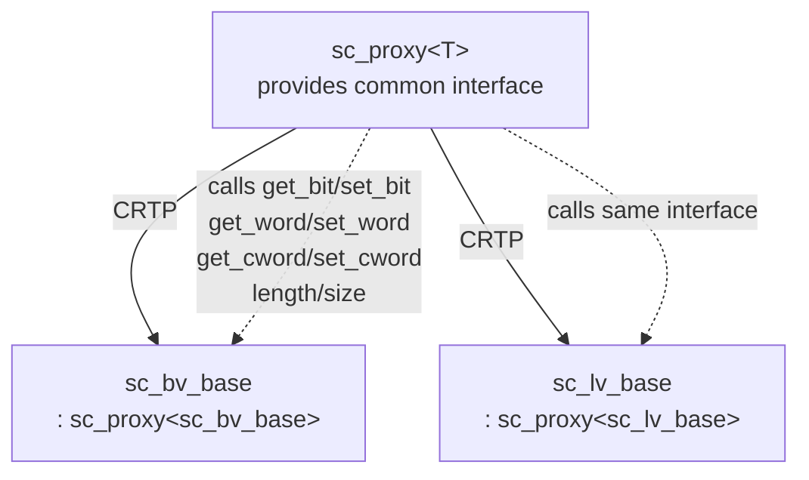
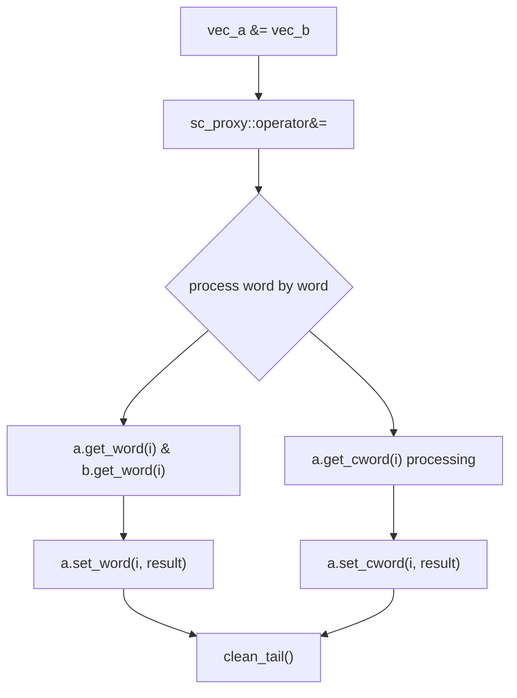

# sc_proxy<T> - CRTP Base Class for Vector Types

## Overview

`sc_proxy<T>` is the common base class for all bit/logic vector types, using the CRTP (Curiously Recurring Template Pattern) to provide a unified interface and common operations for `sc_bv_base` and `sc_lv_base`. It defines bitwise operations, comparisons, conversions, bit select, sub-range select, concatenation, and all other vector-common functionality.

**Source file:** `sc_proxy.h` (approximately 1549 lines)

## Everyday Analogy

`sc_proxy<T>` is like a "universal operation manual". Regardless of whether you are holding a simple switch panel (`sc_bv`) or an advanced switch panel (`sc_lv`), the basic operations are the same:

- Flip all switches (bitwise inversion)
- Check if two panels are identical (comparison)
- Select one specific switch (bit select)
- Select a contiguous group of switches (sub-range select)
- Join two panels together (concatenation)

The manual (`sc_proxy`) does not need to know the specific panel type; it uses CRTP to let concrete types "plug in" their own implementations.

## Key Concepts

### CRTP Pattern

```cpp
template <class X>
class sc_proxy { ... };

class sc_bv_base : public sc_proxy<sc_bv_base> { ... };
class sc_lv_base : public sc_proxy<sc_lv_base> { ... };
```

`sc_proxy` knows its subclass through the template parameter `X`, and can cast itself back to the subclass via `back_cast()` to call subclass methods (such as `get_bit()`, `set_bit()`). This avoids the overhead of virtual functions.



### Interface Required from Subclasses

Each class inheriting from `sc_proxy` must implement the following methods:

```cpp
int length() const;                     // total bit count
int size() const;                       // number of sc_digit words

value_type get_bit(int i) const;        // get single bit
void set_bit(int i, value_type v);      // set single bit

sc_digit get_word(int i) const;         // get data word
void set_word(int i, sc_digit w);       // set data word
sc_digit get_cword(int i) const;        // get control word
void set_cword(int i, sc_digit w);      // set control word
```

### Traits System

`sc_proxy` uses traits to distinguish behavior between two-valued and four-valued types:

```cpp
// for sc_bv_base
struct sc_proxy_traits<sc_bv_base> {
    typedef sc_logic_value_t value_type;
    typedef sc_logic         bit_type;
    // ... bit-vector specific traits
};

// for sc_lv_base
struct sc_proxy_traits<sc_lv_base> {
    typedef sc_logic_value_t value_type;
    typedef sc_logic         bit_type;
    // ... logic-vector specific traits
};
```

## Functionality Provided by sc_proxy

### Global Constants

```cpp
const int SC_DIGIT_SIZE = BITS_PER_BYTE * sizeof(sc_digit); // usually 32
const sc_digit SC_DIGIT_ZERO = 0;
const sc_digit SC_DIGIT_ONE  = 1;
const sc_digit SC_DIGIT_TWO  = 2;
```

### Bitwise Operators

```cpp
// bitwise operators (between two proxies)
template<class X, class Y>
sc_lv_base operator & (const sc_proxy<X>&, const sc_proxy<Y>&);
sc_lv_base operator | (const sc_proxy<X>&, const sc_proxy<Y>&);
sc_lv_base operator ^ (const sc_proxy<X>&, const sc_proxy<Y>&);

// compound assignment
sc_proxy<X>& operator &= (const sc_proxy<Y>&);
sc_proxy<X>& operator |= (const sc_proxy<Y>&);
sc_proxy<X>& operator ^= (const sc_proxy<Y>&);
```

### Bit Select and Sub-Range

```cpp
// bit select
sc_bitref<X> operator [] (int i);           // read-write
sc_bitref_r<X> operator [] (int i) const;   // read-only

// sub-range (part select)
sc_subref<X> operator () (int hi, int lo);
sc_subref_r<X> operator () (int hi, int lo) const;
sc_subref<X> range(int hi, int lo);
sc_subref_r<X> range(int hi, int lo) const;
```

### Comparison Operators

```cpp
bool operator == (const sc_proxy<Y>&) const;
bool operator != (const sc_proxy<Y>&) const;
```

### Assignment Methods

```cpp
// assign from various types
void assign_(const sc_proxy<Y>& a);     // from another proxy
void assign_(const bool* a);            // from bool array
void assign_(const sc_logic* a);        // from logic array
void assign_(unsigned long a);          // from integer
void assign_(const sc_unsigned& a);     // from sc_unsigned
void assign_(const sc_signed& a);       // from sc_signed
```

### Conversion Methods

```cpp
int to_int() const;
unsigned int to_uint() const;
long to_long() const;
unsigned long to_ulong() const;
int64 to_int64() const;
uint64 to_uint64() const;

std::string to_string() const;
std::string to_string(sc_numrep) const;  // with number base
```

### Reduction Operations

```cpp
sc_logic_value_t and_reduce() const;    // AND all bits
sc_logic_value_t or_reduce() const;     // OR all bits
sc_logic_value_t xor_reduce() const;    // XOR all bits
sc_logic_value_t nand_reduce() const;   // NAND all bits
sc_logic_value_t nor_reduce() const;    // NOR all bits
sc_logic_value_t xnor_reduce() const;   // XNOR all bits
```

## Operation Flow



### assign_p_ Function

`assign_p_` is an important helper function that handles assignment between two vectors. It needs to handle length mismatch cases:

- If the source is shorter: extra high bits are 0-padded
- If the source is longer: truncated and may issue a warning

## Design Rationale / RTL Background

### Why CRTP Instead of Virtual Functions?

1. **Performance**: In hardware simulation, bitwise operations may be executed billions of times. The indirect call overhead of virtual functions is unacceptable in this scenario. CRTP resolves calls at compile time with no runtime overhead.

2. **Inlining optimization**: CRTP allows the compiler to inline all function calls, which is critical for bitwise operation performance.

3. **Type safety**: Different vector types are different CRTP instances, allowing the compiler to perform stricter type checking.

### Hardware Correspondence of Reduction Operations

In Verilog, reduction operations are prefix operators:

```verilog
wire [7:0] data;
wire all_ones = &data;    // AND reduce
wire any_one  = |data;    // OR reduce
wire parity   = ^data;    // XOR reduce (parity check)
```

In hardware, this corresponds to a logic gate tree that reduces N bits down to a single bit.

## Related Files

- [sc_bit_proxies.md](sc_bit_proxies.md) - Concrete implementations of proxy classes
- [sc_bv_base.md](sc_bv_base.md) - Two-valued vector, inherits `sc_proxy<sc_bv_base>`
- [sc_lv_base.md](sc_lv_base.md) - Four-valued vector, inherits `sc_proxy<sc_lv_base>`
- [sc_logic.md](sc_logic.md) - Four-valued logic type
- Source: `ref/systemc/src/sysc/datatypes/bit/sc_proxy.h`
