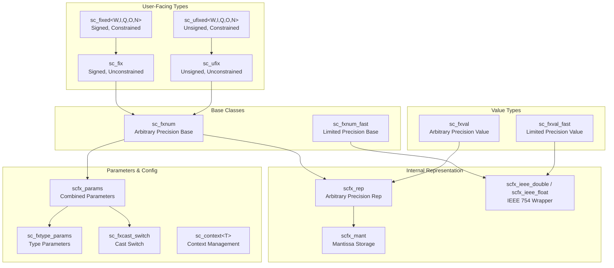

# SystemC Fixed-Point Types -- Overview

This directory contains the **fixed-point** data type implementation for SystemC, providing numeric types with configurable bit-width, quantization, and overflow behavior, primarily used for DSP (Digital Signal Processing) and communication system modeling in hardware simulation.

## What Are Fixed-Point Numbers?

### Everyday Analogy

Imagine you have a calculator whose screen can only display a fixed number of digits. For example, your calculator can display at most 8 digits, with the decimal point fixed at the 3rd position:

```
XXXXX.XXX
```

- The integer part has at most 5 digits -> maximum value 99999
- The fractional part has at most 3 digits -> minimum precision 0.001

If the result is `3.14159265`, you can only store `3.141`. What happens to the extra digits? You can either "truncate" or "round" -- this is **quantization**.

If the result is `123456.789` and exceeds the integer range, what do you do? You can either "saturate to the maximum" or "wrap around" -- this is **overflow handling**.

Fixed-point numbers represent real numbers using a finite number of bits in exactly this way.

### Why Not Use Floating-Point?

In real hardware circuits, floating-point units (FPUs) are very expensive (large area, high power consumption). DSP chips, mobile baseband processors, audio codecs, etc., almost all use fixed-point numbers to save cost. SystemC's fixed-point types let you accurately simulate hardware fixed-point behavior at the software simulation stage.

## Core Concepts

### Fixed-Point Parameters

```
sc_fixed<W, I, Q, O, N>
```

| Parameter | Meaning | Analogy |
|-----------|---------|---------|
| `W` (wl) | Total Word Length | Total number of digits on the calculator screen |
| `I` (iwl) | Integer Word Length | Number of digits to the left of the decimal point |
| `Q` (q_mode) | Quantization Mode | How to handle excess fractional digits |
| `O` (o_mode) | Overflow Mode | How to handle out-of-range values |
| `N` (n_bits) | Saturation Bits | Used with wrap-around mode |

Fractional word length `F = W - I` (computed automatically).

## Class Hierarchy



## Constrained vs. Unconstrained

| Feature | Constrained (`sc_fixed/sc_ufixed`) | Unconstrained (`sc_fix/sc_ufix`) |
|---------|-------------------------------------|----------------------------------|
| Parameter setting | Template parameters, determined at compile time | Constructor arguments, determined at runtime |
| Use case | Final hardware specification is decided | Exploration phase, still tuning parameters |
| Performance | Slightly better (compiler optimization) | More flexible |

## Arbitrary Precision vs. Limited Precision

Each type has two versions:

- **Regular version (arbitrary precision)**: Uses `scfx_rep` internal representation, supports any bit-width
- **Fast version (`_fast`)**: Uses C++ `double` internal representation, limited to 53-bit precision, but faster

## File List

| File | Description | Documentation |
|------|-------------|---------------|
| `fx.h` | Master include file | [fx.md](fx.md) |
| `sc_context.h` | Context management template | [sc_context.md](sc_context.md) |
| `sc_fxdefs.h/cpp` | Enum definitions and defaults | [sc_fxdefs.md](sc_fxdefs.md) |
| `sc_fx_ids.h` | Error message IDs | [sc_fx_ids.md](sc_fx_ids.md) |
| `sc_fxcast_switch.h/cpp` | Type cast switch | [sc_fxcast_switch.md](sc_fxcast_switch.md) |
| `sc_fxtype_params.h/cpp` | Fixed-point type parameters | [sc_fxtype_params.md](sc_fxtype_params.md) |
| `sc_fxnum.h/cpp` | Fixed-point number base class | [sc_fxnum.md](sc_fxnum.md) |
| `sc_fxnum_observer.h/cpp` | Fixed-point number observer | [sc_fxnum_observer.md](sc_fxnum_observer.md) |
| `sc_fxval.h/cpp` | Fixed-point value type | [sc_fxval.md](sc_fxval.md) |
| `sc_fxval_observer.h/cpp` | Fixed-point value observer | [sc_fxval_observer.md](sc_fxval_observer.md) |
| `sc_fixed.h` | Signed constrained fixed-point | [sc_fixed.md](sc_fixed.md) |
| `sc_ufixed.h` | Unsigned constrained fixed-point | [sc_ufixed.md](sc_ufixed.md) |
| `sc_fix.h` | Signed unconstrained fixed-point | [sc_fix.md](sc_fix.md) |
| `sc_ufix.h` | Unsigned unconstrained fixed-point | [sc_ufix.md](sc_ufix.md) |
| `scfx_rep.h/cpp` | Arbitrary precision internal representation | [scfx_rep.md](scfx_rep.md) |
| `scfx_mant.h/cpp` | Mantissa storage | [scfx_mant.md](scfx_mant.md) |
| `scfx_ieee.h` | IEEE 754 wrapper | [scfx_ieee.md](scfx_ieee.md) |
| `scfx_pow10.h/cpp` | Power-of-10 computation | [scfx_pow10.md](scfx_pow10.md) |
| `scfx_utils.h/cpp` | Utility functions | [scfx_utils.md](scfx_utils.md) |
| `scfx_params.h` | Combined parameters | [scfx_params.md](scfx_params.md) |
| `scfx_string.h` | Internal string class | [scfx_string.md](scfx_string.md) |
| `scfx_other_defs.h` | Interoperability with other types | [scfx_other_defs.md](scfx_other_defs.md) |

## Related Files

- `sysc/datatypes/int/` -- Integer data types (`sc_int`, `sc_uint`, `sc_signed`, `sc_unsigned`)
- `sysc/datatypes/bit/` -- Bit vector types (`sc_bv_base`)
- `sysc/utils/sc_report.h` -- Error reporting mechanism
