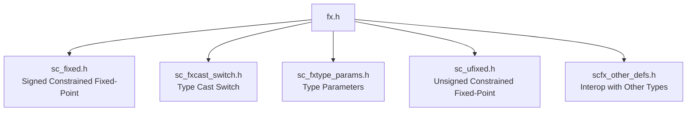

# fx.h -- Master Include File for Fixed-Point Types

## Overview

`fx.h` is the **master include** header for the SystemC fixed-point subsystem. Simply `#include "fx.h"` to access all fixed-point types. This file contains no logic itself -- it is purely a convenience entry point that aggregates other headers.

### Everyday Analogy

Like the front entrance of a department store -- you don't need to know which brand is on which floor; just walk through the door and you can reach everything. `fx.h` is the front door to the fixed-point world.

## Included Headers



### Include Order Explanation

1. `sc_fixed.h` -- Brings in signed fixed-point (indirectly includes `sc_fix.h` -> `sc_fxnum.h` -> entire dependency chain)
2. `sc_fxcast_switch.h` -- Type cast control
3. `sc_fxtype_params.h` -- Fixed-point parameter definitions
4. `sc_ufixed.h` -- Brings in unsigned fixed-point (indirectly includes `sc_ufix.h`)
5. `scfx_other_defs.h` -- Defines conversion operators between fixed-point and `sc_signed`, `sc_unsigned`, etc.

## Usage

```cpp
#include "sysc/datatypes/fx/fx.h"

// Now all fixed-point types are available:
sc_dt::sc_fixed<8, 4> a;      // 8-bit signed, 4 integer bits
sc_dt::sc_ufixed<16, 8> b;    // 16-bit unsigned, 8 integer bits
sc_dt::sc_fix c(8, 4);        // unconstrained signed
sc_dt::sc_ufix d(16, 8);      // unconstrained unsigned
```

## Design Rationale

Centralizing all includes into a single file has two benefits:

1. **User convenience** -- No need to remember a dozen header file names
2. **Dependency management** -- Guarantees correct include order, avoiding forward declaration issues

## Related Files

- `sc_fixed.h` / `sc_ufixed.h` -- Constrained fixed-point templates
- `sc_fix.h` / `sc_ufix.h` -- Unconstrained fixed-point types
- `scfx_other_defs.h` -- Interoperability definitions with integer types
