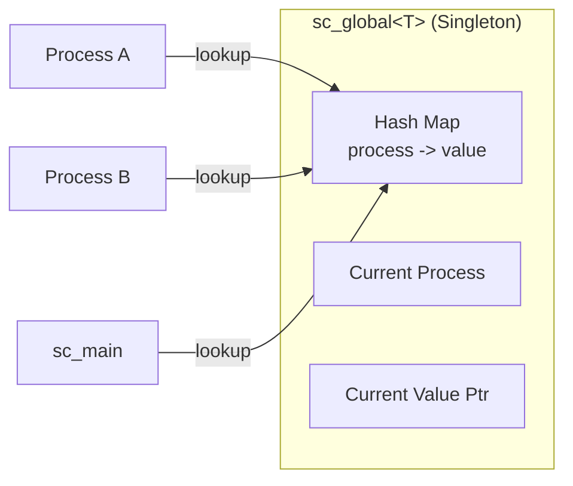
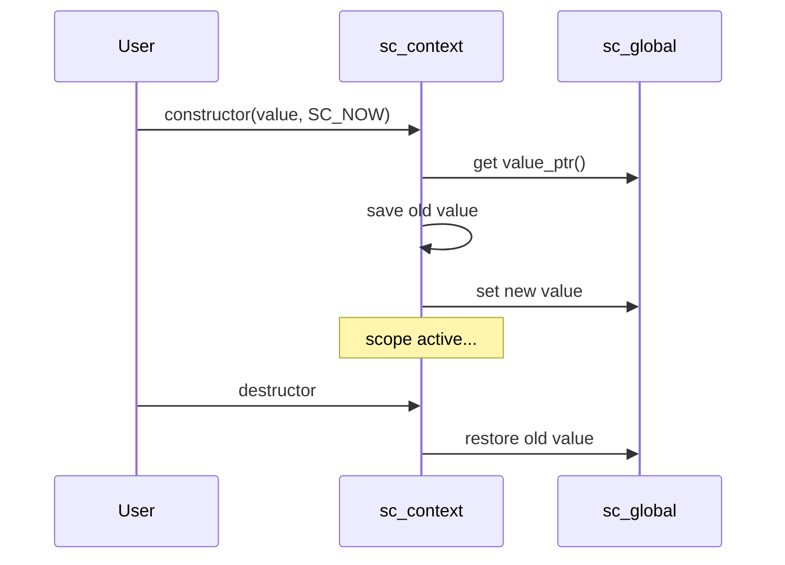

# sc_context.h -- Fixed-Point Context Management

## Overview

`sc_context.h` provides a **templated context management mechanism** that allows fixed-point default parameters to be dynamically switched within different program scopes. This is one of the most elegant designs in the SystemC fixed-point system.

## Everyday Analogy

Imagine you work at an international company. The company has a default language (English), but when you enter a meeting room in the Japan branch, the default language automatically switches to Japanese. When you leave the meeting room, it switches back to English.

`sc_context` is this "meeting room" -- when you enter its scope, the fixed-point default parameters automatically change; when you leave, they automatically revert.

```cpp
// Default: wl=32, iwl=32
{
    sc_fxtype_context ctx(sc_fxtype_params(16, 8, SC_RND, SC_SAT));
    // Inside this scope: wl=16, iwl=8, rounding, saturation
    sc_fix a;  // uses 16-bit, 8-integer-bit format
}
// Back to default: wl=32, iwl=32
```

## Core Classes

### `sc_without_context`

An empty tag class indicating "don't use context, use hardcoded defaults directly."

### `sc_global<T>` -- Global Variable Management (Singleton)



`sc_global<T>` is a singleton template that maintains independent default values for each SystemC simulation process (co-routine). This is important because multiple SystemC modules may execute under different contexts simultaneously.

**Key Members:**

| Member | Description |
|--------|-------------|
| `m_instance` | Static singleton pointer |
| `m_map` | Hash map mapping process pointers to default values |
| `m_proc` | Current process pointer |
| `m_value_ptr` | Current default value pointer |
| `update()` | Updates the default value when switching processes |
| `instance()` | Gets the singleton instance |
| `value_ptr()` | Gets the current default value pointer |

### `sc_context_begin` -- Activation Timing Enum

```cpp
enum sc_context_begin {
    SC_NOW,   // constructor runs immediately
    SC_LATER  // must explicitly call begin()
};
```

### `sc_context<T>` -- Context Class

This is a RAII (Resource Acquisition Is Initialization) style template class:



**Key Members:**

| Member | Description |
|--------|-------------|
| `m_value` | The value for this context |
| `m_def_value_ptr` | Reference to the global default value |
| `m_old_value_ptr` | Saved old value, used for restoration |
| `begin()` | Manually activate the context |
| `end()` | Manually deactivate the context |
| `default_value()` | Static method to get the current default value |
| `value()` | Get this context's value |

**Important Restrictions:**

- Copy construction is prohibited
- Heap allocation via `new` is prohibited (must be used on the stack to ensure correct RAII)
- When nested, follows last-in first-out order

## Concrete typedefs

This template is instantiated as two concrete types:

```cpp
typedef sc_context<sc_fxtype_params> sc_fxtype_context;   // in sc_fxtype_params.h
typedef sc_context<sc_fxcast_switch> sc_fxcast_context;   // in sc_fxcast_switch.h
```

## Co-routine Safety

`sc_global` uses a hash map to maintain independent default values for each SystemC process, ensuring that multiple `SC_THREAD`s do not interfere with each other. When the SystemC scheduler switches threads, the `update()` method automatically looks up the value corresponding to the current process.

## Related Files

- `sc_fxtype_params.h` -- Definition of `sc_fxtype_context`
- `sc_fxcast_switch.h` -- Definition of `sc_fxcast_context`
- `sc_fxdefs.h` -- Default parameter values
- `sysc/kernel/sc_simcontext.h` -- Gets the current process
