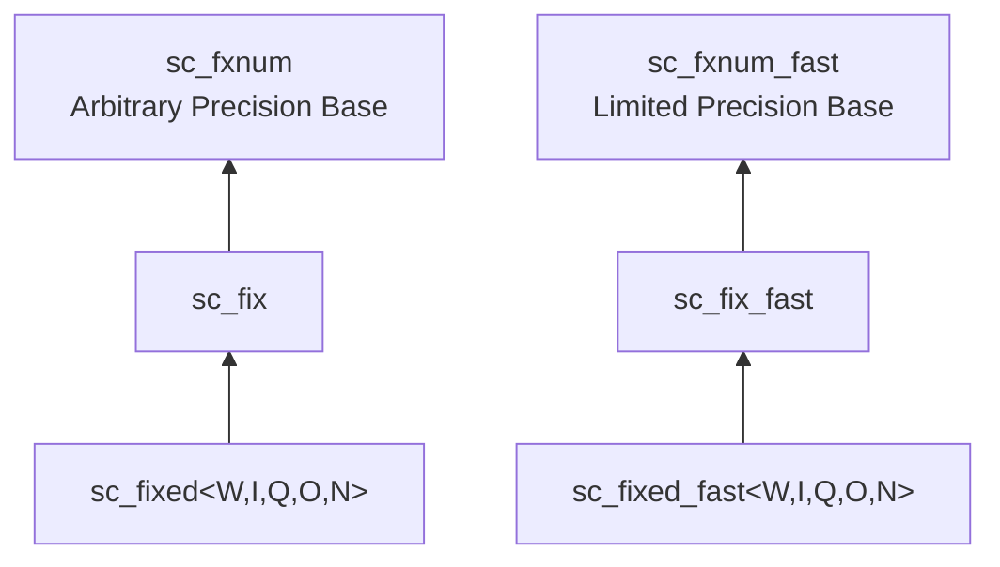

# sc_fix.h -- Signed Unconstrained Fixed-Point

## Overview

`sc_fix` and `sc_fix_fast` are **signed, runtime-parameterized** fixed-point classes. Unlike `sc_fixed`, `sc_fix` specifies bit-width and behavior parameters through constructor arguments rather than template parameters, so they can be determined dynamically at runtime.

## Everyday Analogy

If `sc_fixed<8,4>` is a "fixed 8cm x 4cm picture frame," then `sc_fix` is an "adjustable-size picture frame." You tell the shopkeeper how big you want it when you buy it (construction time), but you cannot change it afterward.

## Inheritance Hierarchy



## Constructors

`sc_fix` provides a large number of constructor overloads, mainly in the following patterns:

```cpp
// No initial value, specify parameters
sc_fix( int wl, int iwl, sc_fxnum_observer* = 0 );
sc_fix( int wl, int iwl, sc_q_mode, sc_o_mode, sc_fxnum_observer* = 0 );
sc_fix( int wl, int iwl, sc_q_mode, sc_o_mode, int n_bits, sc_fxnum_observer* = 0 );

// With initial value
sc_fix( double, int wl, int iwl, sc_fxnum_observer* = 0 );
sc_fix( double, int wl, int iwl, sc_q_mode, sc_o_mode, sc_fxnum_observer* = 0 );

// With cast switch
sc_fix( int wl, int iwl, const sc_fxcast_switch&, sc_fxnum_observer* = 0 );
sc_fix( double, int wl, int iwl, const sc_fxcast_switch&, sc_fxnum_observer* = 0 );

// Using type params
sc_fix( const sc_fxtype_params&, sc_fxnum_observer* = 0 );
sc_fix( double, const sc_fxtype_params&, sc_fxnum_observer* = 0 );
```

All constructors ultimately call the `sc_fxnum` constructor, passing `SC_TC_` (two's complement encoding).

## Operators

### Arithmetic Operators (return `sc_fxval`)

```cpp
friend sc_fxval operator + ( const sc_fix&, const sc_fix& );
friend sc_fxval operator - ( const sc_fix&, const sc_fix& );
friend sc_fxval operator * ( const sc_fix&, const sc_fix& );
friend sc_fxval operator / ( const sc_fix&, const sc_fix& );
```

### Assignment Operators

```cpp
sc_fix& operator = ( double );
sc_fix& operator += ( double );
sc_fix& operator -= ( double );
sc_fix& operator *= ( double );
sc_fix& operator /= ( double );
sc_fix& operator <<= ( int );
sc_fix& operator >>= ( int );
```

### Bitwise Operators

```cpp
friend sc_fix operator & ( const sc_fix&, const sc_fix& );
friend sc_fix operator | ( const sc_fix&, const sc_fix& );
friend sc_fix operator ^ ( const sc_fix&, const sc_fix& );
sc_fix& operator &= ( const sc_fix& );
sc_fix& operator |= ( const sc_fix& );
sc_fix& operator ^= ( const sc_fix& );
```

Bitwise operations have special meaning on fixed-point numbers -- they operate on individual bits of the two's complement representation, commonly used for bit manipulation in DSP algorithms.

## Usage Example

```cpp
// Runtime-parameterized
int bits = compute_required_bits();
sc_fix signal(bits, bits/2, SC_RND, SC_SAT);

// Arithmetic
sc_fxval result = signal * 0.5;
signal = result + 1.0;
```

## sc_fix vs sc_fixed

| Feature | `sc_fix` | `sc_fixed<W,I,Q,O,N>` |
|---------|---------|----------------------|
| Parameter setting | At construction (runtime) | Template (compile time) |
| Flexibility | High | Low |
| Type safety | Lower | Higher (different params = different types) |
| Usage stage | Exploration / prototyping | Final design |

## Related Files

- `sc_fxnum.h` -- Parent class `sc_fxnum`
- `sc_fixed.h` -- Constrained version `sc_fixed`, inherits from `sc_fix`
- `sc_ufix.h` -- Unsigned version
- `sc_fxval.h` -- Return type of arithmetic operations
