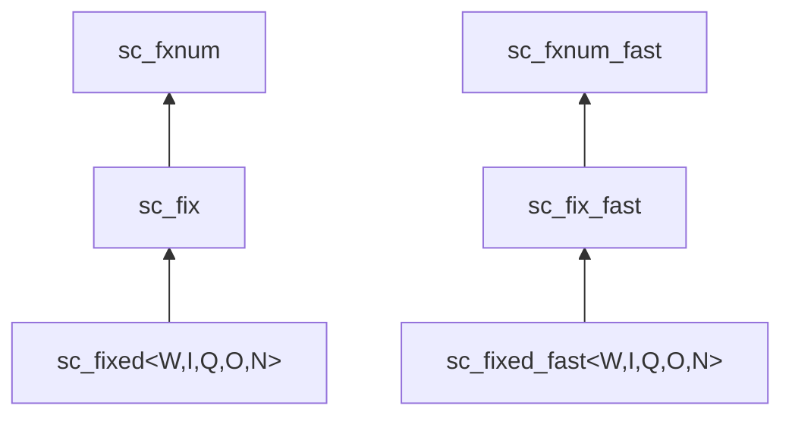

# sc_fixed.h -- Signed Constrained Fixed-Point

## Overview

`sc_fixed<W, I, Q, O, N>` and `sc_fixed_fast<W, I, Q, O, N>` are **signed, compile-time constrained** fixed-point template classes. All parameters are determined at compile time through template parameters and cannot be changed at runtime.

## Everyday Analogy

`sc_fixed` is like a "measuring cup with a fixed specification." You decide at design time how much it can hold (bit-width) and its scale precision (fractional bit-width), and you cannot change it afterward. If you pour in too much water (overflow), it handles it according to preset rules (wrap, saturate, etc.).

In contrast, `sc_fix` is like an "adjustable-size measuring cup."

## Template Parameters

```cpp
template <int W, int I,
          sc_q_mode Q = SC_DEFAULT_Q_MODE_,
          sc_o_mode O = SC_DEFAULT_O_MODE_,
          int N = SC_DEFAULT_N_BITS_>
class sc_fixed : public sc_fix { ... };
```

| Parameter | Default | Description |
|-----------|---------|-------------|
| `W` | (required) | Total word length |
| `I` | (required) | Integer word length |
| `Q` | `SC_TRN` | Quantization mode |
| `O` | `SC_WRAP` | Overflow mode |
| `N` | `0` | Saturation bits |

## Inheritance Hierarchy



`sc_fixed` inherits from `sc_fix` and passes the template parameters `W, I, Q, O, N` to the parent class constructor at construction time.

## Constructors

All constructors pass the template parameters to `sc_fix`'s constructor:

```cpp
// Default constructor
sc_fixed( sc_fxnum_observer* = 0 );
// -> sc_fix( W, I, Q, O, N, observer_ )

// Value constructor
sc_fixed( double a, sc_fxnum_observer* = 0 );
// -> sc_fix( a, W, I, Q, O, N, observer_ )
```

Supported initial value types: `int`, `unsigned int`, `long`, `unsigned long`, `float`, `double`, `const char*`, `sc_fxval`, `sc_fxnum`, `int64`, `uint64`, `sc_int_base`, `sc_uint_base`, `sc_signed`, `sc_unsigned`.

## Assignment Operators

Supports all standard arithmetic assignments: `=`, `*=`, `/=`, `+=`, `-=`, `<<=`, `>>=`, `&=`, `|=`, `^=`

All operators delegate to the corresponding methods of `sc_fix`:

```cpp
sc_fixed& operator = ( double a ) {
    sc_fix::operator = ( a );
    return *this;
}
```

## Increment / Decrement

```cpp
sc_fxval operator ++ ( int );  // post-increment, returns old value
sc_fxval operator -- ( int );  // post-decrement, returns old value
sc_fixed& operator ++ ();     // pre-increment
sc_fixed& operator -- ();     // pre-decrement
```

## Usage Example

```cpp
// 8-bit signed, 4 integer bits, 4 fractional bits
// Range: -8.0 to +7.9375, step: 0.0625
sc_fixed<8, 4> a = 3.7;

// 16-bit, 10 integer bits, rounding, saturation
sc_fixed<16, 10, SC_RND, SC_SAT> b = 123.456;

// Arithmetic produces sc_fxval (full precision)
sc_fxval c = a * b;

// Assigning back to sc_fixed triggers quantization
a = c;
```

## sc_fixed vs sc_fixed_fast

| Feature | `sc_fixed` | `sc_fixed_fast` |
|---------|-----------|-----------------|
| Precision | Any bit-width | Up to 53 bits |
| Speed | Slower | Faster |
| Base class | `sc_fix` -> `sc_fxnum` | `sc_fix_fast` -> `sc_fxnum_fast` |
| Internal representation | `scfx_rep` | `double` |

## Related Files

- `sc_fix.h` -- Parent class `sc_fix` / `sc_fix_fast`
- `sc_ufixed.h` -- Unsigned version `sc_ufixed`
- `sc_fxnum.h` -- Ultimate base class
- `fx.h` -- Master include entry point
