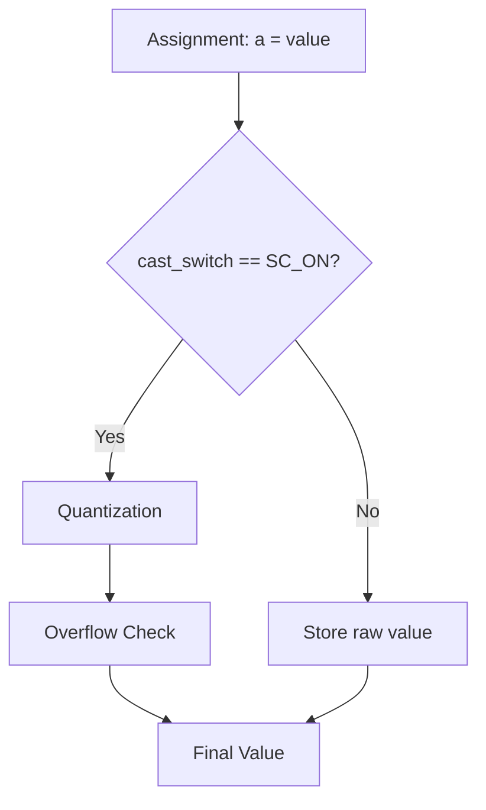

# sc_fxcast_switch.h / .cpp -- Fixed-Point Type Cast Switch

## Overview

`sc_fxcast_switch` controls whether **quantization** and **overflow** processing should be applied after fixed-point assignment or computation. In simple terms, it is a switch for "whether to apply fixed-point constraints."

## Everyday Analogy

Imagine you are practicing painting. Normally the teacher requires you to use only 8 crayons (constrained), but sometimes the teacher says "free play today, use any color you want." `sc_fxcast_switch` is this instruction from the teacher:

- `SC_ON`: Apply the fixed-point bit-width constraints (normal mode)
- `SC_OFF`: Do not apply constraints (useful for debugging or initialization)

## Class Details

### `sc_fxcast_switch`

```cpp
class sc_fxcast_switch {
public:
    sc_fxcast_switch();                          // use context default
    sc_fxcast_switch( sc_switch );               // explicit ON/OFF
    sc_fxcast_switch( const sc_fxcast_switch& ); // copy
    explicit sc_fxcast_switch( sc_without_context ); // use compile-time default

    sc_fxcast_switch& operator = ( const sc_fxcast_switch& );

    friend bool operator == ( const sc_fxcast_switch&, const sc_fxcast_switch& );
    friend bool operator != ( const sc_fxcast_switch&, const sc_fxcast_switch& );

    std::string to_string() const;
    void print( std::ostream& ) const;
    void dump( std::ostream& ) const;

private:
    sc_switch m_sw;  // SC_ON or SC_OFF
};
```

**Constructor Behavior:**

| Constructor | Behavior |
|-------------|----------|
| Default | Gets the current default value from `sc_fxcast_context` |
| `sc_switch` | Directly sets ON or OFF |
| `sc_without_context` | Uses the compile-time constant `SC_DEFAULT_CAST_SWITCH_` (= `SC_ON`) |

### `sc_fxcast_context`

```cpp
typedef sc_context<sc_fxcast_switch> sc_fxcast_context;
```

This typedef instantiates the `sc_context` template specifically for the cast switch. Usage:

```cpp
{
    sc_fxcast_context ctx(sc_fxcast_switch(SC_OFF));
    // Inside this scope, casting is OFF
    sc_fix a(16, 8);
    a = 999.999;  // no quantization/overflow applied
}
// Outside: casting is back to ON
```

## Cast Switch Flow



## .cpp File

`sc_fxcast_switch.cpp` contains:

1. Explicit template instantiation of `sc_global<sc_fxcast_switch>` and `sc_context<sc_fxcast_switch>`
2. Implementation of `to_string()`, `print()`, `dump()`

## Related Files

- `sc_fxdefs.h` -- `sc_switch` enum definition and `SC_DEFAULT_CAST_SWITCH_` constant
- `sc_context.h` -- `sc_context<T>` template
- `scfx_params.h` -- Uses cast switch in combination within `scfx_params`
- `sc_fxnum.h` -- Checks cast switch in the `cast()` method
