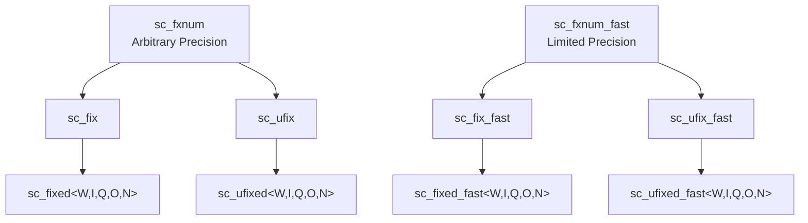
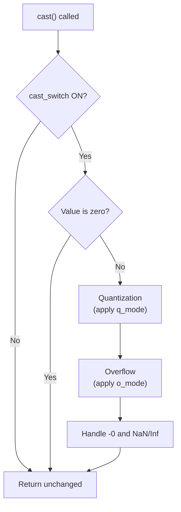

# sc_fxnum.h / .cpp -- Fixed-Point Number Base Class

## Overview

`sc_fxnum` and `sc_fxnum_fast` are the **base classes** for all fixed-point number types. `sc_fxnum` uses an arbitrary precision internal representation (`scfx_rep`), while `sc_fxnum_fast` uses C++ `double` (limited to 53-bit precision). These two classes provide complete arithmetic operations, type conversions, bit manipulation, and observer support.

## Everyday Analogy

If `sc_fixed<8,4>` is an "8-inch cake" you bought from a supermarket, then `sc_fxnum` is the "standard cake production line" at the factory. All cake specifications come out of the same production line -- the only difference is the mold (parameters).

`sc_fxnum_fast` is the "simplified production line" -- faster but can only make small cakes (limited precision).

## Class Hierarchy

## sc_fxnum -- Arbitrary Precision

### Core Members

| Member | Type | Description |
|--------|------|-------------|
| `m_rep` | `scfx_rep*` | Arbitrary precision internal representation |
| `m_params` | `scfx_params` | Type parameters (wl, iwl, enc, q_mode, o_mode, etc.) |
| `m_q_flag` | `bool` | Whether quantization has occurred |
| `m_o_flag` | `bool` | Whether overflow has occurred |
| `m_observer` | `sc_fxnum_observer*` | Observer pointer |

### Main Operations

**Arithmetic operators:** `+`, `-`, `*`, `/`, etc., return `sc_fxval` (intermediate values not constrained by bit-width).

**Assignment operators:** `=`, `+=`, `-=`, `*=`, `/=`, automatically call `cast()` after assignment to apply quantization and overflow.

**Comparison operators:** `==`, `!=`, `<`, `<=`, `>`, `>=`

**Bit manipulation:**
- `operator[]` -- Bit-select, returns `sc_fxnum_bitref`
- `operator()` or `range()` -- Part-select, returns `sc_fxnum_subref`

**Type conversions:**
- `to_int()`, `to_uint()`, `to_long()`, `to_double()`, etc.
- `to_string()`, `to_bin()`, `to_oct()`, `to_hex()`, `to_dec()`

### cast() Method

`cast()` is the core of the fixed-point system -- it performs quantization and overflow processing on the value according to the parameters:

## sc_fxnum_fast -- Limited Precision

### Core Members

| Member | Type | Description |
|--------|------|-------------|
| `m_val` | `double` | Uses native double for storage |
| `m_params` | `scfx_params` | Type parameters |
| `m_q_flag` | `bool` | Quantization flag |
| `m_o_flag` | `bool` | Overflow flag |
| `m_observer` | `sc_fxnum_fast_observer*` | Observer |

### Quantization Implementation (Fast Version)

The `quantization()` function in the `.cpp` file shows the complete quantization logic:

1. Compute fractional word length `fwl = wl - iwl`
2. Scale up the value by multiplying by `2^fwl`
3. Separate integer and fractional parts using `modf()`
4. Decide whether to round up based on `q_mode`
5. Scale back down by dividing by `2^fwl`

### Overflow Implementation (Fast Version)

The `overflow()` function logic:

1. Compute the representable range `[low, high]`
2. Determine if the value is out of range
3. Handle based on `o_mode`: saturation, set to zero, wrap-around, etc.

## Proxy Classes

### `sc_fxnum_bitref` / `sc_fxnum_bitref_r`

Proxy classes for bit-select, allowing `a[3]` to read/write individual bits. The `_r` version is read-only.

### `sc_fxnum_subref` / `sc_fxnum_subref_r`

Proxy classes for part-select, allowing `a(7, 0)` to read/write bit ranges. Behaves similarly to `sc_bv_base`.

## Observer Pattern

Implements mutually exclusive observer access through `lock_observer()` / `unlock_observer()`, preventing reentrancy issues during notification callbacks.

## Related Files

- `scfx_rep.h` -- Arbitrary precision internal representation
- `scfx_params.h` -- Combined parameters class
- `sc_fxnum_observer.h` -- Observer base class
- `sc_fxval.h` -- Return type of arithmetic operations
- `sc_fix.h` / `sc_ufix.h` -- Inherit from `sc_fxnum`
