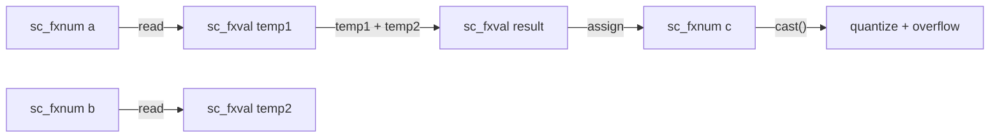

# sc_fxval.h / .cpp -- Fixed-Point Value Type

## Overview

`sc_fxval` and `sc_fxval_fast` are **fixed-point value types not constrained by bit-width**. They are used to store intermediate results of arithmetic operations, preserving full precision until the value is assigned to a bit-width-constrained `sc_fxnum`, at which point quantization and overflow processing are performed.

## Everyday Analogy

Imagine you are working on a math problem:

1. Intermediate calculation: `3.14 * 2.71828 = 8.5394...` (keep all decimal places)
2. Write to the answer sheet: round to two decimal places = `8.54`

`sc_fxval` is the "scratch paper" that can temporarily store infinite-precision intermediate results. `sc_fxnum` is the "answer sheet" with format constraints.

## Class Comparison

| Feature | `sc_fxval` | `sc_fxnum` |
|---------|-----------|-----------|
| Bit-width constraint | None | Yes |
| Quantization/overflow | Not applied | Applied on assignment |
| Purpose | Intermediate computation results | Final stored value |
| Internal representation | `scfx_rep*` | `scfx_rep*` + `scfx_params` |

## sc_fxval -- Arbitrary Precision Value

### Core Members

| Member | Type | Description |
|--------|------|-------------|
| `m_rep` | `scfx_rep*` | Arbitrary precision internal representation |
| `m_observer` | `sc_fxval_observer*` | Observer pointer |

### Main Operations

**Arithmetic operators (return `sc_fxval`):**

```cpp
sc_fxval operator + ( const sc_fxval& ) const;
sc_fxval operator - ( const sc_fxval& ) const;
sc_fxval operator * ( const sc_fxval& ) const;
sc_fxval operator / ( const sc_fxval& ) const;
sc_fxval operator - () const;  // unary minus
```

**Shift operators:**

```cpp
sc_fxval operator << ( int ) const;
sc_fxval operator >> ( int ) const;
```

**Type conversions:**

```cpp
short to_short() const;
int to_int() const;
long to_long() const;
float to_float() const;
double to_double() const;
std::string to_string() const;
// ... and more
```

**Query functions:**

```cpp
bool is_neg() const;
bool is_zero() const;
bool is_nan() const;
bool is_inf() const;
bool is_normal() const;
bool get_bit( int ) const;
```

## sc_fxval_fast -- Limited Precision Value

### Core Members

| Member | Type | Description |
|--------|------|-------------|
| `m_val` | `double` | C++ native double |
| `m_observer` | `sc_fxval_fast_observer*` | Observer |

`sc_fxval_fast` uses `double` for storage, with precision limited to the 52-bit mantissa of IEEE 754 double precision. Operations are much faster than `sc_fxval`.

### Arithmetic Operations

The fast version's arithmetic directly uses C++ `double` operations, without the need for software-emulated arbitrary precision arithmetic.

## Operation Flow



## .cpp File

`sc_fxval.cpp` contains:

1. Implementation of `to_string()` family of methods
2. `to_dec()`, `to_bin()`, `to_oct()`, `to_hex()` conversions
3. `print()`, `scan()`, `dump()` methods
4. Observer lock/unlock mechanism
5. `to_string()` utility function (converts `scfx_ieee_double` to string)

## Related Files

- `scfx_rep.h` -- Internal representation of `sc_fxval`
- `sc_fxnum.h` -- Uses `sc_fxval` as the operation result type
- `sc_fxval_observer.h` -- Value observer
- `scfx_ieee.h` -- IEEE wrapper used by `sc_fxval_fast`
