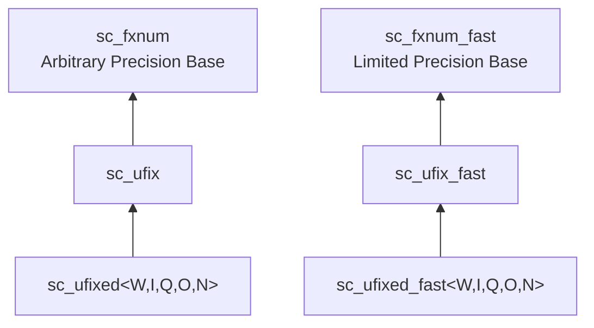

# sc_ufix.h -- Unsigned Unconstrained Fixed-Point

## Overview

`sc_ufix` and `sc_ufix_fast` are **unsigned, runtime-parameterized** fixed-point classes. The difference from `sc_fix` is the use of unsigned encoding (`SC_US_`), which can only represent non-negative values.

## Everyday Analogy

`sc_ufix` is like an "adjustable-size digital scale that can only display positive numbers." At construction time you decide its range and precision, but it will never display negative numbers.

## Inheritance Hierarchy



## Differences from sc_fix

1. **Encoding**: `sc_ufix` passes `SC_US_` (unsigned) when constructing `sc_fxnum`, while `sc_fix` passes `SC_TC_` (two's complement)
2. **Range**: With the same bit-width, unsigned can represent larger positive numbers
3. **Restriction**: Cannot use the `SC_WRAP_SM` overflow mode (sign magnitude wrap is meaningless for unsigned numbers)

## Constructors

Structurally identical to `sc_fix`, the only difference being that `SC_US_` is passed internally to `sc_fxnum`.

## Operators

Same arithmetic, assignment, and bitwise operators as `sc_fix`. Bitwise operators `&=`, `|=`, `^=` accept `sc_ufix` and `sc_ufix_fast`.

## Usage Example

```cpp
// Unsigned 12-bit with 8 integer bits
// Range: 0 to 255.9375
sc_ufix amplitude(12, 8);
amplitude = 128.5;

// Unsigned with saturation
sc_ufix level(10, 5, SC_TRN, SC_SAT);
level = 50.0;  // ok
level = -1.0;  // saturates to 0
```

## Related Files

- `sc_fxnum.h` -- Parent class `sc_fxnum`
- `sc_ufixed.h` -- Constrained version `sc_ufixed`, inherits from `sc_ufix`
- `sc_fix.h` -- Signed version
- `sc_fxval.h` -- Return type of arithmetic operations
