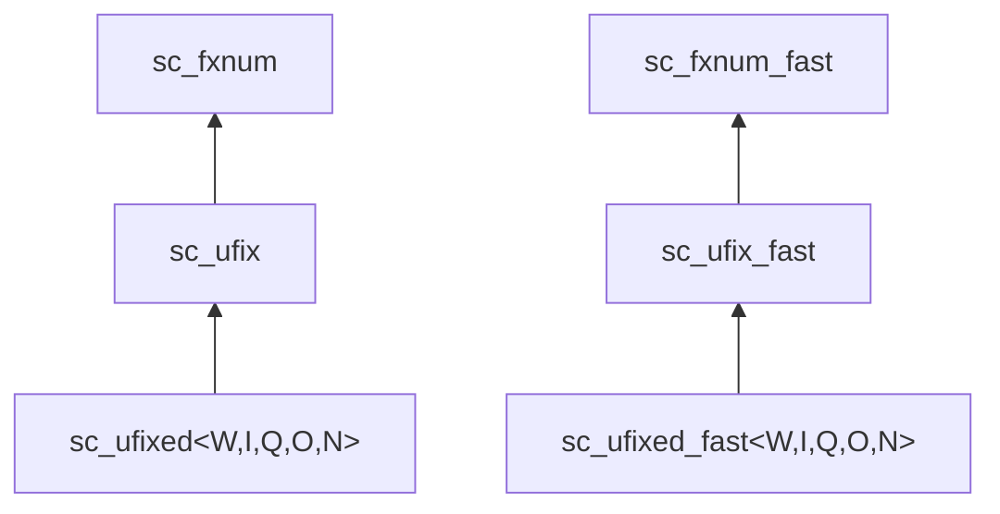

# sc_ufixed.h -- Unsigned Constrained Fixed-Point

## Overview

`sc_ufixed<W, I, Q, O, N>` and `sc_ufixed_fast<W, I, Q, O, N>` are **unsigned, compile-time constrained** fixed-point template classes. The difference from `sc_fixed` is the use of unsigned encoding (`SC_US_`), so they can only represent non-negative values.

## Everyday Analogy

If `sc_fixed` is a thermometer that can display both positive and negative temperatures, `sc_ufixed` is a thermometer that can only display temperatures above 0 degrees -- no negative sign, but the same number of bits can represent larger positive numbers.

## Template Parameters

```cpp
template <int W, int I,
          sc_q_mode Q = SC_DEFAULT_Q_MODE_,
          sc_o_mode O = SC_DEFAULT_O_MODE_,
          int N = SC_DEFAULT_N_BITS_>
class sc_ufixed : public sc_ufix { ... };
```

Parameter meanings are identical to `sc_fixed`.

## Inheritance Hierarchy



## Differences from sc_fixed

| Feature | `sc_fixed` | `sc_ufixed` |
|---------|-----------|------------|
| Encoding | `SC_TC_` (two's complement) | `SC_US_` (unsigned) |
| Range (8-bit, 4 integer bits) | -8.0 ~ +7.9375 | 0 ~ 15.9375 |
| Parent class | `sc_fix` | `sc_ufix` |
| `SC_WRAP_SM` | Available | Not available (triggers error) |

## Usage Example

```cpp
// 8-bit unsigned, 4 integer bits
// Range: 0 to 15.9375, step: 0.0625
sc_ufixed<8, 4> pixel_value = 12.5;

// 10-bit unsigned, 1 integer bit (9 fractional bits)
// Range: 0 to ~1.998, step: ~0.002
sc_ufixed<10, 1> probability = 0.75;
```

## Bitwise Operations

Bitwise operators `&=`, `|=`, `^=` accept `sc_ufix` and `sc_ufix_fast` types (not `sc_fix`), ensuring type safety.

## Related Files

- `sc_ufix.h` -- Parent class `sc_ufix` / `sc_ufix_fast`
- `sc_fixed.h` -- Signed version `sc_fixed`
- `sc_fxnum.h` -- Ultimate base class
- `fx.h` -- Master include entry point
