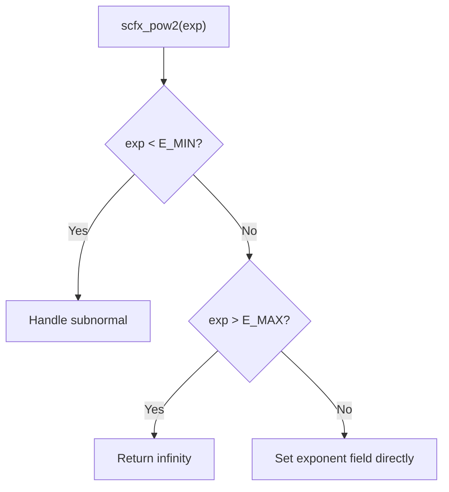

# scfx_ieee.h -- IEEE 754 Floating-Point Wrapper

## Overview

`scfx_ieee.h` provides **low-level bit-field access** interfaces for IEEE 754 single-precision and double-precision floating-point numbers. Through unions and bit-fields, you can directly read and write the sign bit, exponent, and mantissa of a floating-point number without manual bit manipulation.

## Everyday Analogy

A `double` floating-point number is like a sealed black box -- you know its value is `3.14`, but you don't know how the bits are arranged inside. `scfx_ieee_double` is like a transparent box that lets you directly see and modify the three internal parts: sign, exponent, and mantissa.

## IEEE 754 Double-Precision Format

```
 63  62    52 51                                    0
[S] [EEEEEEEEEEE] [MMMMMMMMMMMMMMMMMMMMMMMMMMMMMM...]
 ^      ^ (11 bits)              ^ (52 bits)
Sign   Exponent                Mantissa
```

### `ieee_double` Union

```cpp
union ieee_double {
    double d;
    struct {
        unsigned mantissa1:32;  // lower 32 bits of mantissa
        unsigned mantissa0:20;  // upper 20 bits of mantissa
        unsigned exponent:11;   // biased exponent
        unsigned negative:1;    // sign bit
    } s;
};
```

**Note:** The bit-field layout order depends on the platform's byte order (big-endian/little-endian). The source code uses `SC_BIG_ENDIAN` / `SC_LITTLE_ENDIAN` conditional compilation.

### Key Constants

| Constant | Value | Description |
|----------|-------|-------------|
| `SCFX_IEEE_DOUBLE_BIAS` | 1023 | Exponent bias |
| `SCFX_IEEE_DOUBLE_E_MAX` | 1023 | Maximum exponent |
| `SCFX_IEEE_DOUBLE_E_MIN` | -1022 | Minimum normal exponent |
| `SCFX_IEEE_DOUBLE_M_SIZE` | 52 | Mantissa bit count |

## `scfx_ieee_double` Class

### Access Methods

| Method | Description |
|--------|-------------|
| `negative()` / `negative(v)` | Read/set sign bit |
| `exponent()` / `exponent(v)` | Read/set exponent (bias already subtracted) |
| `mantissa0()` / `mantissa0(v)` | Read/set upper 20 bits of mantissa |
| `mantissa1()` / `mantissa1(v)` | Read/set lower 32 bits of mantissa |

### State Queries

| Method | Condition | Description |
|--------|-----------|-------------|
| `is_zero()` | exponent = E_MIN-1, mantissa = 0 | Positive or negative zero |
| `is_subnormal()` | exponent = E_MIN-1, mantissa != 0 | Subnormal number |
| `is_normal()` | E_MIN <= exponent <= E_MAX | Normal number |
| `is_inf()` | exponent = E_MAX+1, mantissa = 0 | Positive or negative infinity |
| `is_nan()` | exponent = E_MAX+1, mantissa != 0 | Not a Number (NaN) |

### Bit Search

| Method | Description |
|--------|-------------|
| `msb()` | Find the position of the most significant bit in the mantissa |
| `lsb()` | Find the position of the least significant bit in the mantissa |

These methods use a binary search technique with O(log n) efficiency.

## `scfx_ieee_float` Class

IEEE 754 single-precision version, similar in structure but:

| Feature | Double Precision | Single Precision |
|---------|-----------------|------------------|
| Bit count | 64 | 32 |
| Exponent bits | 11 | 8 |
| Mantissa bits | 52 | 23 |
| Bias | 1023 | 127 |

## `scfx_pow2()` Function

```cpp
inline double scfx_pow2(int exp);
```

Efficiently computes `2.0^exp`. Instead of using the `pow()` function, it directly manipulates the IEEE 754 exponent field:



This function is one of the most frequently called fundamental functions in fixed-point quantization and overflow calculations.

## Related Files

- `scfx_mant.h` -- Uses `scfx_ieee.h` for floating-point conversion
- `sc_fxnum.cpp` -- `sc_fxnum_fast` uses `scfx_ieee_double` for casting
- `sc_fxval.h` -- Internal representation of `sc_fxval_fast`
- `sc_fxdefs.h` -- Included by this file
