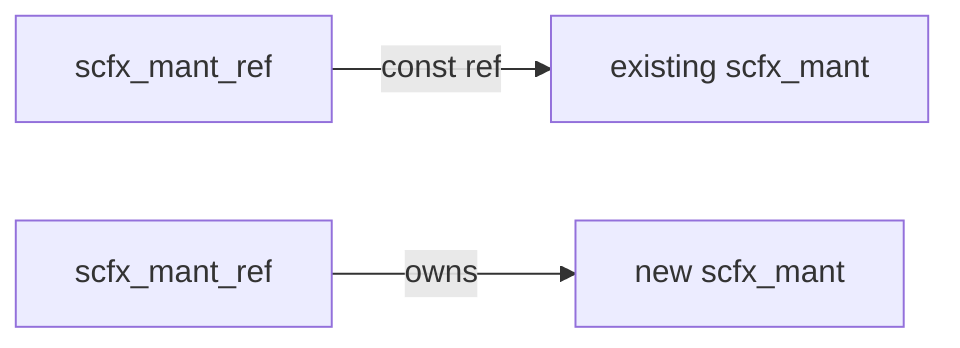

# scfx_mant.h / .cpp -- Mantissa Storage Class

## Overview

`scfx_mant` is a **dynamically-sized word array** used to store the mantissa of a fixed-point value in `scfx_rep`. It handles big-endian/little-endian differences and provides word-level and half-word-level access interfaces.

## Everyday Analogy

`scfx_mant` is like an "expandable storage box." Each compartment (word) can hold 32 marbles (bits). If the number gets bigger, more compartments are added; if it gets smaller, compartments are removed. And it is smart enough to adapt to different arrangement methods (big-endian vs. little-endian).

## Class Details

### Member Variables

| Member | Type | Description |
|--------|------|-------------|
| `m_array` | `word*` | Dynamically allocated word array |
| `m_size` | `int` | Array size (number of words) |

### Type Definitions

```cpp
typedef unsigned int word;        // 32-bit unit
typedef unsigned short half_word; // 16-bit unit
```

### Main Methods

| Method | Description |
|--------|-------------|
| `scfx_mant(size)` | Construct a mantissa of the specified size |
| `operator[](i)` | Read/write the i-th word |
| `half_at(i)` | Read/write the i-th half-word |
| `half_addr(i)` | Get the half-word pointer of the i-th word |
| `clear()` | Zero out everything |
| `resize_to(size, restore)` | Resize, optionally preserving content |
| `size()` | Get the current size |

### Big-Endian / Little-Endian Handling

`scfx_mant` internally uses different indexing depending on the platform's byte order:

```cpp
// Big Endian: index 0 is at the highest address
word operator[](int i) { return m_array[-i]; }

// Little Endian: index 0 is at the lowest address
word operator[](int i) { return m_array[i]; }
```

### Two Modes of resize_to

```
restore == 1 (MSB aligned):
  Before: [A][B][C]
  After:  [A][B][C][0][0]  (new words at high end)

restore == -1 (LSB aligned):
  Before:     [A][B][C]
  After:  [0][0][A][B][C]  (new words at low end)
```

## Helper Functions

### `complement()` -- One's Complement

```cpp
void complement(scfx_mant& target, const scfx_mant& source, int size);
```

Performs bitwise inversion on the mantissa.

### `inc()` -- Increment

```cpp
void inc(scfx_mant& mant);
```

Adds 1 to the mantissa, handling carries. Used together with `complement()` to implement two's complement conversion.

## `scfx_mant_ref` -- Mantissa Reference Class



`scfx_mant_ref` is a smart reference that can point to:
- An **existing** `scfx_mant` (read-only, does not own)
- A **newly created** `scfx_mant` (owns, deletes on destruction)

This is used in functions like `align()` to avoid unnecessary copies.

| Member | Description |
|--------|-------------|
| `m_mant` | Pointer to `scfx_mant` |
| `m_not_const` | Whether owned (true = owned, deleted on destruction) |

## Memory Management

`alloc()` and `free()` are static methods that encapsulate word array allocation and deallocation. On big-endian platforms, they adjust pointer positions so that `operator[]` works correctly.

## Related Files

- `scfx_rep.h` -- Uses `scfx_mant` for mantissa storage
- `scfx_ieee.h` -- Dependent IEEE floating-point utilities
- `scfx_utils.h` -- Dependent utility functions
