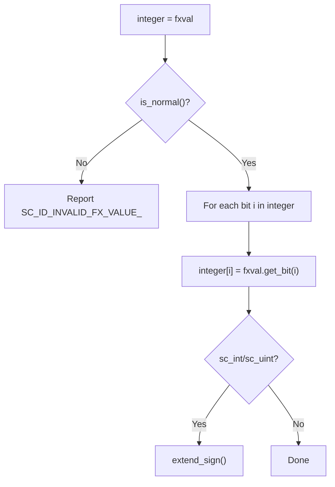
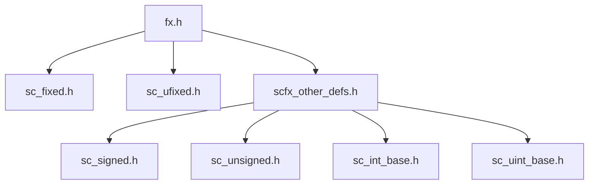

# scfx_other_defs.h -- Fixed-Point Interoperability with Other Types

## Overview

`scfx_other_defs.h` defines **assignment operators** between fixed-point types and SystemC integer types. It allows `sc_signed`, `sc_unsigned`, `sc_int_base`, and `sc_uint_base` to directly receive fixed-point values.

## Everyday Analogy

Like power plug adapters for different countries, this file provides "adapters" between fixed-point and integer types. Without it, you couldn't directly assign an `sc_fixed<8,4>` value to an `sc_int<8>`.

## Supported Conversions

### Source Types (Fixed-Point)

| Type | Description |
|------|-------------|
| `sc_fxval` | Arbitrary precision fixed-point value |
| `sc_fxval_fast` | Limited precision fixed-point value |
| `sc_fxnum` | Arbitrary precision fixed-point number |
| `sc_fxnum_fast` | Limited precision fixed-point number |

### Target Types (Integer)

| Type | Description |
|------|-------------|
| `sc_signed` | Arbitrary precision signed integer |
| `sc_unsigned` | Arbitrary precision unsigned integer |
| `sc_int_base` | Fixed precision signed integer (up to 64 bits) |
| `sc_uint_base` | Fixed precision unsigned integer (up to 64 bits) |

## Conversion Logic

All conversions follow the same pattern:



1. First check whether the fixed-point value is normal (not NaN or Inf)
2. Bit-by-bit copy: from bit 0 of the fixed-point number to the highest bit of the integer
3. For `sc_int_base` and `sc_uint_base`, sign extension is performed at the end

## Conditional Compilation

The entire file is wrapped in `#ifdef SC_INCLUDE_FX`. This means fixed-point functionality is optional -- these interoperability definitions are only compiled when the `SC_INCLUDE_FX` macro is defined.

```cpp
#ifdef SC_INCLUDE_FX
// ... all conversion operators ...
#endif
```

## Why Is This in a Separate File?

These conversion operators must see the complete definitions of both fixed-point types and integer types. To avoid circular include dependencies, they are placed in a separate file and included at the end of `fx.h` (the master include).



## Related Files

- `fx.h` -- Includes this file
- `sc_fxval.h` -- `sc_fxval`'s `get_bit()` method
- `sc_fxnum.h` -- `sc_fxnum`'s `get_bit()` method
- `sysc/datatypes/int/sc_signed.h` -- Definition of `sc_signed`
- `sysc/datatypes/int/sc_unsigned.h` -- Definition of `sc_unsigned`
- `sysc/datatypes/int/sc_int_base.h` -- Definition of `sc_int_base`
- `sysc/datatypes/int/sc_uint_base.h` -- Definition of `sc_uint_base`
