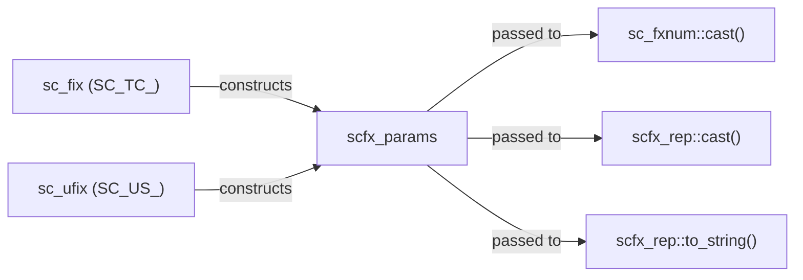

# scfx_params.h -- Combined Parameters Class

## Overview

`scfx_params` bundles `sc_fxtype_params` (type parameters), `sc_enc` (encoding), and `sc_fxcast_switch` (cast switch) into a **unified parameter object** for use by `sc_fxnum` and `scfx_rep` during quantization and overflow processing.

## Everyday Analogy

If `sc_fxtype_params` is the "camera settings," `sc_enc` is the "film type," and `sc_fxcast_switch` is the "autofocus switch," then `scfx_params` is packaging all three into a "photo configuration profile" for convenient one-shot passing to the capture function.

## Class Details

### Member Variables

| Member | Type | Description |
|--------|------|-------------|
| `m_type_params` | `sc_fxtype_params` | wl, iwl, q_mode, o_mode, n_bits |
| `m_enc` | `sc_enc` | SC_TC_ (two's complement) or SC_US_ (unsigned) |
| `m_cast_switch` | `sc_fxcast_switch` | SC_ON or SC_OFF |

### Constructor

```cpp
scfx_params(const sc_fxtype_params& type_params,
            sc_enc enc,
            const sc_fxcast_switch& cast_sw);
```

At construction time it validates: if the encoding is unsigned (`SC_US_`) and the overflow mode is `SC_WRAP_SM`, an error is reported. This is because sign magnitude wrap-around is meaningless for unsigned numbers.

### Shortcut Access Methods

| Method | Equivalent to | Description |
|--------|---------------|-------------|
| `wl()` | `type_params().wl()` | Total word length |
| `iwl()` | `type_params().iwl()` | Integer word length |
| `fwl()` | `wl() - iwl()` | Fractional word length |
| `q_mode()` | `type_params().q_mode()` | Quantization mode |
| `o_mode()` | `type_params().o_mode()` | Overflow mode |
| `n_bits()` | `type_params().n_bits()` | Saturation bits |
| `enc()` | -- | Encoding |
| `cast_switch()` | -- | Cast switch |

## Usage Scenario



`scfx_params` is the standard way to pass parameters internally in the fixed-point system. It is assembled during `sc_fxnum` construction and used in all operations that require parameters.

## Related Files

- `sc_fxtype_params.h` -- Type parameters
- `sc_fxdefs.h` -- `sc_enc` enumeration
- `sc_fxcast_switch.h` -- Cast switch
- `sc_fxnum.h` -- Uses `scfx_params` as a member
- `scfx_rep.h` -- Uses `scfx_params` in quantization/overflow
