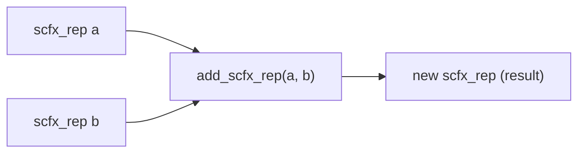

# scfx_rep.h / .cpp -- Arbitrary Precision Fixed-Point Internal Representation

## Overview

`scfx_rep` is the **arbitrary precision core engine** of SystemC fixed-point numbers. It stores values in a manner similar to scientific notation: a variable-length mantissa paired with a bit-level exponent. All arbitrary precision versions of `sc_fxval` and `sc_fxnum` depend on this class.

## Everyday Analogy

Imagine you are recording a very large or very small number on graph paper. Each cell can hold one digit. If the number is large, you use more cells; if it is small, you add a decimal point in front. `scfx_rep` is this graph paper -- it can dynamically add or remove cells to accommodate numbers of any size.

## Core Members

| Member | Type | Description |
|--------|------|-------------|
| `m_mant` | `scfx_mant` | Mantissa (bit array) |
| `m_wp` | `int` | Word point -- which word the decimal point is at |
| `m_sign` | `int` | Sign (1 or -1) |
| `m_state` | `state` | State: normal / infinity / not_a_number |
| `m_msw` | `int` | Index of the most significant word |
| `m_lsw` | `int` | Index of the least significant word |
| `m_r_flag` | `bool` | Carry flag |

### state Enum

```cpp
enum state { normal, infinity, not_a_number };
```

## Value Representation

```
m_mant:  [word_0] [word_1] [word_2] ... [word_n]
              ^
           m_wp (word point position)
```

Value = m_sign * (m_mant interpreted as integer) * 2^(m_wp * bits_in_word)

## Helper Class: `scfx_index`

```cpp
class scfx_index {
    int m_wi;  // word index
    int m_bi;  // bit index within word
};
```

`calc_indices(n)` converts bit position `n` to a `(word_index, bit_index)` pair.

## Constructors

Supports construction from the following types:

- `int`, `unsigned int`, `long`, `unsigned long`
- `double`
- `const char*` (string, supports various radix prefixes)
- `int64`, `uint64`
- `sc_signed`, `sc_unsigned`

## Arithmetic Operations (Friend Functions)

All arithmetic is implemented through friend functions, returning heap-allocated new `scfx_rep` objects:

| Function | Operation |
|----------|-----------|
| `neg_scfx_rep()` | Negate |
| `mult_scfx_rep()` | Multiply |
| `div_scfx_rep()` | Divide |
| `add_scfx_rep()` | Add |
| `sub_scfx_rep()` | Subtract |
| `lsh_scfx_rep()` | Left shift |
| `rsh_scfx_rep()` | Right shift |
| `cmp_scfx_rep()` | Compare |



## Quantization and Overflow

The `cast()` method is the core of fixed-point behavior:

```cpp
void cast(const scfx_params& params, bool& q_flag, bool& o_flag);
```

Internally calls `quantization()` and `overflow()`, truncating/rounding and handling overflow according to the settings in `scfx_params`.

### Quantization Helper Methods

| Method | Description |
|--------|-------------|
| `q_bit()` | Get the quantization bit (determines whether to round up) |
| `q_clear()` | Clear bits below the quantization bit |
| `q_incr()` | Round up the quantization bit |
| `q_odd()` | Determine if the lowest retained bit is odd |
| `q_zero()` | Determine if all bits below the quantization bit are zero |

### Overflow Helper Methods

| Method | Description |
|--------|-------------|
| `o_extend()` | Sign extension |
| `o_bit_at()` | Get the overflow decision bit |
| `o_zero_left/right()` | Determine if all bits on the left/right are zero |
| `o_set_low/high()` | Set to minimum/maximum value |
| `o_set()` | Set the post-overflow value |
| `o_invert()` | Invert bits |

## String Conversion

```cpp
const char* to_string(sc_numrep, int, sc_fmt, const scfx_params*) const;
void from_string(const char*, int);
```

Supports bidirectional conversion in binary, octal, decimal, hexadecimal, and CSD formats.

## Memory Management

`scfx_rep` overrides `operator new` and `operator delete`, potentially using a custom memory pool to improve performance for frequent creation/destruction (arithmetic operations produce large numbers of temporary objects).

## Related Files

- `scfx_mant.h` -- Mantissa storage class
- `scfx_params.h` -- Parameters for quantization/overflow
- `scfx_string.h` -- String class for string conversion
- `sc_fxval.h` -- Uses `scfx_rep` as internal representation
- `sc_fxnum.h` -- Uses `scfx_rep` as internal representation
