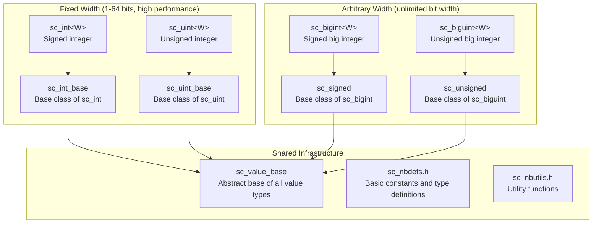
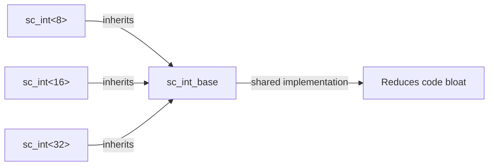

# SystemC Integer Type Subsystem - Complete Hardware Integer Data Type Library

## Overview

The `datatypes/int/` directory implements all integer-related data types in SystemC. These types are the building blocks of hardware modeling, allowing software engineers to precisely control integer bit widths, signed/unsigned characteristics, and arithmetic behavior.

### Everyday Analogy

Imagine you are shopping at a supermarket:
- **C++ native `int`**: like a fixed-size shopping bag, available only in 32-bit or 64-bit sizes
- **SystemC integer types**: like custom-sized containers — you can request a box that holds exactly 7 apples (7 bits), or a large crate that holds 128 apples (128 bits)

In hardware design, every bit consumes actual circuit area and power, so precise control of bit width is very important.

## Type System Overview



## How to Choose the Right Type

| Type | Bit Width | Signed/Unsigned | Performance | Use Case |
|------|-----------|-----------------|-------------|----------|
| `sc_int<W>` | 1-64 | Signed | Highest | General registers, counters |
| `sc_uint<W>` | 1-64 | Unsigned | Highest | Addresses, flags |
| `sc_bigint<W>` | Arbitrary | Signed | Lower | Large number arithmetic, DSP |
| `sc_biguint<W>` | Arbitrary | Unsigned | Lower | Large number arithmetic, cryptography |
| `sc_signed` | Determined at runtime | Signed | Lowest | Dynamic width requirements |
| `sc_unsigned` | Determined at runtime | Unsigned | Lowest | Dynamic width requirements |

## File Structure

### Core Type Files
| File | Description |
|------|-------------|
| [sc_int_base.md](sc_int_base.md) | `sc_int_base` — Signed fixed-width integer base class |
| [sc_int.md](sc_int.md) | `sc_int<W>` — Signed fixed-width integer template class |
| [sc_uint_base.md](sc_uint_base.md) | `sc_uint_base` — Unsigned fixed-width integer base class |
| [sc_uint.md](sc_uint.md) | `sc_uint<W>` — Unsigned fixed-width integer template class |
| [sc_signed.md](sc_signed.md) | `sc_signed` — Arbitrary-precision signed integer |
| [sc_unsigned.md](sc_unsigned.md) | `sc_unsigned` — Arbitrary-precision unsigned integer |
| [sc_bigint.md](sc_bigint.md) | `sc_bigint<W>` — Compile-time width arbitrary-precision signed integer |
| [sc_biguint.md](sc_biguint.md) | `sc_biguint<W>` — Compile-time width arbitrary-precision unsigned integer |

### Support Files
| File | Description |
|------|-------------|
| [sc_nbdefs.md](sc_nbdefs.md) | Basic constants and type definitions |
| [sc_nbutils.md](sc_nbutils.md) | Shared utility functions |
| [sc_big_ops.md](sc_big_ops.md) | Big integer operator implementations |
| [sc_int_ids.md](sc_int_ids.md) | Error reporting identifiers |
| [sc_length_param.md](sc_length_param.md) | Length parameter type |
| [sc_int32_mask.md](sc_int32_mask.md) | 32-bit mask lookup table |
| [sc_int64_mask.md](sc_int64_mask.md) | 64-bit mask lookup table |
| [sc_int64_io.md](sc_int64_io.md) | 64-bit I/O support |
| [sc_vector_utils.md](sc_vector_utils.md) | Vector operation utilities |

## Design Philosophy

### Why a Two-Layer Architecture (Base + Template)?



- **Base class** (e.g., `sc_int_base`): contains all logic independent of bit width, compiled only once
- **Template class** (e.g., `sc_int<W>`): just a thin wrapper that adds compile-time width checking
- This design avoids C++ templates generating complete duplicate code for each different width

### RTL Background

In Verilog/VHDL, you must specify the exact bit width when declaring signals:
```
// Verilog
reg [7:0] counter;    // 8-bit register
wire [31:0] address;  // 32-bit wire
```

SystemC integer types correspond to this concept:
```cpp
sc_int<8> counter;     // same as reg [7:0]
sc_uint<32> address;   // same as wire [31:0]
```

## Related Directories

- [../misc/](../misc/_index.md) — Base classes such as `sc_value_base` and `sc_concatref`
- `../bit/` — Bit vector types (`sc_bv`, `sc_lv`)
- `../fx/` — Fixed-point number types
