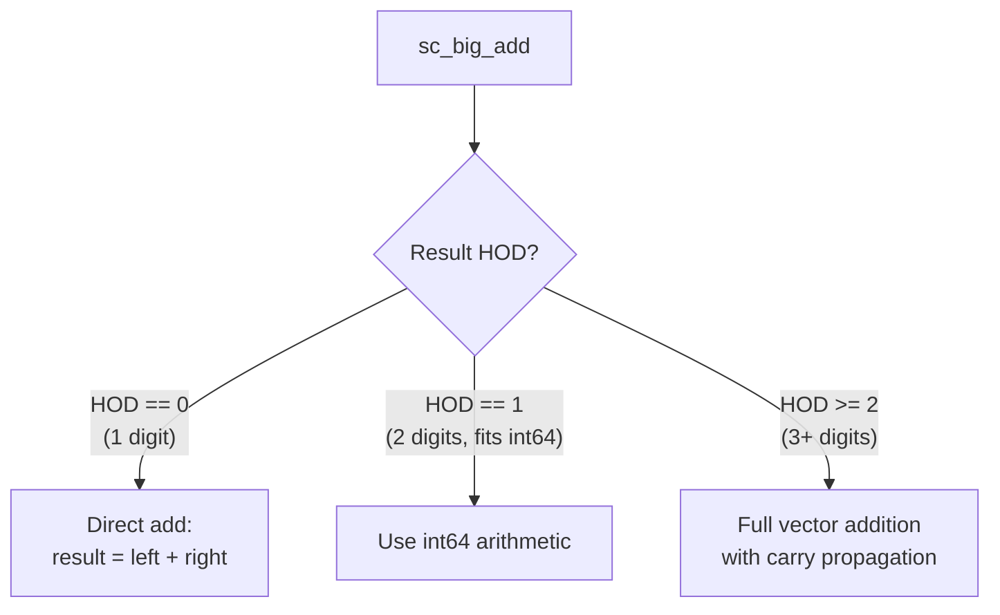

# sc_big_ops.h — Big Integer Operator Implementations

## Overview

`sc_big_ops.h` implements all arithmetic and bitwise operation inline functions between `sc_bigint<W>` and `sc_biguint<W>`. These operations directly manipulate two's complement digit vectors and are the performance core of big integer arithmetic.

**Source file:**
- `ref/systemc/src/sysc/datatypes/int/sc_big_ops.h`

## Everyday Analogy

Imagine you are doing long-form addition with large numbers. `sc_big_ops.h` is the set of "long-form calculation rules":
- Start from the least significant position
- Add digit by digit
- Handle carries
- Finally handle the sign

The difference is that each "digit" here is a 32-bit `sc_digit`, not a decimal 0~9.

## Core Operations

### 1. Addition (sc_big_add)

```cpp
template<typename RESULT, typename LEFT, typename RIGHT>
inline void sc_big_add( RESULT& result, const LEFT& left, const RIGHT& right );
```

The addition strategy is tiered and optimized based on the size of the operands:



- **1 digit**: direct 32-bit addition
- **2 digits**: convert to 64-bit integer for addition
- **3+ digits**: add digit by digit, handling the carry chain

### 2. Other Operations

The same tiered optimization strategy also applies to:
- **Subtraction** (`sc_big_sub`)
- **Multiplication** (`sc_big_mul`)
- **Division** (`sc_big_div`)
- **Modulus** (`sc_big_mod`)
- **Bitwise operations** (AND, OR, XOR)

### 3. Helper Macros

```cpp
#define SC_BIG_MAX(LEFT,RIGHT) ( (LEFT) > (RIGHT) ? (LEFT) : (RIGHT) )
#define SC_BIG_MIN(LEFT,RIGHT) ( (LEFT) < (RIGHT) ? (LEFT) : (RIGHT) )
```

Used to calculate the bit width needed for the result at compile time.

### 4. Debugging Tools

```cpp
inline void vector_dump( int source_hod, sc_digit* source_p );
```

Dumps the digit vector in hexadecimal format to standard output for debugging purposes.

## Why Must This File Be Loaded Last?

`sc_big_ops.h` requires complete definitions of all types including `sc_bigint`, `sc_biguint`, `sc_signed`, and `sc_unsigned` to compile. Therefore, it must be `#include`d after all other `int` header files.

## Related Files

- [sc_bigint.md](sc_bigint.md) — `sc_bigint<W>` type definition
- [sc_biguint.md](sc_biguint.md) — `sc_biguint<W>` type definition
- [sc_vector_utils.md](sc_vector_utils.md) — Vector operation type information utilities
- [sc_nbutils.md](sc_nbutils.md) — Low-level vector manipulation functions
