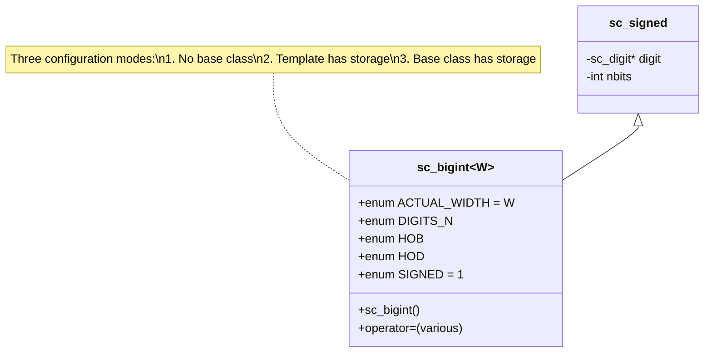
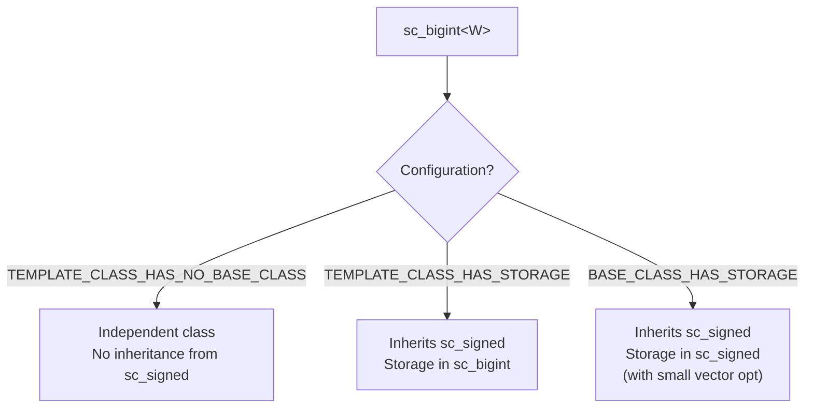

# sc_bigint\<W\> — Compile-Time Width Arbitrary-Precision Signed Integer

## Overview

`sc_bigint<W>` is a template class that provides compile-time bit-width arbitrary-precision signed integers. It combines the arbitrary-precision capability of `sc_signed` with the compile-time type safety brought by the template parameter `W`.

**Source files:**
- `ref/systemc/src/sysc/datatypes/int/sc_bigint.h`
- `ref/systemc/src/sysc/datatypes/int/sc_bigint_inlines.h`

## Everyday Analogy

If `sc_signed` is a calculator with "unlimited digits, adjustable at runtime," then `sc_bigint<W>` is a specially-made calculator with "digits fixed at the factory." For example, `sc_bigint<128>` is a 128-bit calculator.

**Key difference:**
- `sc_signed`: "Boss, I need a calculator, but I don't know how many digits yet — I'll tell you later"
- `sc_bigint<128>`: "Boss, I want a 128-digit calculator"

## Class Architecture



## Core Concepts

### 1. Three Configuration Modes

`sc_bigint<W>` supports three memory configuration strategies, selected via macros:



- **NO_BASE_CLASS**: `sc_bigint` is an independent class, does not inherit from `sc_signed`
- **TEMPLATE_CLASS_HAS_STORAGE**: inherits `sc_signed`, but the digit array is stored in the template class
- **BASE_CLASS_HAS_STORAGE**: inherits `sc_signed`, the digit array is managed by the base class (with small vector optimization)

### 2. Compile-Time Constants

```cpp
enum {
    ACTUAL_WIDTH = W,                   // actual bit width
    DIGITS_N     = SC_DIGIT_COUNT(W),   // number of 32-bit digits needed
    HOB          = SC_BIT_INDEX(W-1),   // bit index within highest digit
    HOD          = SC_DIGIT_INDEX(W-1), // index of highest digit
    SIGNED       = 1,                   // this is a signed type
    WIDTH        = W                    // width parameter
};
```

These `enum` values are determined at compile time, allowing the compiler to perform extensive optimizations including:
- Loop unrolling
- Directly calculating the number of digits needed
- Selecting optimized operation paths in `sc_big_ops.h`

### 3. Constructors

`sc_bigint<W>` provides constructors for conversion from various types:

```cpp
sc_bigint<128> a;                // default: 0
sc_bigint<128> b(42);            // from integer
sc_bigint<128> c(some_signed);   // from sc_signed
sc_bigint<128> d("0xABCD...");   // from string
sc_bigint<128> e(some_biguint);  // from sc_biguint (different width OK)
```

### 4. sc_bigint_inlines.h

Contains inline functions that can only be defined after all header files are loaded, typically involving forward-declared types such as `sc_unsigned` and `sc_biguint`.

## Usage Examples

```cpp
// DSP: 128-bit accumulator
sc_bigint<128> accumulator = 0;
sc_bigint<64> sample;
accumulator += sample;

// Cryptography
sc_bigint<256> hash_value;
sc_bigint<512> product = hash_value * hash_value;

// Cross-width operations
sc_bigint<32> small = 100;
sc_bigint<64> big = 200;
sc_bigint<65> result = small + big;  // auto width expansion
```

## When to Use sc_bigint vs. sc_int?

| Condition | Recommended Type |
|-----------|-----------------|
| Bit width <= 64 | `sc_int<W>` (best performance) |
| Bit width > 64 | `sc_bigint<W>` (only option) |
| Width determined at runtime | `sc_signed` (dynamic width) |

## Related Files

- [sc_signed.md](sc_signed.md) — Base class `sc_signed`
- [sc_biguint.md](sc_biguint.md) — Unsigned version `sc_biguint<W>`
- [sc_big_ops.md](sc_big_ops.md) — Big integer operator implementations
- [sc_int.md](sc_int.md) — Alternative for 64 bits or fewer
