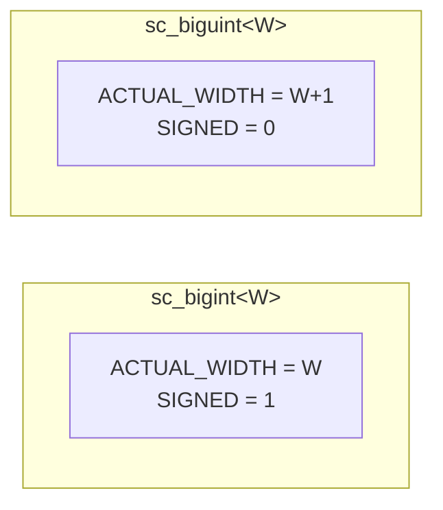

# sc_biguint\<W\> — Compile-Time Width Arbitrary-Precision Unsigned Integer

## Overview

`sc_biguint<W>` is the unsigned version of `sc_bigint<W>`, providing compile-time bit-width arbitrary-precision unsigned integers. It inherits from `sc_unsigned` and is a mirror design of `sc_bigint<W>`.

**Source files:**
- `ref/systemc/src/sysc/datatypes/int/sc_biguint.h`
- `ref/systemc/src/sysc/datatypes/int/sc_biguint_inlines.h`

## Everyday Analogy

`sc_biguint<W>` is like an "extra-large odometer" with digits fixed at the factory. `sc_biguint<256>` is a 256-bit odometer that can count up to 2^256 - 1 — an astronomical number (larger than the number of atoms in the universe).

## Core Concepts

### 1. Key Differences from sc_bigint\<W\>



Note `ACTUAL_WIDTH = W+1`! This is because `sc_biguint<W>` needs an extra bit to represent "sign bit is 0," maintaining consistency with `sc_unsigned` semantics.

### 2. Compile-Time Constants

```cpp
enum {
    ACTUAL_WIDTH = W+1,                 // one extra bit for sign=0
    DIGITS_N     = SC_DIGIT_COUNT(W+1), // digits needed
    HOB          = SC_BIT_INDEX(W),     // high order bit index
    HOD          = SC_DIGIT_INDEX(W),   // high order digit index
    SIGNED       = 0,                   // unsigned type
    WIDTH        = W                    // user-specified width
};
```

### 3. Three Configuration Modes

Same as `sc_bigint<W>`, three memory configuration strategies are supported:
- `SC_BIGINT_CONFIG_TEMPLATE_CLASS_HAS_NO_BASE_CLASS`
- `SC_BIGINT_CONFIG_TEMPLATE_CLASS_HAS_STORAGE`
- `SC_BIGINT_CONFIG_BASE_CLASS_HAS_STORAGE`

### 4. Constructors

```cpp
sc_biguint<256> a;                  // default: 0
sc_biguint<256> b(42u);             // from unsigned int
sc_biguint<256> c(some_unsigned);   // from sc_unsigned
sc_biguint<256> d("0xABCD...");     // from string
sc_biguint<256> e(true);            // from bool (0 or 1)
```

Note there is a special `bool` constructor, which is not present in `sc_bigint<W>`.

## Usage Examples

```cpp
// Large address space
sc_biguint<128> ipv6_address;

// Cryptographic key
sc_biguint<2048> rsa_key;

// Hash value
sc_biguint<256> sha256_hash;

// Mixed operations with signed types
sc_biguint<128> a = 100;
sc_bigint<128> b = -50;
sc_bigint<129> result = a + b;  // result is signed (mixed operation)
```

## Related Files

- [sc_unsigned.md](sc_unsigned.md) — Base class `sc_unsigned`
- [sc_bigint.md](sc_bigint.md) — Signed version `sc_bigint<W>`
- [sc_big_ops.md](sc_big_ops.md) — Big integer operator implementations
- [sc_uint.md](sc_uint.md) — Alternative for 64 bits or fewer
