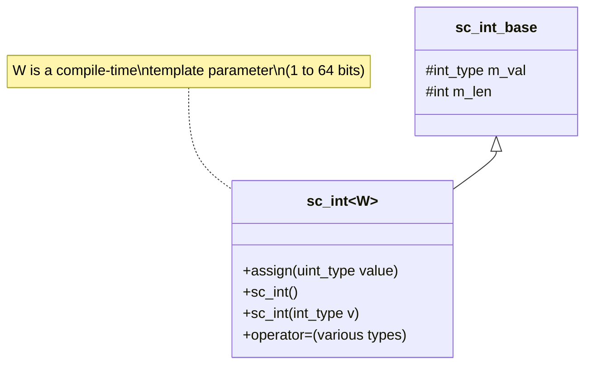

# sc_int\<W\> — Signed Fixed-Width Integer Template Class

## Overview

`sc_int<W>` is the signed integer type directly used by users, where `W` is the bit width (1 to 64). It inherits from `sc_int_base`, and its main jobs are:
1. Remember the bit width `W` at compile time
2. Ensure all assignment operations correctly perform sign extension
3. Provide type-safe constructors and assignment operators

**Source files:**
- `ref/systemc/src/sysc/datatypes/int/sc_int.h`
- `ref/systemc/src/sysc/datatypes/int/sc_int_inlines.h`

## Everyday Analogy

If `sc_int_base` is an "adjustable-digit calculator," then `sc_int<W>` is a "calculator with digits fixed at the factory." For example, `sc_int<8>` is a calculator that can only display -128 to 127, while `sc_int<16>` can display -32768 to 32767.

## Class Structure



## Core Mechanisms

### 1. Sign Extension

The most important method of `sc_int<W>` is `assign()`, which ensures the value is correctly truncated and sign-extended:

```cpp
void assign( uint_type value )
{
    m_val = ( value & (1ull << (W-1)) ) ?
        value | (~UINT64_ZERO << (W-1)) :   // negative: extend sign
        value & ( ~UINT_ZERO >> (SC_INTWIDTH-W) );  // positive: mask
}
```

**Analogy explanation:** Imagine you have a 4-bit number `1011` (binary):
- The most significant bit is `1`, indicating this is negative
- To place it in a 64-bit space, you must fill all leading positions with `1`
- The result is `1111...1011`, which is the 64-bit two's complement representation of `-5`

### 2. Constructor Family

`sc_int<W>` provides numerous constructors that can convert from almost any SystemC numeric type:

```cpp
sc_int<8> a;              // default: value is 0
sc_int<8> b(42);          // from int
sc_int<8> c(some_signed); // from sc_signed
sc_int<8> d("0xFF");      // from string
sc_int<8> e(bv);          // from sc_bv_base (bit vector)
```

### 3. Assignment Operators

Every assignment operator calls `assign()` to ensure correct sign extension:

```cpp
sc_int<8>& operator = ( int_type v )
    { assign(v); return *this; }

sc_int<8>& operator = ( const sc_int_base& a )
    { assign( a ); return *this; }
```

### 4. Role of sc_int_inlines.h

`sc_int_inlines.h` contains inline functions that can only be implemented after other header files are fully defined. This is due to C++ header file interdependency issues — certain functions need to use `sc_signed` or `sc_unsigned`, which are defined in different header files.

## Usage Examples

```cpp
// Basic usage
sc_int<8> counter = 0;
counter++;
if (counter == 127) counter = -128;  // wraps around like hardware

// Bit operations
sc_int<16> reg = 0xABCD;
bool flag = reg[15];           // read MSB
reg.range(7,0) = 0xFF;        // modify lower byte

// Mixed operations
sc_int<8> a = 10;
sc_int<16> b = 20;
sc_int<17> result = a + b;     // result has enough bits
```

## Design Rationale

### Why is `sc_int<W>` so "thin"?

`sc_int<W>` delegates almost all logic to `sc_int_base`. Its sole reason for existence is:

1. **Compile-time type safety**: `sc_int<8>` and `sc_int<16>` are different types, allowing the compiler to check type matching
2. **Automatic sign extension**: every assignment automatically truncates and extends based on `W`
3. **RTL semantics**: corresponds to the behavior of fixed-width registers in hardware

### RTL Correspondence

```
// Verilog
reg signed [7:0] my_reg;
assign my_reg = some_value;  // auto truncation to 8 bits

// SystemC equivalent
sc_int<8> my_reg;
my_reg = some_value;  // assign() handles truncation
```

## Related Files

- [sc_int_base.md](sc_int_base.md) — Base class containing all implementation logic
- [sc_uint.md](sc_uint.md) — Unsigned version `sc_uint<W>`
- [sc_bigint.md](sc_bigint.md) — Alternative for widths exceeding 64 bits
