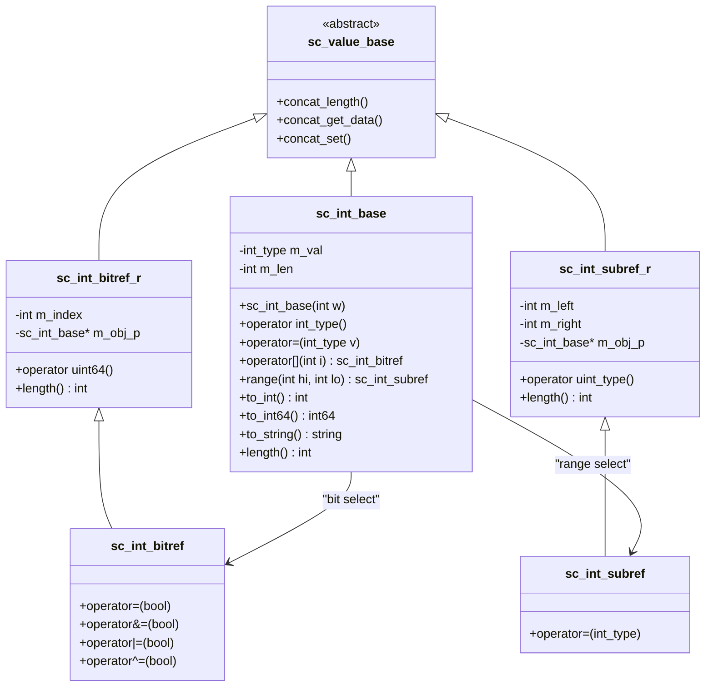

# sc_int_base — Signed Fixed-Width Integer Base Class

## Overview

`sc_int_base` is the base class of the `sc_int<W>` template class, implementing all functionality independent of bit width. It represents a signed integer with a length between 1 and 64 bits, and internally uses a C++ native 64-bit integer (`int64`) to store the value, so performance is close to native types.

**Source files:**
- `ref/systemc/src/sysc/datatypes/int/sc_int_base.h`
- `ref/systemc/src/sysc/datatypes/int/sc_int_base.cpp`

## Everyday Analogy

Think of `sc_int_base` as an "adjustable-width numeric display":
- You can set it to display 1 to 64 digits
- It is "signed," so the most significant bit represents the sign (like a thermometer that can show temperatures below zero)
- When you store a number exceeding the display range, it automatically truncates (like an odometer rolling over past 99999)

## Class Structure



## Core Concepts

### 1. Value Storage and Sign Extension

`sc_int_base` has only two member variables internally:

```cpp
int_type m_val;  // 64-bit signed integer, stores the actual value
int      m_len;  // bit width (1-64)
```

When you set an 8-bit signed integer to `-3`, it actually stores the 64-bit two's complement representation of `-3` in the 64-bit variable, but only the lower 8 bits are "valid."

### 2. Bit Selection

```cpp
sc_int<8> x = 0b10110100;
bool b = x[3];   // returns sc_int_bitref_r, reads bit 3 (value: 0)
x[0] = 1;        // returns sc_int_bitref, writes bit 0
```

`sc_int_bitref_r` is a "read-only" proxy object, and `sc_int_bitref` is a "read-write" proxy object. This uses the C++ proxy pattern, allowing `operator[]` to support both reading and writing.

### 3. Range / Part Selection

```cpp
sc_int<16> x = 0xABCD;
sc_int_subref r = x.range(11, 4);  // extracts bits [11:4] = 0xBC
x.range(7, 0) = 0xFF;              // sets lower 8 bits
```

This corresponds to the `x[11:4]` syntax in Verilog.

### 4. Concatenation Support

`sc_int_base` supports concatenation operations through virtual methods inherited from `sc_value_base`:

```cpp
sc_int<8> a = 0xAB;
sc_int<8> b = 0xCD;
sc_int<16> result = (a, b);  // result = 0xABCD
```

Internally implemented through `concat_get_data()`, `concat_set()`, and other methods.

### 5. Operators

Supports a full set of arithmetic and bitwise operators:
- **Arithmetic**: `+`, `-`, `*`, `/`, `%`
- **Bitwise**: `&`, `|`, `^`, `~`, `<<`, `>>`
- **Comparison**: `==`, `!=`, `<`, `<=`, `>`, `>=`
- **Assignment**: `=`, `+=`, `-=`, `*=`, `/=`, `%=`, `&=`, `|=`, `^=`, `<<=`, `>>=`

All operations execute on 64-bit native types, delivering very high performance.

## Design Rationale

### Why Isn't the Base Class a Template?

If `sc_int_base` were also a template `sc_int_base<W>`, every different `W` value would generate a complete copy of the code. Placing shared logic in a non-template base class significantly reduces binary file size.

### RTL Correspondence

| SystemC | Verilog | Description |
|---------|---------|-------------|
| `sc_int<8> x` | `reg signed [7:0] x` | 8-bit signed register |
| `x[3]` | `x[3]` | Bit selection |
| `x.range(7,4)` | `x[7:4]` | Part selection |
| `(a, b)` | `{a, b}` | Concatenation |

## Related Files

- [sc_int.md](sc_int.md) — Template subclass `sc_int<W>`
- [sc_uint_base.md](sc_uint_base.md) — Unsigned version `sc_uint_base`
- [sc_nbdefs.md](sc_nbdefs.md) — Basic type definitions like `int_type`
- [../misc/sc_value_base.md](../misc/sc_value_base.md) — Base class for concatenation support
