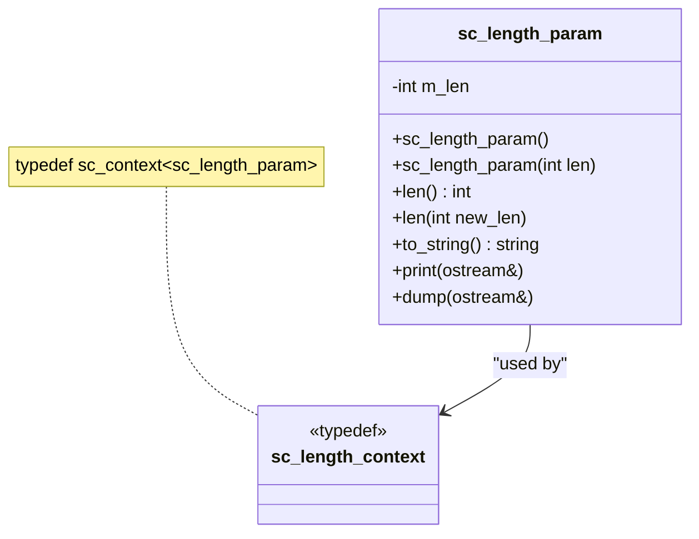

# sc_length_param — Length Parameter Type

## Overview

`sc_length_param` is a class for managing bit-width parameters of integer types. It works with SystemC's context mechanism to allow setting default bit widths within a specific scope. It is mainly used for interaction between the fixed-point system and integer types.

**Source files:**
- `ref/systemc/src/sysc/datatypes/int/sc_length_param.h`
- `ref/systemc/src/sysc/datatypes/int/sc_length_param.cpp`

## Everyday Analogy

Imagine you are setting paper sizes at a print shop. You can:
1. Specify the paper size each time you print (passing parameters directly)
2. Set a "default paper size," and use that default whenever you don't specify one (context mechanism)

`sc_length_param` is that "paper size setting," and `sc_length_context` is the mechanism that manages default values.

## Class Structure



## Core Concepts

### 1. Construction Methods

```cpp
sc_length_param();                  // use default from context
sc_length_param(int len);           // explicit length
sc_length_param(sc_without_context); // no context lookup
```

### 2. Context Mechanism

```cpp
// Set default length to 16 for this scope
sc_length_context ctx(sc_length_param(16));

// Now sc_length_param() without argument will default to 16
sc_length_param p;  // p.len() == 16
```

### 3. Validation

The `SC_CHECK_WL_()` macro is called during construction to validate the legality of the length value.

## Related Files

- [sc_int_base.md](sc_int_base.md) — Class that uses length parameters
- [sc_uint_base.md](sc_uint_base.md) — Class that uses length parameters
- [sc_nbdefs.md](sc_nbdefs.md) — Related constant definitions
