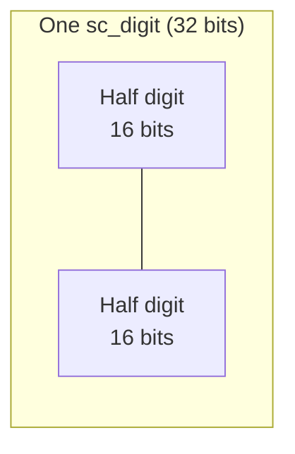
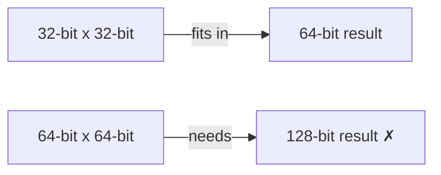

# sc_nbdefs.h — Basic Constants and Type Definitions for the Integer Subsystem

## Overview

`sc_nbdefs.h` defines the basic constants, type aliases, and macros shared across the entire integer subsystem (`datatypes/int/`). It is the "foundation stone" of all integer types — almost every file directly or indirectly `#include`s it.

**Source file:**
- `ref/systemc/src/sysc/datatypes/int/sc_nbdefs.h`

## Everyday Analogy

`sc_nbdefs.h` is like a "standards handbook for units and measures." When everyone agrees that "1 meter = 100 centimeters," the entire system can work together. This file defines the "units and measures" of the integer subsystem:
- A "digit" is 32 bits
- A "half digit" is 16 bits
- The largest native integer is 64 bits
- And so on...

## Key Definitions

### 1. Basic Type Aliases

```cpp
typedef int64_t   int64;     // 64-bit signed
typedef uint64_t  uint64;    // 64-bit unsigned
typedef int64     int_type;  // native signed type for sc_int
typedef uint64    uint_type; // native unsigned type for sc_uint
```

### 2. Digit-Related Constants



| Constant | Value | Description |
|----------|-------|-------------|
| `BITS_PER_DIGIT` | 32 | Bits per sc_digit |
| `BITS_PER_HALF_DIGIT` | 16 | Bits per half digit |
| `DIGIT_MASK` | `0xFFFFFFFF` | Digit mask |
| `HALF_DIGIT_MASK` | `0xFFFF` | Half digit mask |

### 3. Integer Width Constants

| Constant | Value | Description |
|----------|-------|-------------|
| `SC_INTWIDTH` | 64 | Maximum width of `sc_int`/`sc_uint` |
| `INT64_ZERO` | `0LL` | 64-bit signed zero |
| `UINT64_ZERO` | `0ULL` | 64-bit unsigned zero |

### 4. Digit Calculation Macros

```cpp
#define SC_DIGIT_COUNT(BIT_WIDTH) (((BIT_WIDTH)+BITS_PER_DIGIT-1)/BITS_PER_DIGIT)
#define SC_DIGIT_INDEX(BIT_INDEX) ((BIT_INDEX)/BITS_PER_DIGIT)
#define SC_BIT_INDEX(BIT_INDEX)   ((BIT_INDEX)%BITS_PER_DIGIT)
```

- `SC_DIGIT_COUNT(100)` = 4 (100 bits require 4 32-bit digits)
- `SC_DIGIT_INDEX(65)` = 2 (bit 65 is in digit 2)
- `SC_BIT_INDEX(65)` = 1 (bit 65 is at position 1 within the digit)

### 5. Sign Type

```cpp
typedef int small_type;
#define SC_POS   1   // positive
#define SC_ZERO  0   // zero
#define SC_NEG  -1   // negative
```

### 6. BigInt Configuration

Three mutually exclusive macros define the memory management strategy for `sc_bigint`/`sc_biguint`:

| Macro | Description |
|-------|-------------|
| `SC_BIGINT_CONFIG_TEMPLATE_CLASS_HAS_NO_BASE_CLASS` | Template class does not inherit from base class |
| `SC_BIGINT_CONFIG_TEMPLATE_CLASS_HAS_STORAGE` | Template class manages its own storage |
| `SC_BIGINT_CONFIG_BASE_CLASS_HAS_STORAGE` | Base class manages storage (with small vector optimization) |

### 7. Concatenation Support

```cpp
#define SC_DT_MIXED_COMMA_OPERATORS
```

Enables mixed-type comma operator concatenation, e.g., `(sc_int_value, sc_uint_value)`.

## Design Rationale

### Why is a Digit 32 Bits Instead of 64 Bits?

Multiplication is the key reason. The product of two 32-bit numbers is at most 64 bits, which fits exactly in a native `uint64`. If a digit were 64 bits, multiplication results would require 128 bits, which most processors do not natively support.



## Related Files

- [sc_signed.md](sc_signed.md) — Primary class using these definitions
- [sc_unsigned.md](sc_unsigned.md) — Primary class using these definitions
- [sc_nbutils.md](sc_nbutils.md) — Utility functions based on these definitions
- [sc_int_base.md](sc_int_base.md) — Class using `int_type`/`uint_type`
