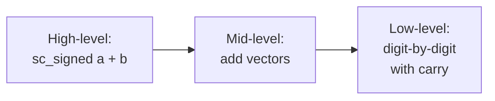

# sc_nbutils — Shared Utility Functions for Arbitrary-Precision Integers

## Overview

`sc_nbutils.h/.cpp` provides low-level utility functions shared by `sc_signed` and `sc_unsigned`. These functions handle the most basic operations: string parsing, vector arithmetic, type conversion, carry handling, etc.

**Source files:**
- `ref/systemc/src/sysc/datatypes/int/sc_nbutils.h`
- `ref/systemc/src/sysc/datatypes/int/sc_nbutils.cpp`

## Everyday Analogy

If `sc_signed` and `sc_unsigned` are two bakeries, `sc_nbutils` is the shared "flour factory." Both shops need to knead dough, let it rise, and bake — these basic steps are the same, so they are placed in the factory and shared.

## Core Function Categories

### 1. String Parsing

```cpp
void parse_binary_bits(const char* src_p, int dst_n,
                       sc_digit* data_p, sc_digit* ctrl_p=0);

void parse_hex_bits(const char* src_p, int dst_n,
                    sc_digit* data_p, sc_digit* ctrl_p=0);
```

Converts string-formatted numbers (e.g., `"0b1010"` or `"0xFF"`) into digit vectors. The `ctrl_p` parameter is used for four-valued logic (`sc_lv`) control bits.

### 2. Digit Manipulation Utilities

```cpp
// Concatenate two half-digits into one digit
inline sc_digit concat(sc_digit h, sc_digit l)
{
    return ((h << BITS_PER_HALF_DIGIT) | l);
}

// Create a number with n 1's: (2^n - 1)
inline sc_carry one_and_ones(int n)
{
    return (((sc_carry) 1 << n) - 1);
}

// Create a number with one 1 and n 0's: 2^n
inline sc_carry one_and_zeros(int n)
{
    return ((sc_carry) 1 << n);
}
```

### 3. Type Conversion

```cpp
// Copy unsigned value into digit vector
template<class Type>
inline void from_uint(int ulen, sc_digit* u, Type v);
```

Converts C++ native integer types (`unsigned long`, `uint64`, etc.) into digit vector representation.

### 4. Vector Arithmetic

Low-level addition, subtraction, comparison, and other operations that directly manipulate `sc_digit` arrays:



## Design Rationale

### Why a Separate File?

Most low-level operations of `sc_signed` and `sc_unsigned` are completely identical — the only difference is sign handling. Extracting these operations into `sc_nbutils` provides:

1. **Eliminates duplicate code**: one implementation serves both classes
2. **Independent testing**: these low-level operations can be tested in isolation
3. **Centralized performance optimization**: optimize in one place, both classes benefit

## Related Files

- [sc_signed.md](sc_signed.md) — Signed integer class using these utilities
- [sc_unsigned.md](sc_unsigned.md) — Unsigned integer class using these utilities
- [sc_nbdefs.md](sc_nbdefs.md) — Basic type and constant definitions
- [sc_vector_utils.md](sc_vector_utils.md) — Higher-level vector operation utilities
