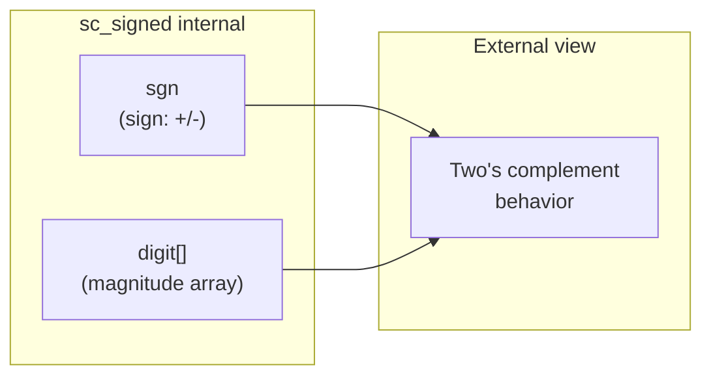

# sc_signed — Arbitrary-Precision Signed Integer

## Overview

`sc_signed` is the core class for arbitrary-precision signed integers in SystemC, and also the base class of `sc_bigint<W>`. Unlike `sc_int_base` which is limited to 64 bits, `sc_signed` can represent signed integers of arbitrary width. It uses sign-magnitude representation internally but guarantees two's complement behavior externally.

**Source files:**
- `ref/systemc/src/sysc/datatypes/int/sc_signed.h`
- `ref/systemc/src/sysc/datatypes/int/sc_signed.cpp`
- `ref/systemc/src/sysc/datatypes/int/sc_signed_inlines.h`
- `ref/systemc/src/sysc/datatypes/int/sc_signed_ops.h`
- `ref/systemc/src/sysc/datatypes/int/sc_signed_friends.h`

## Everyday Analogy

If `sc_int_base` is a "calculator with at most 64 digits," then `sc_signed` is a "calculator with unlimited digits." Imagine you are doing astronomical calculations that require numbers with hundreds of digits — an ordinary calculator cannot hold them, but `sc_signed` can.

Another analogy:
- `sc_int<W>` is like a fixed-length strip of paper — once full, there is no more room
- `sc_signed` is like a roll of receipt paper — tear off as much as you need

## Class Structure

```mermaid
classDiagram
    class sc_value_base {
        <<abstract>>
    }

    class sc_signed {
        -sc_digit* digit
        -int nbits
        -int ndigits
        -small_type sgn
        +sc_signed(int nb)
        +operator=(various)
        +operator[](int i) sc_signed_bitref
        +range(int hi, int lo) sc_signed_subref
        +to_int() int
        +to_int64() int64
        +to_uint64() uint64
        +to_string() string
        +length() int
        +is_neg() bool
    }

    class sc_signed_bitref_r {
        -int m_index
        -sc_signed* m_obj_p
    }

    class sc_signed_bitref {
        +operator=(bool)
    }

    class sc_signed_subref_r {
        -int m_left
        -int m_right
    }

    class sc_signed_subref {
        +operator=(various)
    }

    sc_value_base <|-- sc_signed
    sc_value_base <|-- sc_signed_bitref_r
    sc_signed_bitref_r <|-- sc_signed_bitref
    sc_value_base <|-- sc_signed_subref_r
    sc_signed_subref_r <|-- sc_signed_subref
    sc_signed <|-- sc_bigint_W["sc_bigint&lt;W&gt;"]
```

## Core Concepts

### 1. Internal Representation: Sign-Magnitude



- **Sign** (`sgn`): `SC_POS` (positive), `SC_NEG` (negative), `SC_ZERO` (zero)
- **Magnitude** (`digit[]`): an array of `sc_digit` (32-bit unsigned integers) storing the absolute value

Why choose sign-magnitude instead of two's complement directly?
- **Better arithmetic performance**: operations like addition and multiplication can process the magnitude first, then determine the sign
- **Drawback of two's complement**: carry chain handling is more complex for arbitrary-width addition

### 2. Digit Vector

Each `sc_digit` is 32 bits (`unsigned int`), and multiple `sc_digit`s are concatenated to represent a large number:

```
Number: 0x1234567890ABCDEF

digit[0] = 0x90ABCDEF  (lowest 32 bits)
digit[1] = 0x12345678  (next 32 bits)
```

### 3. Small Vector Optimization

When configured with `SC_BIGINT_CONFIG_BASE_CLASS_HAS_STORAGE`, `sc_signed` has a built-in small fixed-size digit array. Dynamic memory allocation (malloc) is only needed when the value exceeds this size. This is similar to C++ `std::string`'s SSO (Small String Optimization).

### 4. File Responsibilities

| File | Responsibility |
|------|----------------|
| `sc_signed.h` | Class declaration, proxy classes, operator declarations |
| `sc_signed.cpp` | Core implementation (construction, conversion, I/O) |
| `sc_signed_inlines.h` | Deferred inline function definitions |
| `sc_signed_ops.h` | Arithmetic and bitwise operation implementations |
| `sc_signed_friends.h` | Friend operator declarations (for compiler forward declarations) |

### 5. Operation Semantics

Per the VSIA standard: the result of mixed signed/unsigned operations is **signed**:

```cpp
sc_signed a(8);   // signed
sc_unsigned b(8); // unsigned
// a + b returns sc_signed (not sc_unsigned)
```

This differs from C/C++ (where signed + unsigned = unsigned).

## Operator Support

```cpp
// Unary operators
sc_signed operator + (const sc_signed& u);   // unary plus
sc_signed operator - (const sc_signed& u);   // unary minus
sc_signed operator - (const sc_unsigned& u); // negate unsigned -> signed
sc_signed operator ~ (const sc_signed& u);   // bitwise NOT

// Binary arithmetic (+, -, *, /, %) with all combinations:
// sc_signed op sc_signed
// sc_signed op sc_unsigned
// sc_signed op int/long/int64/uint64/...
// ... and all reverse combinations
```

## RTL Background

In Verilog, managing arbitrary-width signed operations requires manual effort:

```
// Verilog: manually managing wide signed values
reg signed [127:0] big_value;
reg signed [255:0] result;

// SystemC: natural C++ syntax
sc_signed big_value(128);
sc_signed result(256);
result = big_value * big_value;  // just works
```

## Related Files

- [sc_bigint.md](sc_bigint.md) — Template subclass `sc_bigint<W>`
- [sc_unsigned.md](sc_unsigned.md) — Unsigned version `sc_unsigned`
- [sc_nbutils.md](sc_nbutils.md) — Low-level vector operation utility functions
- [sc_nbdefs.md](sc_nbdefs.md) — Type definitions for `sc_digit`, `small_type`, etc.
- [sc_vector_utils.md](sc_vector_utils.md) — Vector operation type utilities
