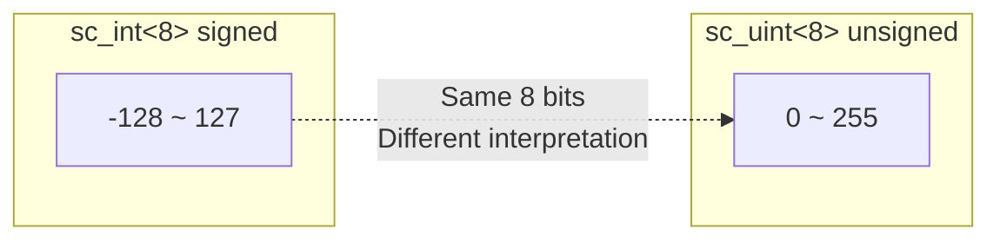

# sc_uint\<W\> — Unsigned Fixed-Width Integer Template Class

## Overview

`sc_uint<W>` is the unsigned integer type directly used by users, where `W` is the bit width (1 to 64). It inherits from `sc_uint_base` and is a mirror design of `sc_int<W>`, but handles unsigned values.

**Source files:**
- `ref/systemc/src/sysc/datatypes/int/sc_uint.h`
- `ref/systemc/src/sysc/datatypes/int/sc_uint_inlines.h`

## Everyday Analogy

`sc_uint<W>` is like a fixed-digit "odometer." `sc_uint<8>` is a 3-digit odometer (0~255) that automatically rolls over to zero after 255. Unlike `sc_int<8>`, the odometer never shows a negative number.

## Core Mechanisms

### 1. Comparison with sc_int\<W\>



The same 8-bit value `11111111`:
- `sc_int<8>` interprets it as `-1`
- `sc_uint<8>` interprets it as `255`

### 2. Assignment Truncation

```cpp
void assign( uint_type value )
{
    m_val = value & ( ~UINT_ZERO >> (SC_INTWIDTH-W) );
}
```

Unlike the sign extension of `sc_int<W>`, `sc_uint<W>` simply masks off the upper bits. Like an odometer: after 99999 comes 00000.

### 3. Role of sc_uint_inlines.h

Similar to `sc_int_inlines.h`, it contains deferred inline functions because they depend on other types (such as `sc_signed`, `sc_unsigned`) that are not yet fully defined.

## Usage Examples

```cpp
// Address bus
sc_uint<32> addr = 0x80000000;

// Bit field extraction
sc_uint<8> status_reg = read_register();
bool error_flag = status_reg[7];
sc_uint<4> error_code = status_reg.range(6, 3);

// Counter with wrap-around
sc_uint<4> counter = 15;
counter++;  // becomes 0 (wrap around)
```

## RTL Correspondence

```
// Verilog (unsigned by default)
reg [31:0] addr;
wire [7:0] status_reg;
wire error_flag = status_reg[7];
wire [3:0] error_code = status_reg[6:3];

// SystemC
sc_uint<32> addr;
sc_uint<8> status_reg;
bool error_flag = status_reg[7];
sc_uint<4> error_code = status_reg.range(6, 3);
```

## Related Files

- [sc_uint_base.md](sc_uint_base.md) — Base class
- [sc_int.md](sc_int.md) — Signed version `sc_int<W>`
- [sc_biguint.md](sc_biguint.md) — Alternative for widths exceeding 64 bits
