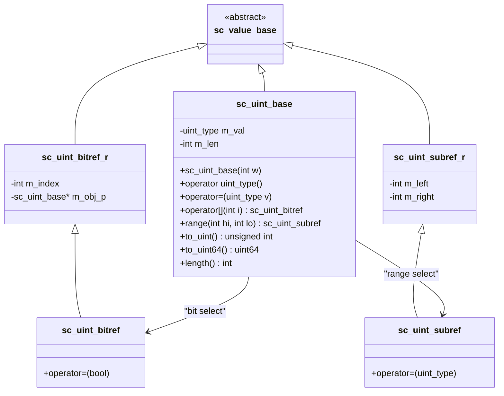

# sc_uint_base — Unsigned Fixed-Width Integer Base Class

## Overview

`sc_uint_base` is the base class of the `sc_uint<W>` template class, representing a 1 to 64-bit unsigned integer. It is almost a mirror design of `sc_int_base`, but all operations are performed in an unsigned manner.

**Source files:**
- `ref/systemc/src/sysc/datatypes/int/sc_uint_base.h`
- `ref/systemc/src/sysc/datatypes/int/sc_uint_base.cpp`

## Everyday Analogy

`sc_uint_base` is like a car's odometer — it can only count upward and never shows negative numbers. A 5-digit odometer displays up to 99999, and then rolls over to zero. `sc_uint_base` works the same way: an 8-bit value ranges from 0 to 255, and wraps around when exceeded.

## Class Structure



## Core Concepts

### 1. Value Storage

```cpp
uint_type m_val;  // 64-bit unsigned integer
int       m_len;  // bit width (1-64)
```

Unlike `sc_int_base` which uses a signed `int_type`, `sc_uint_base` uses an unsigned `uint_type`. This means:
- No sign extension issues
- Right shift is logical (zero-filled), not arithmetic (sign-filled)

### 2. Differences from sc_int_base

| Feature | sc_int_base | sc_uint_base |
|---------|-------------|--------------|
| Storage type | `int_type` (signed) | `uint_type` (unsigned) |
| Value range | -2^(W-1) ~ 2^(W-1)-1 | 0 ~ 2^W-1 |
| Right shift behavior | Arithmetic right shift (preserves sign bit) | Logical right shift (zero-filled) |
| Comparison | Signed comparison | Unsigned comparison |

### 3. Proxy Classes

Like `sc_int_base`, four proxy classes are provided:
- `sc_uint_bitref_r`: read-only bit selection
- `sc_uint_bitref`: writable bit selection
- `sc_uint_subref_r`: read-only range selection
- `sc_uint_subref`: writable range selection

### 4. Mask Table (mask_int)

```cpp
extern const uint_type mask_int[SC_INTWIDTH][SC_INTWIDTH];
```

This is a precomputed lookup table used for fast part-selection operations. `mask_int[i][j]` stores the mask value needed to clear all bits outside the range from bit `i` to bit `j`.

## RTL Background

In hardware, the most common uses for unsigned integers are:
- **Address buses**: memory addresses are never negative
- **Counters**: such as packet length, loop count
- **Flag registers**: each bit represents an independent control flag

```
// Verilog
reg [7:0] address;     // unsigned by default in Verilog
wire [3:0] count;

// SystemC
sc_uint<8> address;
sc_uint<4> count;
```

## Related Files

- [sc_uint.md](sc_uint.md) — Template subclass `sc_uint<W>`
- [sc_int_base.md](sc_int_base.md) — Signed version `sc_int_base`
- [sc_int32_mask.md](sc_int32_mask.md) — 32-bit mask table
- [sc_int64_mask.md](sc_int64_mask.md) — 64-bit mask table
- [../misc/sc_value_base.md](../misc/sc_value_base.md) — Base class
