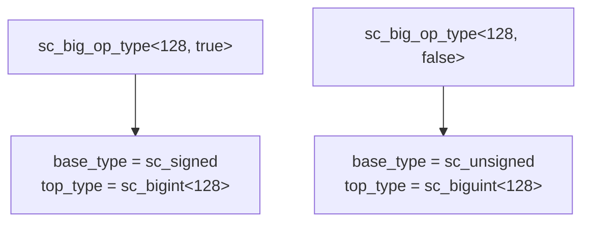

# sc_vector_utils.h — Vector Operation Type Utilities

## Overview

`sc_vector_utils.h` provides a set of template utility classes for computing type information and widths needed by big integer operations at compile time. These utilities are the infrastructure for the operator implementations in `sc_big_ops.h`.

**Source file:**
- `ref/systemc/src/sysc/datatypes/int/sc_vector_utils.h`

## Everyday Analogy

When you do long-form multiplication, you need to know beforehand:
- How many digits does each number have?
- How many digits can the result have at most?
- How large a sheet of paper do you need?

`sc_vector_utils.h` is the tool that answers these questions "before you start calculating." Moreover, it completes all calculations at compile time, with zero runtime overhead.

## Core Classes

### 1. sc_big_op_type\<WIDTH, SIGNED\>

Selects the correct type based on width and signedness:



```cpp
template<int WIDTH>
class sc_big_op_type<WIDTH, true> {
    typedef sc_signed        base_type;
    typedef int              hod_type;   // high order digit type (signed)
    typedef sc_bigint<WIDTH> top_type;
};

template<int WIDTH>
class sc_big_op_type<WIDTH, false> {
    typedef sc_unsigned       base_type;
    typedef sc_digit          hod_type;   // high order digit type (unsigned)
    typedef sc_biguint<WIDTH> top_type;
};
```

### 2. sc_big_op_info\<WL, SL, WR, SR\>

Computes at compile time the bit width needed for the result of various operations between two operands:

```cpp
template<int WL, bool SL, int WR, bool SR>
class sc_big_op_info {
    enum {
        signed_result = SL || SR,

        // Result widths for different operations:
        add_bits = max(WL+extra, WR+extra) + 1,
        sub_bits = max(WL+extra, WR+extra) + 1,
        mul_bits = WL + WR,
        div_bits = WL + SR,
        mod_bits = min(WL, WR+extra),
        bit_bits = max(WL+extra, WR+extra),  // bitwise ops

        // Digit indices for results:
        add_hod = digit_index(add_bits - 1),
        // ... etc
    };
};
```

**Width calculation rules:**

| Operation | Result Width | Reason |
|-----------|-------------|--------|
| Addition | max(WL, WR) + 1 | Carry may add one bit |
| Subtraction | max(WL, WR) + 1 | Borrow may add one bit |
| Multiplication | WL + WR | Bit widths add up |
| Division | WL + SR | Dividend width (plus sign bit) |
| Modulus | min(WL, WR) | Remainder does not exceed divisor |
| Bitwise ops | max(WL, WR) | Takes the wider one |

### 3. Extra Bits for Signed/Unsigned Mixing

When signed and unsigned operands are mixed, extra bits are needed:

```cpp
left_extra = !SL && SR,   // unsigned left + signed right: left needs extra bit
right_extra = SL && !SR,  // signed left + unsigned right: right needs extra bit
```

This is because converting an unsigned number to signed requires an extra 0 as the sign bit.

## Design Rationale

All calculations happen at compile time (via `enum`), which means:

1. **Zero runtime overhead**: width calculations consume no CPU time
2. **Compiler optimization**: knowing the exact number of digits enables loop unrolling
3. **Type safety**: incorrect operand combinations are caught at compile time

## Related Files

- [sc_big_ops.md](sc_big_ops.md) — Uses this type information to implement operations
- [sc_bigint.md](sc_bigint.md) — Provides constants like `DIGITS_N`, `HOD`, etc.
- [sc_biguint.md](sc_biguint.md) — Provides constants like `DIGITS_N`, `HOD`, etc.
- [sc_nbdefs.md](sc_nbdefs.md) — Macro definitions for `SC_DIGIT_COUNT`, etc.
