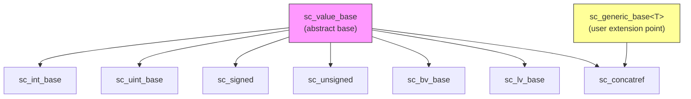

# SystemC Data Types Misc Subsystem -- Base Classes and Concatenation Support

## Overview

The `datatypes/misc/` directory contains the infrastructure classes for the SystemC data type system. These classes do not belong to any specific data type category (integers, bit vectors, fixed-point numbers), but instead serve as the shared "foundation" used by all data types.

## Everyday Analogy

If SystemC data types are various appliances (refrigerator, washing machine, TV), then `misc/` is the place that provides the "power outlet standard" and the "universal adapter":
- `sc_value_base`: The power outlet standard (all appliances must comply)
- `sc_concatref`: The universal adapter (connects signals from different appliances together)

## File List

| File | Description |
|------|-------------|
| [sc_value_base.md](sc_value_base.md) | `sc_value_base` -- Abstract base class for all SystemC value types |
| [sc_concatref.md](sc_concatref.md) | `sc_concatref` -- Bit concatenation proxy class |

## Class Relationships

## Related Directories

- [../int/](../int/_index.md) -- Integer data types
- `../bit/` -- Bit vector data types
- `../fx/` -- Fixed-point data types
