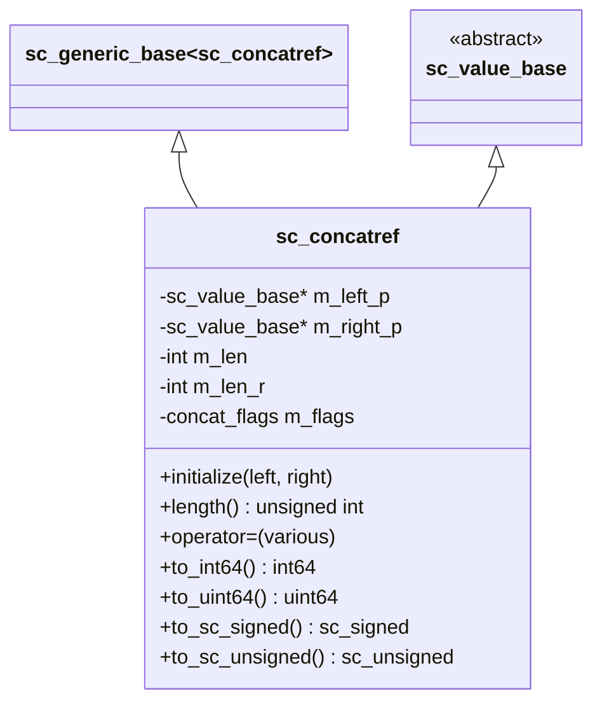
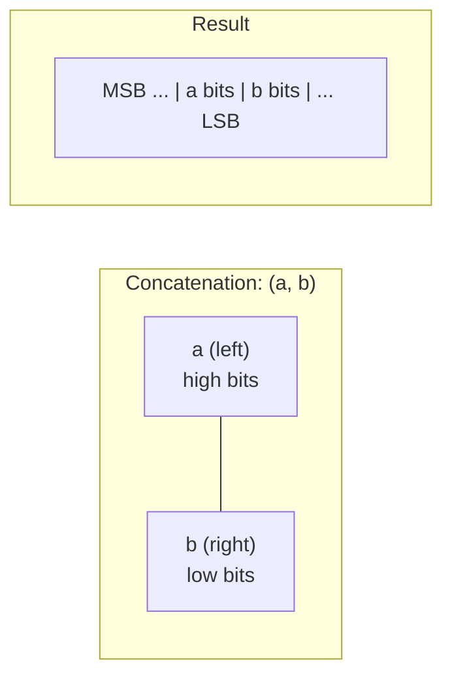

# sc_concatref -- Bit Concatenation Proxy Class

## Overview

`sc_concatref` is the core proxy class for SystemC concatenation operations. When you write `(a, b)` to concatenate two values, the result is an `sc_concatref` object. It can appear on the left side of an assignment (splitting) and the right side (combining), supporting mixed concatenation of all SystemC numeric types.

**Source file:**
- `ref/systemc/src/sysc/datatypes/misc/sc_concatref.h`

## Everyday Analogy

Imagine you have two ribbons of different lengths, and you tape them together:
- After taping them together, you can use the entire ribbon as a single unit (read)
- You can also operate on the entire ribbon, and the effects automatically propagate to the two original ribbons (write)

`sc_concatref` is that roll of "tape" -- it does not store any data itself, it only "references" the two original values and provides a unified interface.

## Class Structure



## Core Concepts

### 1. Initialization

```cpp
void initialize( sc_value_base& left, sc_value_base& right )
{
    m_left_p = &left;
    m_right_p = &right;
    m_len_r = right.concat_length(&right_xz);
    m_len = left.concat_length(&left_xz) + m_len_r;
    m_flags = ( left_xz || right_xz ) ? cf_xz_present : cf_none;
}
```

`sc_concatref` stores pointers to the left and right operands along with their respective bit lengths. It does not copy any data itself.

### 2. Concatenation Direction



The left value occupies the high bits, and the right value occupies the low bits. This is consistent with Verilog's `{a, b}` semantics.

### 3. Read Operations

When reading, `sc_concatref` delegates to its two child values:

```cpp
virtual bool concat_get_data( sc_digit* dst_p, int low_i ) const
{
    bool rnz = m_right_p->concat_get_data( dst_p, low_i );
    bool lnz = m_left_p->concat_get_data( dst_p, low_i + m_len_r );
    return rnz || lnz;
}
```

It first retrieves the right side (low bits), then the left side (high bits, offset by the length of the right side).

### 4. Write Operations

Writing follows a similar delegation pattern:

```cpp
virtual void concat_set( int64 src, int low_i )
{
    m_right_p->concat_set( src, low_i );
    m_left_p->concat_set( src, low_i + m_len_r );
}
```

### 5. Recursive Concatenation

`sc_concatref` itself inherits from `sc_value_base`, so concatenation can be recursive:

```cpp
sc_int<4> a, b, c;
// ((a, b), c) works: (a,b) creates sc_concatref,
// then (sc_concatref, c) creates another sc_concatref
auto result = (a, b, c);
```

### 6. sc_concat_bool

`sc_concatref.h` also defines `sc_concat_bool`, which wraps a single `bool` value into an object that can participate in concatenation operations.

### 7. Object Pool

`sc_concatref` objects are managed through an `sc_vpool` object pool to avoid frequent memory allocation and deallocation:

```cpp
friend class sc_core::sc_vpool<sc_concatref>;
```

## Operator Support

`sc_concatref` supports:
- **Assignment**: Assign from various types (int, string, sc_signed, sc_unsigned, etc.)
- **Conversion**: Convert to various types (to_int64, to_uint64, to_sc_signed, etc.)
- **Arithmetic**: Add, subtract, multiply, divide, modulo
- **Bitwise**: AND, OR, XOR, NOT, left shift, right shift
- **Comparison**: All comparison operators

## RTL Correspondence

```
// Verilog: concatenation
wire [7:0] a, b;
wire [15:0] result = {a, b};        // read concatenation
assign {a, b} = some_16bit_value;   // write concatenation (split)

// SystemC equivalent
sc_uint<8> a, b;
sc_uint<16> result = (a, b);        // read concatenation
(a, b) = some_16bit_value;          // write concatenation (split)
```

## Design Rationale

### Why a proxy object instead of directly producing a new value?

1. **Lvalue semantics**: Concatenation can appear on the left side of an assignment, directly modifying the original variables
2. **Zero-copy**: No data copying needed, only references are stored
3. **Type-agnostic**: Through `sc_value_base` virtual methods, any type combination is supported

### Mixed Type Support

```cpp
sc_int<4> a = 5;
sc_uint<4> b = 3;
sc_bv<8> c;
(a, b) = c;    // mixed signed/unsigned/bitvector concatenation
```

This is the most powerful aspect of `sc_concatref` -- it can concatenate any type that inherits from `sc_value_base`.

## Related Files

- [sc_value_base.md](sc_value_base.md) -- Base class that defines the concatenation interface
- [../int/sc_int_base.md](../int/sc_int_base.md) -- One of the types that can participate in concatenation
- [../int/sc_uint_base.md](../int/sc_uint_base.md) -- One of the types that can participate in concatenation
- [../int/sc_signed.md](../int/sc_signed.md) -- One of the types that can participate in concatenation
