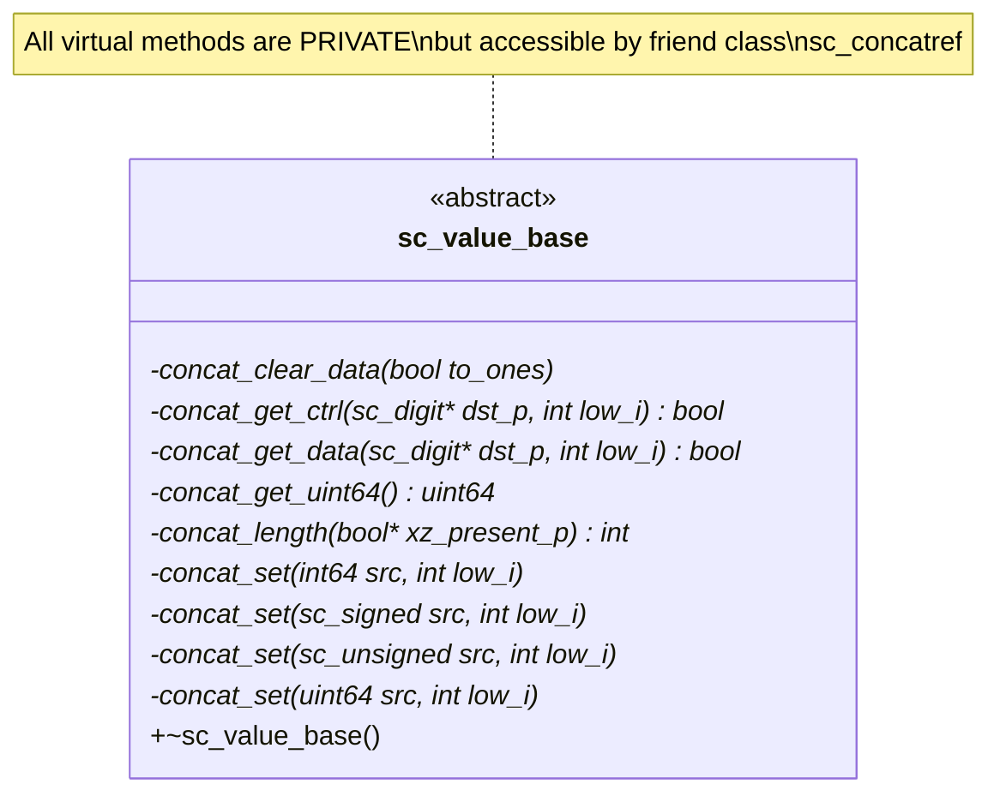
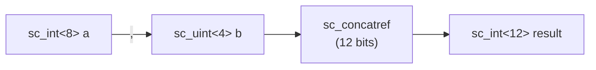

# sc_value_base -- Abstract Base Class for All SystemC Value Types

## Overview

`sc_value_base` is the abstract base class for all native numeric types in SystemC. Its primary responsibility is to define a set of virtual methods that allow values of different types to perform **concatenation** operations. All integer types (`sc_int_base`, `sc_uint_base`, `sc_signed`, `sc_unsigned`) and bit vector types (`sc_bv_base`, `sc_lv_base`) inherit from this class.

**Source files:**
- `ref/systemc/src/sysc/datatypes/misc/sc_value_base.h`
- `ref/systemc/src/sysc/datatypes/misc/sc_value_base.cpp`

## Everyday Analogy

Imagine a factory with various different parts (screws, gears, bearings), each with different specifications and purposes. But they all must comply with a common "interface standard" so they can be assembled on the same production line.

`sc_value_base` is that "interface standard". It specifies the basic operations every numeric type must support:
- How many bits do you have? (`concat_length`)
- Copy your data to here (`concat_get_data`)
- Read data from here into yourself (`concat_set`)

## Class Definition



## Core Methods

### Concatenation Interface (all `private virtual`)

| Method | Description |
|--------|-------------|
| `concat_length(bool* xz_present_p)` | Returns the bit length of this value; sets `xz_present_p` if x/z values are present |
| `concat_get_data(sc_digit* dst_p, int low_i)` | Writes data bits into the target digit array starting at position `low_i` |
| `concat_get_ctrl(sc_digit* dst_p, int low_i)` | Writes control bits (x/z) into the target digit array |
| `concat_get_uint64()` | Returns the lower 64 bits of the value |
| `concat_set(...)` | Sets this value from a source (multiple overloaded versions) |
| `concat_clear_data(bool to_ones)` | Clears data (sets to all 0s or all 1s) |

### Why Private?

These methods are marked as `private`, accessible only by `friend class sc_concatref`. This is done for:

1. **Encapsulation**: Users should not call these low-level methods directly
2. **Safety**: Only the concatenation mechanism (`sc_concatref`) needs access to them
3. **Flexibility**: The internal implementation can be modified without affecting the public interface

## sc_generic_base\<T\>

The same header file also defines `sc_generic_base<T>`, which serves as an extension point for user-defined types:

```cpp
template<class T>
class sc_generic_base {
    const T* operator->() const { return (const T*)this; }
    T* operator->() { return (T*)this; }
};
```

Usage:

```cpp
class my_type : public sc_generic_base<my_type> {
    uint64 to_uint64() const;
    int64 to_int64() const;
    void to_sc_unsigned(sc_unsigned&) const;
    void to_sc_signed(sc_signed&) const;
};
```

By inheriting from `sc_generic_base`, user-defined types can convert to and assign from SystemC integer types. The use of `operator->` allows templates to access derived class methods through CRTP (Curiously Recurring Template Pattern).

## Design Rationale

### Why is a common base class needed?



The concatenation operation `(a, b)` needs to combine values of different types. Without a common base class, specialized code would be required for every pair of type combinations. With `sc_value_base`, `sc_concatref` only needs to call unified virtual methods.

### RTL Correspondence

This corresponds to the concatenation operator `{}` in Verilog:

```
// Verilog
wire [11:0] result = {a, b};  // a is 8-bit, b is 4-bit

// SystemC
sc_int<12> result = (a, b);   // same thing, different syntax
```

## Related Files

- [sc_concatref.md](sc_concatref.md) -- Concatenation proxy class, the primary consumer of `sc_value_base`
- [../int/sc_int_base.md](../int/sc_int_base.md) -- Integer class that inherits from `sc_value_base`
- [../int/sc_signed.md](../int/sc_signed.md) -- Arbitrary-precision class that inherits from `sc_value_base`
