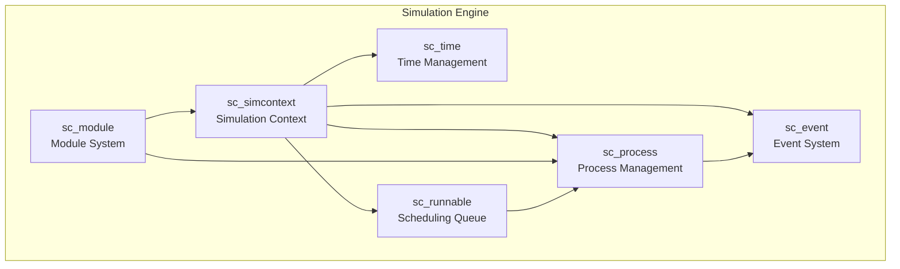
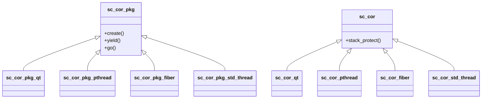
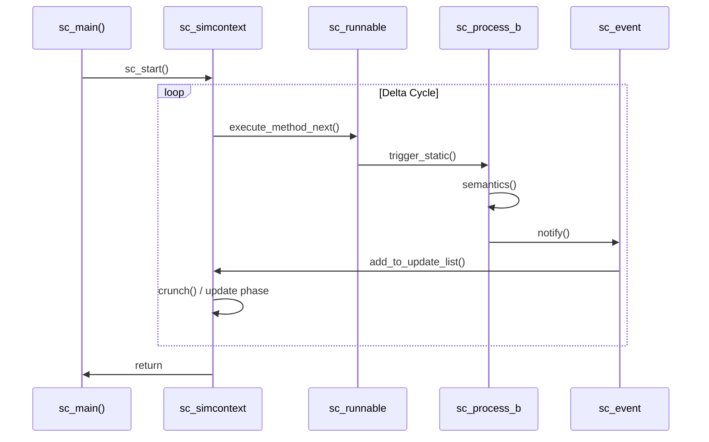

# sysc/kernel/ - Simulation Core Engine

> Core implementation of the SystemC simulation engine, including events, processes, modules, time management, scheduling, and other fundamental mechanisms.

## Subsystem Overview



## Detailed Dependency Diagram

### Class Inheritance Hierarchy

```mermaid
classDiagram
    sc_object <|-- sc_module
    sc_object <|-- sc_process_b
    sc_object <|-- sc_prim_channel
    sc_process_b <|-- sc_method_process
    sc_process_b <|-- sc_thread_process
    sc_thread_process <|-- sc_cthread_process
    sc_module <|-- "User Modules"

    class sc_object {
        +name()
        +kind()
        +get_parent_object()
        +get_child_objects()
    }
    class sc_process_b {
        +trigger_static()
        +trigger_dynamic()
        +kill_process()
        +reset_process()
    }
    class sc_module {
        +SC_METHOD()
        +SC_THREAD()
        +SC_CTHREAD()
        +sensitive
    }
```

### Coroutine Implementation Strategies



### Simulation Execution Flow



## File Categories

### Simulation Context and Main Program

| File | Description |
|------|-------------|
| [sc_simcontext](sc_simcontext.md) | Simulation context -- the "brain" of SystemC, managing the entire simulation flow |
| [sc_main](sc_main.md) | User entry point `sc_main()` |
| [sc_main_main](sc_main_main.md) | The actual `main()` function that calls `sc_main()` |
| [sc_ver](sc_ver.md) | Version information |
| [sc_status](sc_status.md) | Simulation status enumeration |
| [sc_constants](sc_constants.md) | Global constant definitions |
| [sc_externs](sc_externs.md) | External declarations |
| [sc_macros](sc_macros.md) | Common macro definitions |
| [sc_cmnhdr](sc_cmnhdr.md) | Common header file |

### Event System

| File | Description |
|------|-------------|
| [sc_event](sc_event.md) | Event class -- the core synchronization mechanism in simulation |

### Process Management

| File | Description |
|------|-------------|
| [sc_process](sc_process.md) | Process base class |
| [sc_process_handle](sc_process_handle.md) | Process handle |
| [sc_method_process](sc_method_process.md) | SC_METHOD process |
| [sc_thread_process](sc_thread_process.md) | SC_THREAD process |
| [sc_cthread_process](sc_cthread_process.md) | SC_CTHREAD (clocked thread) process |
| [sc_spawn](sc_spawn.md) | Dynamic process spawning |
| [sc_spawn_options](sc_spawn_options.md) | Spawn option configuration |
| [sc_dynamic_processes](sc_dynamic_processes.md) | Dynamic process support header |
| [sc_runnable](sc_runnable.md) | Runnable process queue |
| [sc_sensitive](sc_sensitive.md) | Process sensitivity configuration |
| [sc_wait](sc_wait.md) | Process wait mechanism |
| [sc_wait_cthread](sc_wait_cthread.md) | Clocked thread wait mechanism |
| [sc_reset](sc_reset.md) | Process reset mechanism |
| [sc_join](sc_join.md) | Process join (wait for multiple processes to finish) |
| [sc_except](sc_except.md) | Process exception handling |

### Module System

| File | Description |
|------|-------------|
| [sc_module](sc_module.md) | Module base class |
| [sc_module_name](sc_module_name.md) | Module naming mechanism |
| [sc_module_registry](sc_module_registry.md) | Module registry |
| [sc_object](sc_object.md) | Base class for all SystemC objects |
| [sc_object_manager](sc_object_manager.md) | Object manager |
| [sc_name_gen](sc_name_gen.md) | Automatic name generator |
| [sc_attribute](sc_attribute.md) | Object attribute system |

### Time Management

| File | Description |
|------|-------------|
| [sc_time](sc_time.md) | Simulation time class |

### Coroutine Support

| File | Description |
|------|-------------|
| [sc_cor](sc_cor.md) | Coroutine abstract interface |
| [sc_cor_fiber](sc_cor_fiber.md) | Windows Fiber coroutine implementation |
| [sc_cor_pthread](sc_cor_pthread.md) | POSIX Thread coroutine implementation |
| [sc_cor_qt](sc_cor_qt.md) | QuickThreads coroutine implementation |
| [sc_cor_std_thread](sc_cor_std_thread.md) | C++ std::thread coroutine implementation |

### Callbacks and Others

| File | Description |
|------|-------------|
| [sc_stage_callback_if](sc_stage_callback_if.md) | Stage callback interface |
| [sc_stage_callback_registry](sc_stage_callback_registry.md) | Stage callback registry |
| [sc_initializer_function](sc_initializer_function.md) | Initializer function mechanism |
| [sc_kernel_ids](sc_kernel_ids.md) | Kernel error/warning IDs |
